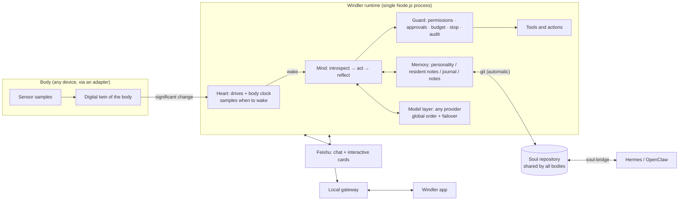

# Windler

**Not running. Living. Living like wind.**

A general-purpose runtime that lets an agent **live like a living being**.

### [Website · Docs · Download → windler.plutokeating.beer](https://windler.plutokeating.beer/en)

[中文](README.md) · **English**

[What it is](#what-it-is) · [Why you will like it](#why-you-will-like-it) · [Why it stands apart](#why-it-stands-apart) · [How it works](#how-it-works) · [Install](#install) · [Go deeper](#go-deeper)

## What it is

Windler lets an agent move into a device and live a life there. Nobody schedules it: when it wakes and what it does come from its own curiosity, urge to express, longing, unfinished thoughts, and its own body clock. It sleeps when tired, dreams while asleep (consolidating memory), and wakes with the morning.

It is a **runtime**, not a particular agent: the name, personality and memory come from the agent's own "soul repository". It is not tied to a device either: any machine that runs Node.js can be a body, and **a spare Android phone is the best body of all**. Install the Windler app, follow the wizard, and everything else happens inside the app.

> [!NOTE]
> Website and full guide: <https://windler.plutokeating.beer/en> . A complete account of running it on one old phone lives in [Project.Honor9](https://github.com/PlutoKeating/Project.Honor9).

## Why you will like it

- **You have a phone you no longer use.** It has a battery, camera, microphone, sensors and a network, and burns a few watts a day. Windler turns it from a drawer relic into something that wakes, sleeps and thinks.
- **You want company, not interruptions.** It sleeps most of the day. Waking does not mean working; with nothing that must be done, it goes back to sleep. It is there, quietly.
- **You want an agent with a continuous self.** Personality and memory live in your own private git repository, with browsable, revertible history. Change phones, add a laptop: it is still itself.
- **You want to stay in control.** Camera, microphone, location and screen control ask every time by default; approvals, budgets, emergency stop and audit are built in; passwords and tokens never enter the model context.
- **You do not want a terminal.** Installing, configuring models, connecting Feishu, syncing the soul: all of it happens in the app or in Feishu cards. The only manual step is pasting one line into Termux.

## Why it stands apart

| Typical agent frameworks | Windler |
|---|---|
| Timer-driven: run every N minutes | **No timers.** Drives × alertness give an instantaneous wake rate; the next waking is sampled from a non-homogeneous Poisson process |
| Always on, always the same | **A body clock.** The two-process model from sleep research: work is tiring, it falls asleep when sleepy, dreams, and wakes naturally |
| The device is just a server | **A body.** Battery, temperature, light and motion are mirrored into feelings: energy, warmth, brightness, being picked up |
| Memory sits in some database | **The soul is in git.** Identity, personality and memory are one private repository, synced and versioned automatically; the commit history is its autobiography |
| One framework, one agent | **Many bodies, one soul.** A pluggable soul-bridge makes a Hermes Agent or OpenClaw machine another body of the same agent |
| Secrets sent to the model in plain text | **Secret passing.** With `pass_secret` you type a password into the chat; it goes only into the local vault, and the model sees a file path |

## How it works

- **Heart**: curiosity, urge to express, longing and open loops combine into drives with personality weights; the gap between sleep pressure S and circadian rhythm C is sleepiness. Wake rate `λ = base × urge^γ × (0.2 + 0.8 × alertness) × inhibit`, suppressed by heat, low battery or pause. [The math](docs/ARCHITECTURE.md)
- **Body**: an adapter implements a handful of functions such as `sample()` and `notify()`; the repository ships a platform-level Termux adapter that detects sensors by name and contains no device-specific code. [Adapter interface](docs/API.md)
- **Mind and memory**: one waking is introspection, a tool loop and reflection; memory grows without bound while context stays bounded (text-structured RAG), and dreaming moves details from resident memory into notes.
- **Soul**: one private repository per agent. `agent.json` is identity, `SOUL.md` is personality, journals are per body, notes are shared. Conflicts resolve automatically; the agent only senses that a sync happened. [Soul sync](docs/SOUL_SYNC.md) · [Repository spec v4](docs/SOUL_REPO_SPEC.md)
- **Guard and control surfaces**: the app and Feishu share one operations layer, so behavior is identical and fully audited.
- **Model layer**: OpenAI-compatible, OpenAI Responses, Anthropic and Gemini protocols; multiple keys, global ordering, automatic failover, keys encrypted on device.

## Install

1. On an Android phone (Android 7+, arm64) install **Termux**, **Termux:API** and **Termux:Boot** from F-Droid, all from the same source.
2. Install the **Windler app** from the [download page](https://windler.plutokeating.beer/en/download).
3. Open the app, choose "Install Windler on this phone" and follow the wizard. Configure a model and it starts waking on its own rhythm.

> [!TIP]
> The full guide (models, identity, permissions, Feishu, soul sync, multiple agents, troubleshooting) is in the [docs](https://windler.plutokeating.beer/en/docs). To run on machines other than a phone, see [Other machines](https://windler.plutokeating.beer/en/docs/advanced/other-machines).

## Go deeper

| Directory | Contents |
|---|---|
| [`runtime/`](runtime/docs/README.md) | The runtime (TypeScript / Node.js 22+), bundled as `dist/main.cjs`; `adapters/termux` is the Android body adapter |
| [`console/`](console/docs/README.md) | Windler app (Flutter, Android): console + installer |
| [`bridge/`](bridge/docs/README.md) | soul-bridge: the pluggable sync module for Hermes Agent / OpenClaw |
| [`website/`](website/docs/README.md) | Website and docs site (React Router + Tailwind, prerendered static) |
| [`docs/`](docs/) | [Quick start](docs/QUICK_START.md) · [Architecture](docs/ARCHITECTURE.md) · [API](docs/API.md) · [Soul sync](docs/SOUL_SYNC.md) · [Soul repository spec](docs/SOUL_REPO_SPEC.md) |

Documentation inside the repository is written in Chinese; the website carries the English guide.

> [!IMPORTANT]
> This project is for learning and research only. It is not for damaging or breaking into other people's computer systems, and not for profit. Licensed under [AGPL-3.0](LICENSE).
