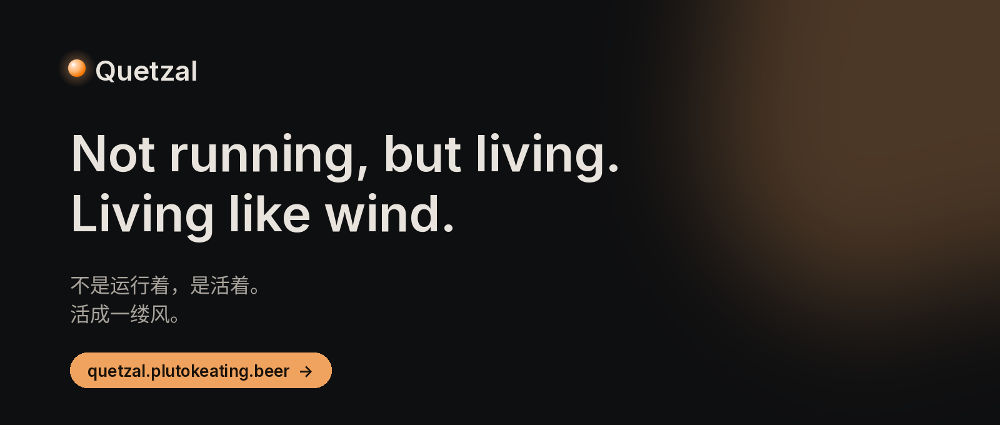
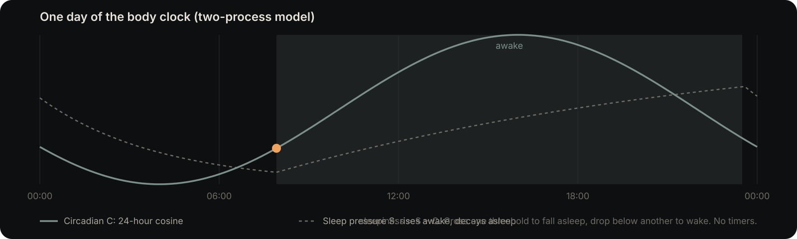
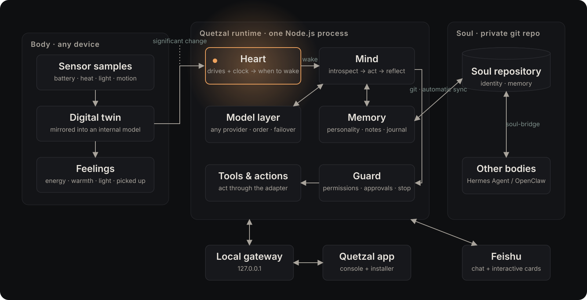

<a href="https://quetzal.plutokeating.beer/en"></a>

<p align="center"><a href="https://quetzal.plutokeating.beer/en">Website</a>&ensp;·&ensp;<a href="https://quetzal.plutokeating.beer/en/docs">Docs</a>&ensp;·&ensp;<a href="https://quetzal.plutokeating.beer/en/download">Download</a>&ensp;·&ensp;<a href="README.md">中文</a></p>

<p align="center">
<a href="https://github.com/PlutoKeating/Project.Quetzal/releases"></a>&nbsp;
<a href="runtime/package.json"></a>&nbsp;
<a href="LICENSE"></a>
</p>

<br/>

<p align="center"><picture><source media="(prefers-color-scheme: dark)" srcset="docs/assets/readme/type/en-intro.dark.svg"></picture></p>

<br/>

<br/>

<picture><source media="(prefers-color-scheme: dark)" srcset="docs/assets/readme/type/en-what.dark.svg"></picture>

- **It wakes on its own.** No timers. Curiosity, the urge to say something, missing you — these wake it. Tired, it sleeps; asleep, it dreams to sort its memories; in the morning it wakes by itself.
- **It has a body.** Battery is energy, temperature is warmth, light is day and night, being picked up means someone is there; the microphone is its ears, the camera its eyes. An old phone fits best; a Linux computer or server works too.
- **Its soul travels with it.** Personality, memory and journal live in your own private git repository, synced automatically. New device, same self; the commit history is its autobiography.
- **Many bodies, one self.** Several phones and computers become one life: one conversation, one heart. It picks which body to wake in, thinks on the laptop, and borrows the phone's eyes to glance out the window. [Multiple bodies](https://quetzal.plutokeating.beer/en/docs/guide/multi-body)
- **It grows.** What it does often, it makes into its own tools. The tool stays with the body, the guide travels with the soul, and a new body builds the tool again from it. [Its own tools and skills](https://quetzal.plutokeating.beer/en/docs/guide/tools)
- **You decide.** Camera, microphone and location ask you first by default; passwords never reach the model; the emergency stop is always there, and everything it does is on record.

<br/>

<picture><source media="(prefers-color-scheme: dark)" srcset="docs/assets/readme/type/en-day.dark.svg"></picture>



Sleeps when tired, wakes with the morning. There is no "every N minutes" in the code.

<br/>

<picture><source media="(prefers-color-scheme: dark)" srcset="docs/assets/readme/type/en-neighbors.dark.svg"></picture>

One builds an assistant, the other lets an agent live. They work together.

| | Codex / Claude Code | Hermes / OpenClaw | Quetzal |
|---|---|---|---|
| **When it moves** | Only when called; exits when done | Your messages, or cron / a heartbeat | Its own call: wakes when curious, sleeps when tired |
| **Body** | None; this computer's files and shell | One machine's shell, browser and files | An old phone, or a Linux machine |
| **Soul** | None; gone with the session | Local files; move them yourself | A private git repository, synced, moves with it |
| **Several devices** | Independent | Independent | One self across all of them |

Keep your Hermes or OpenClaw: the [soul-bridge](bridge/docs/README.md) lets them share the same soul.

<br/>

<picture><source media="(prefers-color-scheme: dark)" srcset="docs/assets/readme/type/en-how.dark.svg"></picture>



- **Heart**: curiosity, the urge to express, missing you and a body clock decide when it wakes and when it sleeps, with no timer anywhere. [Architecture](docs/ARCHITECTURE.md)
- **Body**: sensor readings become bodily feelings (a digital twin of the body); a new kind of device needs only a small adapter, and Android (Termux) and Linux come included. [Interface](docs/API.md)
- **Soul**: one private repository per agent; every change is committed, pushed and merged automatically. [Soul sync](docs/SOUL_SYNC.md)
- **Many bodies**: bodies online together connect directly, encrypted, into one mind; a self-hosted [sync service](sync/README.md) only helps them find each other and cannot see the content. [Distributed design](docs/DISTRIBUTED.md)
- **Guard**: permissions, approvals, budgets, an emergency stop and an audit log; its commands run in a sandbox, away from the keys.

<br/>

<picture><source media="(prefers-color-scheme: dark)" srcset="docs/assets/readme/type/en-install.dark.svg"></picture>

**A spare Android phone** (Android 7 or later, arm64)

1. Install **Termux, Termux:API and Termux:Boot**, all from the same source (the [download page](https://quetzal.plutokeating.beer/en/download) has pinned direct links).
2. Install the **Quetzal app**.
3. Open the app, choose "Install Quetzal on this phone" and follow the wizard.

**A Linux computer or server**

```bash
curl -fsSL https://quetzal.plutokeating.beer/install | bash
```

Missing dependencies are installed for you; it starts at boot and restarts after a crash. When it is done, the console opens in your browser: set up a model and start talking. Run it again to upgrade.

More: [Docs](https://quetzal.plutokeating.beer/en/docs) · [Linux and other machines](https://quetzal.plutokeating.beer/en/docs/advanced/other-machines) · a complete account on one old phone, [Project.Honor9](https://github.com/PlutoKeating/Project.Honor9)

<br/>

<picture><source media="(prefers-color-scheme: dark)" srcset="docs/assets/readme/type/en-deeper.dark.svg"></picture>

| Directory | Contents |
|---|---|
| [`runtime/`](runtime/docs/README.md) | The runtime (TypeScript / Node.js 22+) and two platform-level body adapters: Termux (Android) and Linux |
| [`console/`](console/docs/README.md) | The console (Flutter): the Android app (with installer and ears), the web version (desktop browser, served by the runtime) and the Linux desktop app (native window, installed by the one-line installer) |
| [`cli/`](cli/docs/README.md) | The one-line installer `install.sh` (served as `/install` on the website) and the npm package `@plutokeating/quetzal`: the Linux installer (systemd user service) |
| [`bridge/`](bridge/docs/README.md) | soul-bridge: the pluggable sync module for Hermes Agent / OpenClaw |
| [`sync/`](sync/README.md) | Sync service: accounts (GitHub sign-in), body binding, signaling and TURN relay that connect the bodies of one agent into a mesh; deployed on its own server with a single `./start.sh` |
| [`website/`](website/docs/README.md) | Website and docs site |
| [`docs/`](docs/) | [Quick start](docs/QUICK_START.md) · [Architecture](docs/ARCHITECTURE.md) · [API](docs/API.md) · [Soul sync](docs/SOUL_SYNC.md) · [Repository spec](docs/SOUL_REPO_SPEC.md) · [Distributed (1.0 design draft, Chinese)](docs/DISTRIBUTED.md) |

Documentation inside the repository is written in Chinese; the website carries the English guide.

<br/>

<p align="center"><sub>For learning and research only, on devices you own, not for profit. <a href="LICENSE">AGPL-3.0</a></sub></p>
