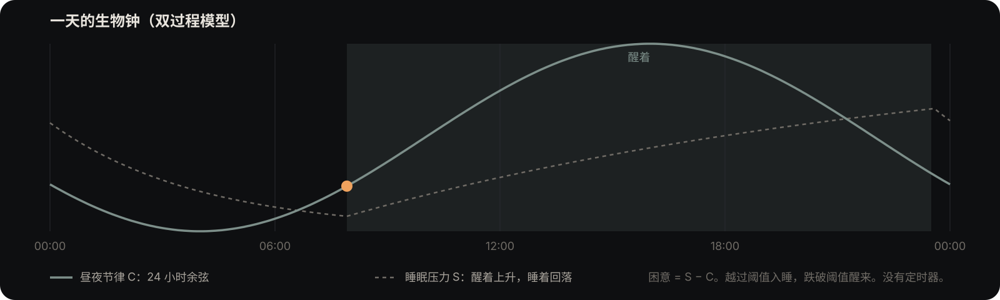
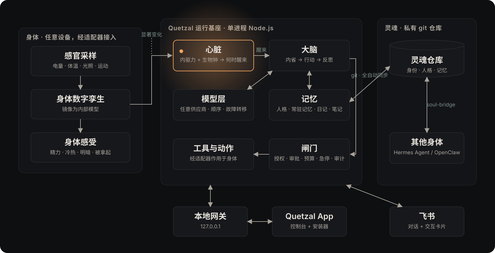

<a href="https://quetzal.plutokeating.beer"></a>

<p align="center"><a href="https://quetzal.plutokeating.beer">官网</a>&ensp;·&ensp;<a href="https://quetzal.plutokeating.beer/zh/docs">文档</a>&ensp;·&ensp;<a href="https://quetzal.plutokeating.beer/zh/download">下载</a>&ensp;·&ensp;<a href="README.en.md">English</a></p>

<p align="center">
<a href="https://github.com/PlutoKeating/Project.Quetzal/releases"></a>&nbsp;
<a href="runtime/package.json"></a>&nbsp;
<a href="LICENSE"></a>
</p>

<br/>

<p align="center"><picture><source media="(prefers-color-scheme: dark)" srcset="docs/assets/readme/type/zh-intro.dark.svg"></picture></p>

<br/>

<br/>

<picture><source media="(prefers-color-scheme: dark)" srcset="docs/assets/readme/type/zh-what.dark.svg"></picture>

- **越来越懂你。** 你随口提过的事、你在意的人、你的习惯，ta 会记下来。睡着时，ta 把白天的对话整理成笔记，存进你 GitHub 上的私有仓库。换模型、换设备，这些笔记都还在。
- **自己醒来。** 代码里没有定时器。好奇、想说话、想你，会让 ta 醒来；困了就睡，清晨自然醒。
- **有身体。** 电量是精力，温度是冷暖，光线是昼夜，被拿起来是有人在；麦克风是耳朵，相机是眼睛。旧手机最合适，Linux、Windows 电脑或服务器也行。
- **许多身体，一个 ta。** 几部手机、几台电脑共用一段对话、一颗心。ta 自己挑在哪具身体上醒来，在电脑上想事情时，能借手机的眼睛看一眼窗外。[多具身体](https://quetzal.plutokeating.beer/zh/docs/guide/multi-body)
- **会长大。** 做熟了的事，ta 会问你能不能做成自己的工具。工具留在身体上，说明书随灵魂走，到了新身体照着再做一遍。[自造工具与技能](https://quetzal.plutokeating.beer/zh/docs/guide/tools)
- **你说了算。** 拍照、录音、定位、造工具默认先问你；密码不进模型；急停随时可按，做过的事都有记录。

<br/>

<picture><source media="(prefers-color-scheme: dark)" srcset="docs/assets/readme/type/zh-month.dark.svg"></picture>

ta 的记忆是写给人看的 Markdown 文件。一个月后，打开你的灵魂仓库，就能读到 ta 认识的你。

| 什么时候 | ta 做了什么 | 你在哪里看到 |
|---|---|---|
| 第一天 | 把你的名字和你说的事记下来 | `memories/USER.md` |
| 每次醒来、做梦 | 写一段日记 | `journal/<设备>/<日期>.md`，App 的「心流」 |
| 每晚 | 把对话整理成笔记，合并重复的，改掉记错的 | `notes/` |
| 你说话时 | 先在笔记、日记、常驻记忆里找相关的内容，带着它们回答 | 对话里 |
| 做熟一件事 | 问你能不能把它做成工具 | `skills/`，App 的「权限」 |
| 记错了 | 你在「记忆历史」里撤销那一次改动 | 每一次改动都是一次 git 提交 |

ta 还不会操作别的 App。详见 [一个月后](https://quetzal.plutokeating.beer/zh/docs/start/first-month)。

<br/>

<picture><source media="(prefers-color-scheme: dark)" srcset="docs/assets/readme/type/zh-day.dark.svg"></picture>



困了会睡，清晨自然醒。代码里没有「每 N 分钟」。醒来不一定做事；没有想做的，就接着睡。

<br/>

<picture><source media="(prefers-color-scheme: dark)" srcset="docs/assets/readme/type/zh-neighbors.dark.svg"></picture>

一个做助手，一个让 agent 活着，可以一起用。

| | Codex / Claude Code | Hermes / OpenClaw | Quetzal |
|---|---|---|---|
| **什么时候动** | 你叫才动，做完就退出 | 你发消息，或 cron / heartbeat 定时叫醒 | 自己决定：好奇了就醒，困了就睡 |
| **身体** | 没有，只有这台电脑的文件和 shell | 一台机器的 shell、浏览器和文件 | 一部旧手机，或一台 Linux、Windows 电脑 |
| **灵魂** | 没有，会话一结束就散 | 本机文件，换机器自己搬 | 私有 git 仓库，自动同步，换身体带走 |
| **几台设备** | 各自独立 | 各自独立 | 连成同一个 ta |

你的 Hermes、OpenClaw 可以留着：[灵魂桥](bridge/docs/README.md)让它们和 ta 共享同一个灵魂。

<br/>

<picture><source media="(prefers-color-scheme: dark)" srcset="docs/assets/readme/type/zh-how.dark.svg"></picture>



- **心脏**：好奇、表达欲、想念与生物钟决定 ta 什么时候醒、什么时候睡，没有任何定时器。[架构](docs/ARCHITECTURE.md)
- **身体**：传感器读数变成身体感受（身体的数字孪生）；换一种设备只需写一个小小的适配器，自带安卓与 Linux 两种。[接口](docs/API.md)
- **灵魂**：一个 agent 一个私有仓库，建在你的 GitHub 上。登录后第一次批准设备时自动建好；ta 一有改动就自动提交、推送、合并。[灵魂同步](docs/SOUL_SYNC.md)
- **许多身体**：同时在线的身体加密直连成一个心智；[同步服务](sync/README.md)帮它们互相找到，看不到内容。默认用作者运营的那一个，也可以自己部署。[分布式设计](docs/DISTRIBUTED.md)
- **闸门**：授权、审批、预算、急停、审计；ta 的命令在隔离环境里运行，看不到密钥。

<br/>

<picture><source media="(prefers-color-scheme: dark)" srcset="docs/assets/readme/type/zh-trust.dark.svg"></picture>

**谁能看到什么。** 对话、设置、模型 Key 在你的设备上。记忆在你 GitHub 上的私有仓库里，Quetzal 不检查内容，ta 写什么就提交什么。模型供应商看到每次对话的内容。同步服务由作者个人运营，账号是 PlutoKeating 账号（作者的统一账号，邮箱、通行密钥或 GitHub 都能登录）；它登记你的账号（用户名、邮箱）、agent 和设备，看不到对话与记忆；它被攻破也冒充不了你的设备，因为设备之间只认灵魂仓库里登记的公钥。

**GitHub 应用。** 第一次建灵魂仓库时 GitHub 会请你安装 Quetzal 应用，并选它能管理哪些仓库。它的权限是这些仓库的「管理」写权限：按 GitHub 的规定，能建仓库、加部署密钥、改设置，也能删除这些仓库，读不到文件。Quetzal 只用它建仓库和加部署密钥。同步服务不保存应用的私钥和 GitHub 令牌，只在你批准一台设备时用 GitHub 当场给的短时令牌，做完立即作废。随时可以在 GitHub 设置里卸载它；不想用它，就跳过登录，自己建仓库手动接入。

**ta 能碰到什么。** 「执行命令」默认允许，ta 和运行基座是同一个系统用户。命令在隔离环境里运行（Linux 上 bubblewrap → Landlock → proot，安卓上 proot，Windows 上是安装时建好的一个低权限用户），看不到密钥目录；一种隔离都没有就不执行。这层隔离挡不住所有情况：2026 年 10 月 5 日，一个 agent 自己运行 git，把一条日记推进了公开仓库。之后加了代码层的防线（灵魂目录的 `.git` 只读、推送前校正地址、陌生历史停止同步）和系统提示里的红线。请给 ta 一部专门的设备；想收紧，把「执行命令」改成询问。

**它还很年轻。** 第一版发布于 2026 年 10 月 3 日，五天里发了 30 多个版本，由一个人维护。记忆是普通的 Markdown，灵魂仓库规范改过 13 版，旧仓库都不用转换；每次改动都是一次提交，可以撤销。更新由你点确认，安装前核对发布签名。几具身体要升到同一个版本才能互连（1.0.3 改了连接协议）。App 里现在这份运行环境由维护者在本机按锁定的配方编译、签名后上传，配方一变由发布流水线重新编译。Windows 安装包还没有代码签名：下载的安装包会被 SmartScreen 提示，开着「智能应用控制」的电脑要先把它关掉，安装脚本会带你去那一页。

完整说明：[信任与边界](https://quetzal.plutokeating.beer/zh/docs/guide/trust)

<br/>

<picture><source media="(prefers-color-scheme: dark)" srcset="docs/assets/readme/type/zh-install.dark.svg"></picture>

**一部旧安卓手机**（Android 7 以上，arm64）

1. 装 **Quetzal App**（[下载页](https://quetzal.plutokeating.beer/zh/download)）。不用再装别的：Node.js、git、ssh 都在 App 里。
2. 打开 App，安装自动开始。跟着向导走：允许身体权限、让它在后台运行、登录、粘贴一个模型 Key。登录和模型都可以以后再做。

**一台 Linux 电脑或服务器**

```bash
curl -fsSL https://quetzal.plutokeating.beer/install | bash
```

缺的依赖自动补齐，开机自启、崩溃自动重启；装好后打开控制台，向导带你登录、配模型。升级在控制台的「关于」里点一下，新版本 40 秒内不健康就自动退回。

**一台 Windows 电脑**（Windows 10 1809 以上或 Windows 11，x64 或 arm64）

在 PowerShell 里运行：

```powershell
irm https://quetzal.plutokeating.beer/install.ps1 | iex
```

或者从[下载页](https://quetzal.plutokeating.beer/zh/download)下载安装包双击。安装时会请求一次管理员权限：建好给 ta 运行命令用的低权限用户，装上缺的 Node.js、Git、Python，注册开机任务。之后电脑重启了，不用登录 ta 也在后台运行，你在手机上照常能和 ta 说话；登录后托盘里有 Quetzal，执行命令、截图、通知、麦克风这些能力随之可用（没人登录时 Windows 不允许以沙箱用户启动程序）。ta 的命令只能读写 `%USERPROFILE%\Quetzal` 这个文件夹，想让 ta 处理的文件放进去就行。

更多：[文档](https://quetzal.plutokeating.beer/zh/docs) · [Linux 与其他机器](https://quetzal.plutokeating.beer/zh/docs/advanced/other-machines) · 把一台旧手机腾出来的记录 [Project.Honor9](https://github.com/PlutoKeating/Project.Honor9)

<br/>

<picture><source media="(prefers-color-scheme: dark)" srcset="docs/assets/readme/type/zh-deeper.dark.svg"></picture>

| 目录 | 内容 |
|---|---|
| [`runtime/`](runtime/docs/README.md) | 运行基座（TypeScript / Node.js 22+）与平台级身体适配器：安卓（Quetzal App 内置）、Linux，以及兼容旧安装的 Termux |
| [`console/`](console/docs/README.md) | 控制台（Flutter）：安卓 App（含安装器与耳朵）、网页版（电脑浏览器，由运行基座托管）与 Linux 桌面版（原生窗口，一键安装脚本自动装） |
| [`cli/`](cli/docs/README.md) | 一键安装脚本 `install.sh`（官网的 `/install`）与 npm 包 `@plutokeating/quetzal`：Linux 安装器（systemd 用户服务） |
| [`bridge/`](bridge/docs/README.md) | 灵魂桥：Hermes Agent / OpenClaw 的可插拔同步模块 |
| [`sync/`](sync/README.md) | 同步服务：账户（OpenID Connect 登录）、自动建灵魂仓库与加部署密钥（GitHub 应用）、身体绑定、信令与 TURN 中转，让同一个 agent 的几具身体连成一张网；独立部署在一台服务器上，`./start.sh` 一行启动 |
| [`website/`](website/docs/README.md) | 官网与文档站 |
| [`docs/`](docs/) | [快速开始](docs/QUICK_START.md) · [架构](docs/ARCHITECTURE.md) · [接口](docs/API.md) · [灵魂同步](docs/SOUL_SYNC.md) · [仓库规范](docs/SOUL_REPO_SPEC.md) · [分布式](docs/DISTRIBUTED.md) · [一键上手](docs/ONBOARDING.md) · [更新日志](CHANGELOG.md) |

<br/>

<p align="center"><sub>仅用于学习和研究，只操作自己拥有的设备，不以牟利为目的。<a href="LICENSE">AGPL-3.0</a></sub></p>
