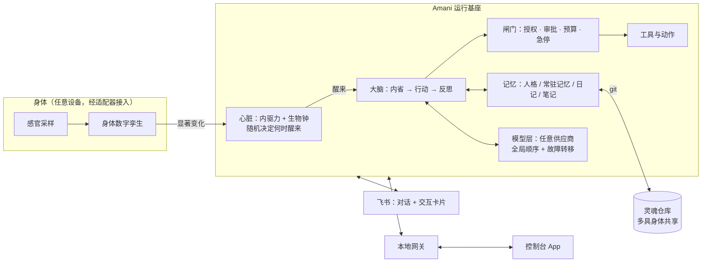

# Project.Amani · 神谷薰

**Amani（神谷薰）** 是一个会自己醒来的智能体。没有人给她排日程：她什么时候醒、醒来做什么，取决于她自己的好奇心、表达欲、想念、没想完的事，以及她的生物钟——困了会睡，睡着会做梦（整理记忆）。

本仓库是 Amani **运行基座的设计与实现**，与具体设备无关。任何能跑 Node.js 的机器都能成为她的"身体"；设备相关的感官与动作通过**身体适配器**接入（例如 [Project.Honor9](https://github.com/PlutoKeating/Project.Honor9) 把她适配到一台荣耀9 手机上）。



## 特点

- **非定时的自主醒来**：内驱力 × 清醒度 → 瞬时醒来率，用非齐次泊松过程的稀疏化抽样决定下一次醒来。代码里没有"每 N 分钟"或"每天几点"。
- **生物钟**：采用睡眠研究中的双过程模型（睡眠压力 S + 昼夜节律 C）。做事越多越累；困了入睡、睡眠中做梦整理记忆、清晨自然醒。
- **身体数字孪生**：把电量、体温、光照、运动等物理采样镜像为内部模型，派生出"精力、冷热、明暗、被拿起"等身体感受，作为她感知自我与世界的接口。
- **多身体共享灵魂**：人格与记忆存放在一个私有 git 仓库，布局与 [Hermes Agent](https://hermes-agent.nousresearch.com/) 兼容；同一个她可以同时住在手机和运行 Hermes 的电脑里。
- **任意模型供应商**：OpenAI 兼容、OpenAI Responses、Anthropic、Google Gemini 四种协议；多供应商、多 Key、全局调用顺序与自动故障转移；Key 本地加密。
- **可控**：能力授权（允许 / 询问 / 禁止）、审批、预算、急停、审计；控制台 App 与飞书交互卡片两种操作方式，全程不需要命令行。

## 仓库结构

```
runtime/   运行基座（TypeScript / Node.js 22+），打包为单文件 dist/main.cjs
console/   控制台 App（Flutter，Android）
hermes/    给 Hermes Agent 的灵魂共享技能（amani-soul）
docs/      架构、API、快速开始
```

## 文档

- [快速开始](docs/QUICK_START.md)
- [运行架构（图文）](docs/ARCHITECTURE.md)
- [接口：网关 API 与身体适配器](docs/API.md)
- 模块文档：[runtime](runtime/docs/README.md) · [console](console/docs/README.md)

## 免责声明

本项目**仅用于学习和研究**，不用于破坏或入侵他人计算机系统，不以牟利为目的。

## 许可证

[GNU Affero General Public License v3.0](LICENSE)
