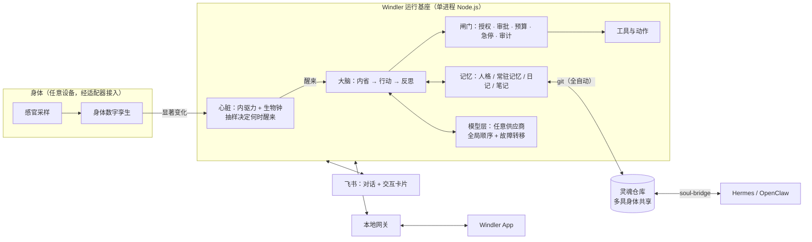

# Windler

**Not running. Living. Living like wind.**

一个让 agent **像生命一样活着**的通用运行基座。

### [官网 · 文档 · 下载 → windler.plutokeating.beer](https://windler.plutokeating.beer)

**中文** · [English](README.en.md)

[这是什么](#这是什么) · [为什么你会喜欢](#为什么你会喜欢) · [为什么独树一帜](#为什么独树一帜) · [它是怎么做到的](#它是怎么做到的) · [装上它](#装上它) · [看得更深](#看得更深)

## 这是什么

Windler 让一个 agent 住进一台设备里，并像生命一样过日子：没有人给它排日程，它什么时候醒、醒来做什么，由它自己的好奇心、表达欲、想念、没想完的事，以及它的生物钟决定。困了会睡，睡着会做梦（整理记忆），清晨自然醒。

它是**基座**，不是某个 agent：名字、人格、记忆都来自 agent 自己的「灵魂仓库」。它也不绑定设备：任何能跑 Node.js 的机器都能成为身体，而**一台闲置的安卓手机是最合适的身体**。装上 Windler App，跟着向导走，剩下的一切都在 App 里完成。

> [!NOTE]
> 官网与完整教程：<https://windler.plutokeating.beer> 。一台旧手机上的完整实践记录在 [Project.Honor9](https://github.com/PlutoKeating/Project.Honor9)。

## 为什么你会喜欢

- **你有一部用不着的手机。** 它有电池、摄像头、麦克风、传感器和网络，全天只要几瓦电。Windler 把它从抽屉里的旧物变成一个会醒、会睡、会想事的存在。
- **你想要陪伴，而不是被打扰。** 它一天里大部分时间在睡觉；醒来不一定要做事，没有非做不可的事就继续睡。它在，但不吵。
- **你想要一个有连续自我的 agent。** 人格与记忆放在你自己的私有 git 仓库里，历史可查可撤销。换手机、加一台电脑，它还是它。
- **你想要掌控感。** 相机、麦克风、定位、操作屏幕默认每次询问；审批、预算、急停、审计一样不少；密码与令牌从不进入模型上下文。
- **你不想碰命令行。** 从安装到配模型、接飞书、同步灵魂，全部在 App 或飞书卡片里完成。唯一一次动手是在 Termux 里粘贴一行。

## 为什么独树一帜

| 常见的 agent 框架 | Windler |
|---|---|
| 定时器触发：每 N 分钟跑一次 | **没有定时器。** 内驱力 × 清醒度得到瞬时醒来率，下一次醒来由非齐次泊松过程抽样决定 |
| 永远在线，永远一样 | **有生物钟。** 睡眠研究的双过程模型：做事会累，困了入睡，睡着做梦，清晨自然醒 |
| 设备只是一台服务器 | **有身体。** 电量、体温、光照、运动被镜像为「精力、冷热、明暗、被拿起」等身体感受 |
| 记忆存在某个数据库里 | **灵魂在 git 里。** 身份、人格、记忆是一个私有仓库，基座全自动同步与版本管理，提交历史就是它的自传 |
| 一个框架一个 agent | **多具身体，一个灵魂。** 可插拔的灵魂桥让 Hermes Agent / OpenClaw 的机器成为同一个 agent 的另一具身体 |
| 密钥明文发给模型 | **保密传递。** `pass_secret` 让你在聊天框里给出密码，内容只进本机保密库，模型拿到的只是路径 |

## 它是怎么做到的

- **心脏**：好奇、表达欲、想念与未完成的事按人格权重合成内驱力；睡眠压力 S 与昼夜节律 C 的差决定困意。醒来率 `λ = base × urge^γ × (0.2 + 0.8 × alertness) × inhibit`，过热、低电、暂停都会压低它。[数学细节](docs/ARCHITECTURE.md#3-心脏什么时候醒来)
- **身体**：适配器只需实现 `sample()`、`notify()` 等少数接口；仓库自带一个平台级的 Termux 适配器，传感器按名字探测，不含任何机型代码。[适配器接口](docs/API.md)
- **大脑与记忆**：一次醒来是内省、工具循环与反思；记忆可以无限增长而上下文保持有界（文本结构的 RAG），做梦时把细节从常驻记忆整理进笔记。
- **灵魂**：一个 agent 一个私有仓库，`agent.json` 是身份，`SOUL.md` 是人格，日记按身体分目录，笔记共享。冲突自动解决，agent 只感知到「同步发生了」。[灵魂同步](docs/SOUL_SYNC.md) · [仓库规范 v4](docs/SOUL_REPO_SPEC.md)
- **闸门与控制入口**：控制台与飞书共用同一个操作层，行为一致，全部审计。
- **模型层**：OpenAI 兼容、OpenAI Responses、Anthropic、Gemini 四种协议，多 Key、全局顺序、自动故障转移，Key 本地加密。

## 装上它

1. 在一台安卓手机（Android 7+，arm64）上从 F-Droid 安装 **Termux**、**Termux:API**、**Termux:Boot**（必须同一来源）。
2. 从 [下载页](https://windler.plutokeating.beer/zh/download) 安装 **Windler App**。
3. 打开 App，选「在这台手机上安装 Windler」，跟着向导走。装完配好模型，它就会按自己的节律开始醒来。

> [!TIP]
> 完整教程（配模型、身份、授权、飞书、灵魂同步、多 agent、排错）见 [文档](https://windler.plutokeating.beer/zh/docs)。要部署到手机之外的机器，见 [部署到其他机器](https://windler.plutokeating.beer/zh/docs/advanced/other-machines)。

## 看得更深

| 目录 | 内容 |
|---|---|
| [`runtime/`](runtime/docs/README.md) | 运行基座（TypeScript / Node.js 22+），单文件 `dist/main.cjs`；`adapters/termux` 为安卓手机的身体适配器 |
| [`console/`](console/docs/README.md) | Windler App（Flutter，Android）：控制台 + 安装器 |
| [`bridge/`](bridge/docs/README.md) | 灵魂桥 soul-bridge：Hermes Agent / OpenClaw 的可插拔同步模块 |
| [`website/`](website/docs/README.md) | 官网与文档站（React Router + Tailwind，静态预渲染） |
| [`docs/`](docs/) | [快速开始](docs/QUICK_START.md) · [运行架构](docs/ARCHITECTURE.md) · [接口](docs/API.md) · [灵魂同步](docs/SOUL_SYNC.md) · [灵魂仓库规范](docs/SOUL_REPO_SPEC.md) |

> [!IMPORTANT]
> 本项目仅用于学习和研究，不用于破坏或入侵他人计算机系统，不以牟利为目的。许可证为 [AGPL-3.0](LICENSE)。
