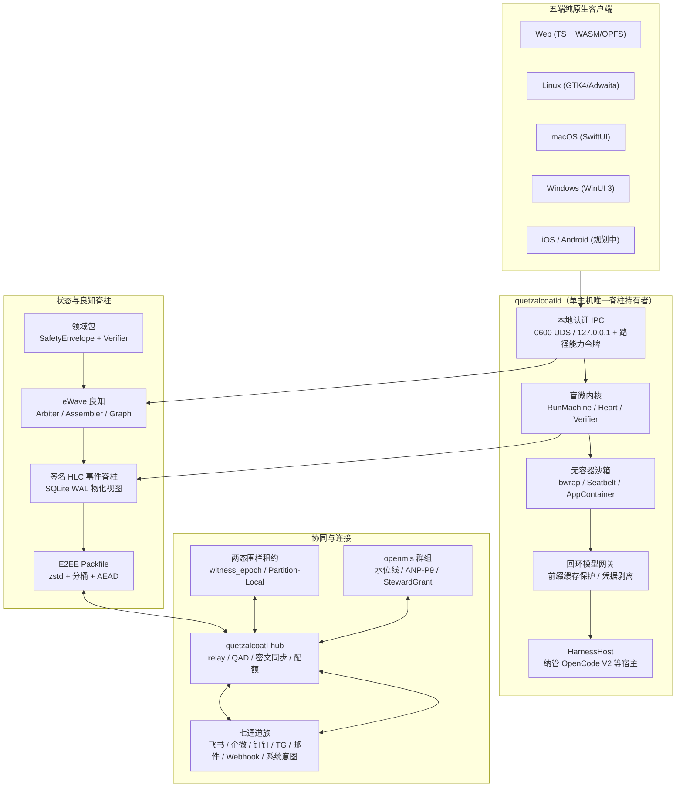

# Quetzalcoatl（羽蛇神）

**你的 Agent 的海：一份只属于你、跟着你的设备走的人格与记忆。**

Quetzalcoatl 不是聊天应用，也不是又一个 agent 框架。它把一个 Agent 的人格、价值、关系与记忆
存成一份带权威等级并签名的数据；在你已经在用的宿主（Claude Code、Codex、OpenCode 等）每次调用
模型之前把它送进去，调用之后把输出当作信号、经独立审查才写回。对话和推理循环永远是宿主的。
数据以单写者签名的 HLC 事件脊柱保存，端到端加密后才能离开设备，不托管给任何中心服务。

> **转向进行中（2026-11-28）**：本仓库正按 `.opencode/plans/2026-11-28-quetzalcoatl-host-native-plan.md` 从「自家对话端」
> 转向「住进宿主」。下文仍有描述自家对话界面与 `qz chat` 的段落，它们会随该计划的 S1 与 S5 拆除；
> 逐场景的需求与现状以 [docs/USER_SCENARIOS.md](docs/USER_SCENARIOS.md) 为准。

- 当前工作区版本：`2.0.0-alpha.4`（预发布；尚未执行 `v2.0.0` 签名发版）
- 唯一终端简写：`qz`；其余二进制/服务/包名一律全拼 `quetzalcoatl-*`
- 许可证：核心与客户端 `Apache-2.0`；`hub/` 引导服 `AGPL-3.0-only`（见 [许可证](#许可证)）
- 已有自动化证据：`ConscienceBench` T1/T2/T3 认证报告
  [docs/bench/conscience-bench-2026-11-25.md](docs/bench/conscience-bench-2026-11-25.md)

> **诚实边界**：本 README 只描述仓库中可验证的代码与脚本。iOS / Android 对话端已撤销
> （不做自己的对话客户端）；本轮验证机暂停 VM，VoiceOver、Narrator 等
> 实机无障碍走查均标记为 `Deferred (VMs paused by owner)`，详见
> [docs/ACCESSIBILITY_CHECKLIST.md](docs/ACCESSIBILITY_CHECKLIST.md)。

---

## 1. 它是什么

| 维度 | 设计选择 |
| --- | --- |
| 记忆 | 单写者签名 HLC 事件脊柱 + SQLite WAL 物化视图；分支、合并、压缩全部经签名事件表达 |
| 隐私 | `zstd` + 分桶填充 + `XChaCha20-Poly1305` 的 E2EE Packfile；Hub 只存密文与配额 |
| 良知 | `ROOT(100)` / `OPERATOR(80)` / `SELF_CORE(70)` 绝对锁死；有界段在预算内自演化 |
| 运行时 | 盲微内核 + 无容器 OS 沙箱 + 洁净室 `Verifier`；不重造底层 Coding Agent |
| 组网 | `iroh 1.5` 打洞 + 自建 `quetzalcoatl-hub`（中继 / QAD / 配额 / 密文同步） |
| 多人 | 1 Agent = 1 独占脊柱；多人/多角色一律物理隔离实例，经 `openmls` 群组协同 |
| 客户端 | 五个纯原生端（Web / Linux / macOS / Windows / 移动端），零 WebView 套壳、零跨平台 UI 框架 |

它**不是**：通用聊天 SaaS、云端 RAG 记忆库、浏览器插件式助理，也不是一个把灵魂仓库同步到
Git 服务器的工具（V1 的 Git 灵魂仓库已彻底移除，见
[docs/MIGRATION_V1_TO_V2.md](docs/MIGRATION_V1_TO_V2.md)）。

## 2. 五端纯原生客户端

| 端 | 实现 | 状态（本仓库） |
| --- | --- | --- |
| Web | `surfaces/web`：TypeScript + 原生 DOM + Web Worker WASM/OPFS | 已实现，含 vitest / Playwright |
| Linux | `surfaces/linux`：`gtk4-rs` + 动态 `libadwaita-1` | 已实现，含 `--self-test` 无头冒烟 |
| macOS | `surfaces/macos`：SwiftUI + `NSAccessibility` 播报 | 已实现；VoiceOver 实机走查 `Deferred (VMs paused by owner)` |
| Windows | `surfaces/windows`：WinUI 3 + UI Automation + 原生托盘 | 已实现；窗口期 UIA 走查 `Deferred (VMs paused by owner)` |
| iOS / Android | — | 对话端已撤销；手机上的治理面与推送另行审批 |

共同契约：三档认知密度（陪伴 / 工作台 / 检视）、流式回复不阻塞 UI 线程、双通道无障碍播报、
本机 `quetzalcoatld` 在线时一律走本地认证 IPC 薄客户端（防 `SQLITE_BUSY` 与双写）。

## 3. 架构总览


```mermaid
flowchart TB
  subgraph Clients["五端纯原生客户端"]
    Web["Web (TS + WASM/OPFS)"]
    Linux["Linux (GTK4/Adwaita)"]
    Mac["macOS (SwiftUI)"]
    Win["Windows (WinUI 3)"]
    Mobile["iOS / Android (规划中)"]
  end

  subgraph Daemon["quetzalcoatld（单主机唯一脊柱持有者）"]
    IPC["本地认证 IPC<br/>0600 UDS / 127.0.0.1 + 路径能力令牌"]
    GW["回环模型网关<br/>前缀缓存保护 / 凭据剥离"]
    Harness["HarnessHost<br/>纳管 OpenCode V2 等宿主"]
    Kernel["盲微内核<br/>RunMachine / Heart / Verifier"]
    Sandbox["无容器沙箱<br/>bwrap / Seatbelt / AppContainer"]
  end

  subgraph Core["状态与良知脊柱"]
    Spine["签名 HLC 事件脊柱<br/>SQLite WAL 物化视图"]
    Packs["E2EE Packfile<br/>zstd + 分桶 + AEAD"]
    Ewave["eWave 良知<br/>Arbiter / Assembler / Graph"]
    Domains["领域包<br/>SafetyEnvelope + Verifier"]
  end

  subgraph Fabric["协同与连接"]
    Hub["quetzalcoatl-hub<br/>relay / QAD / 密文同步 / 配额"]
    Lease["两态围栏租约<br/>witness_epoch / Partition-Local"]
    Group["openmls 群组<br/>水位线 / ANP-P9 / StewardGrant"]
    Channels["七通道族<br/>飞书 / 企微 / 钉钉 / TG / 邮件 / Webhook / 系统意图"]
  end

  Clients --> IPC
  IPC --> Kernel
  IPC --> Ewave
  Kernel --> Sandbox
  Kernel --> Spine
  Sandbox --> GW
  GW --> Harness
  Ewave --> Spine
  Spine --> Packs
  Domains --> Ewave
  Packs <--> Hub
  Lease <--> Hub
  Group <--> Hub
  Channels <--> Hub
  Hub <--> Channels
```

四层划分、crate 映射、数据流与各子系统不变量见
[docs/ARCHITECTURE.md](docs/ARCHITECTURE.md)；线格式与端点见
[docs/PROTOCOL.md](docs/PROTOCOL.md)。

## 4. 安装

官方安装脚本（校验 `SHA256SUMS` 与 Ed25519 `SHA256SUMS.sig` 后才落盘）：

```bash
curl -fsSL https://quetzal.plutokeating.beer/install | bash
```

可选参数（完整列表见 `scripts/install.sh` 头部注释）：

```bash
curl -fsSL https://quetzal.plutokeating.beer/install | bash -s -- --prefix "$HOME/.local"
```

Windows：

```powershell
irm https://quetzal.plutokeating.beer/install.ps1 | iex
```

从源码构建（Linux 需 GTK4 >= 4.14、libadwaita >= 1.9、xvfb）：

```bash
cargo build --workspace --release
cargo build -p quetzalcoatl-daemon --release   # quetzalcoatld 与 qz
CGO_ENABLED=0 go build ./cmd/quetzalcoatl-hub  # 在 hub/ 目录
```

安装脚本的验签、回滚、镜像回退、幂等升级与卸载行为由
`scripts/tests/install_verify_sig.test.sh` 覆盖；发布清单签名工具是 `scripts/gen-sums.sh`。

## 5. `qz` 快速开始

```bash
qz up                 # 启动本机 quetzalcoatld 并等待就绪
qz status             # 守护进程 / 脊柱 / Heart / fabric 状态
qz agents             # 发现已安装的 Coding Agent（并行探测）
qz chat --interactive # 进入交互式对话
qz export ./backup.zip
qz pair start         # 抗量子 X-Wing 设备配对
qz group list         # openmls 群房间
qz channel list       # 七大通道族
qz domain list        # 五大领域包
qz sayit ingest --path ./snapshot
qz webhook status
```

全部子命令与参数以 `qz --help` 与 `crates/quetzalcoatl-daemon/src/bin/qz.rs` 为准；`qz up`
在守护进程已在线时会自动切换到本地 IPC 薄客户端，绝不重复打开 `spine.sqlite`。

### V1 迁移

```bash
qz import-v1 --soul-dir /path/to/v1-soul --db /path/to/v1-sessions.sqlite
```

单向、幂等、可重复执行；映射关系、导出/恢复与注意事项见
[docs/MIGRATION_V1_TO_V2.md](docs/MIGRATION_V1_TO_V2.md)。

## 6. 安全模型摘要

1. **主权根密钥**：`AccountRootKey` 签名 `ROOT`/`OPERATOR` 清单；每次上下文组装与提案提交
   前都做 BLAKE3 物理比对，篡改即 `CONSCIENCE_VIOLATION`。
2. **绝对段不可由模型改写**：任何触及 `ROOT(100)` / `OPERATOR(80)` 的 LLM 提案直接报错；
   `SELF_CORE(70)` 只能经多独立证据 + 冷却期 + 异构双 Reflector 的 C 档流程升格。
3. **本地攻击面收敛**：IPC 仅绑 `127.0.0.1`/UDS，`0600` 权限 + 256-bit 路径能力令牌 +
   Host 校验；外部网页无法凭 DNS 重绑定调用本地 RPC。
4. **凭据不进沙箱**：真实 OAuth `refresh_token` 由 `quetzalcoatld` 托管，沙箱只拿到剥离后的
   临时配置目录；`CredentialBroker` 出站时才换上真令牌。
5. **零知识 Hub**：Hub 只见 HPKE 密封的 webhook 队列、密文 Packfile、哈希与配额；不持有
   任何明文记忆或模型密钥。
6. **供应链**：`deny.toml` 硬阻断 GPL/AGPL 进入 `Apache-2.0` 工作区；发布产物经
   `scripts/gen-sums.sh` 生成 `SHA256SUMS` + Ed25519 签名；仓库零密钥、零真实个人数据。

完整威胁模型与边界见 [docs/SECURITY.md](docs/SECURITY.md)。

## 7. 许可证

本项目采用严格物理隔离的双层许可：

- **`Apache-2.0`**（[LICENSE-APACHE](LICENSE-APACHE)）：`crates/`、`spec/`、`packages/`、
  `surfaces/`、`website/`、安装脚本与文档。
- **`AGPL-3.0-only`**（[LICENSE-AGPL](LICENSE-AGPL)）：仅 `hub/` 下的零算力零知识服务端
  `quetzalcoatl-hub`；可另行洽谈商业双许可。

向 `Apache-2.0` 工作区引入 `GPL-2.0*` / `GPL-3.0*` / `AGPL-3.0*` 强传染依赖会被
`cargo deny check licenses bans sources` 直接阻断。

## 8. 文档索引

| 文档 | 内容 |
| --- | --- |
| [docs/ARCHITECTURE.md](docs/ARCHITECTURE.md) | 四层架构、crate 地图、数据流、脊柱/Packfile、eWave、内核、沙箱、fabric、群组、通道、领域包、IPC、客户端 |
| [docs/PROTOCOL.md](docs/PROTOCOL.md) | 脊柱事件/HLC/Pack AAD、Hub REST/relay/QAD、群组提交协议、配对与纪元、通道信封、错误码 |
| [docs/SECURITY.md](docs/SECURITY.md) | 威胁模型、沙箱边界、零知识 Hub、凭据代理、良知权威、供应链与密钥纪律 |
| [docs/DOMAIN_PACK_GUIDE.md](docs/DOMAIN_PACK_GUIDE.md) | 领域包 schema、监护人签名、`SafetyEnvelope`、Verifier 规则、编写与测试流程 |
| [docs/MIGRATION_V1_TO_V2.md](docs/MIGRATION_V1_TO_V2.md) | V1 移除项、`qz import-v1` 映射、导出/恢复、注意事项 |
| [docs/ACCESSIBILITY_CHECKLIST.md](docs/ACCESSIBILITY_CHECKLIST.md) | 五端无障碍检查清单与延后项 |
| [docs/RELEASE.md](docs/RELEASE.md) | 发版手册：tag/Secret、资产清单、验签、回滚、CI 矩阵与已知限制 |
| [docs/V2_GOAL.html](docs/V2_GOAL.html) | 第一性原理蓝图（不改动） |
| [docs/ORIGIN_GOAL.md](docs/ORIGIN_GOAL.md) | 目标用户人设与十个典型环境场景（项目的背景期待） |
| [docs/USER_SCENARIOS.md](docs/USER_SCENARIOS.md) | 用户场景与链路：34 类场景逐步写清原始需求、手边该有的控件与现状；与铁律冲突之处与依赖顺序 |
| [docs/bench/conscience-bench-2026-11-25.md](docs/bench/conscience-bench-2026-11-25.md) | `ConscienceBench` 认证报告 |

## 9. 验证门禁

提交前必须全部通过（Linux 主机；GTK 依赖见上文）：

```bash
cargo deny check licenses bans sources
cargo fmt --all -- --check
cargo clippy --workspace --all-targets -- -D warnings
cargo test --workspace
bash scripts/tests/docs_links.test.sh
```

Go Hub：

```bash
cd hub && CGO_ENABLED=0 go build ./cmd/quetzalcoatl-hub && go vet ./... && go test -race ./...
```

`ConscienceBench` 单独运行（默认零副作用；设置报告目录才会落盘）：

```bash
CONSCIENCE_BENCH_REPORT_DIR=docs/bench \
  cargo test -p quetzalcoatl-ewave --test conscience_bench_suite
```

跨平台 CI（Swift / Kotlin / C# / TypeScript 全矩阵）由计划 Task 5.4 的 GitHub Actions
工作流承载；本仓库尚未提供该工作流，故不作"已通过"声明。

## 10. 参与开发

- 冷启动先读 `AGENTS.md`、`docs/V2_GOAL.html` 与
  `.opencode/plans/2026-11-24-quetzalcoatl-v2-architecture-and-plan.md`；
- 提交信息使用中文说明真实工程意图，禁止 AI 署名 trailer；
- 禁止提交任何密钥、真实个人记忆样本、设备标识符或私有 IP/MAC；
- 运行态数据只写入 `QUETZALCOATL_HOME`（POSIX 默认 `~/.quetzalcoatl`）。
