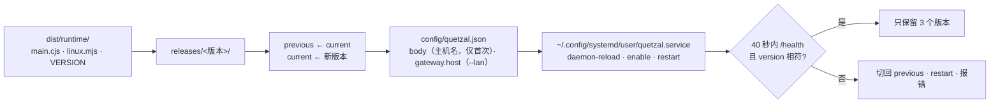

# cli 模块地图

整体原理见仓库根目录 [docs/ARCHITECTURE.md](../../docs/ARCHITECTURE.md) 第 10 节「进程与部署契约」。本文列出每个文件的职责。

```
src/
├── cli.ts        命令行入口：参数解析、子命令分发、status 输出、run（前台运行 current/main.cjs）、uninstall
├── install.ts    安装与升级流程：内置运行基座 → releases/<版本>/ → 切换 current → 缺省配置 → systemd → 健康检查 → 失败回滚 → 清理旧版本
├── layout.ts     家目录布局（与 Android 安装器一致）：putRelease / switchTo / rollback / prune，配置读写，身体名字缺省
├── service.ts    systemd 用户服务：单元文件文本（纯函数）、available / install / restart / stop / uninstall / logs、enable-linger
└── health.ts     /health 轮询（版本必须等于刚装的版本，防止读到旧进程）
test/
├── layout.test.ts   放入、切换、回滚、清理；配置只改安装需要的键
└── service.test.ts  单元文件内容
tool/bundle-runtime.sh   构建 ../runtime 并把 main.cjs、linux.mjs、VERSION 放进 dist/runtime/（校验版本号一致）
```

## 安装流程



与 Android 安装器（`console/assets/install/install.sh`）逐步对应：软件包一步换成 Node 版本检查（22.13+），runit 换成 systemd 用户服务，日志由 journald 接管。

## 设备上的文件

```
~/quetzal/releases/<版本>/main.cjs、linux.mjs
~/quetzal/current → releases/<版本>           运行中的版本
~/quetzal/previous → releases/<版本>          上一版
~/.config/systemd/user/quetzal.service        ExecStart=<安装时的 node> --enable-source-maps ~/quetzal/current/main.cjs
                                              Environment=QUETZAL_HOME、QUETZAL_ADAPTER=~/quetzal/current/linux.mjs
```

`QUETZAL_HOME` 可用 `--home` 或环境变量改；单元文件里写的是绝对路径。`ExecStart` 用安装时运行 npx 的那个 node（`process.execPath`），nvm 之类的用户级 Node 也能被服务找到。

## 约定

- 不碰运行基座的其他配置：模型、授权、飞书、灵魂仓库都在控制台里；这里只写 `body`（没有时）与 `gateway.host`（显式 `--lan` / `--no-lan` 时）。
- 服务不依赖 npx 缓存：运行的文件全部在 `~/quetzal/releases/` 里，npx 缓存被清掉也不影响。
- 没有 systemd 用户实例时不自造守护者：放好文件后提示 `quetzal run`，由容器编排或部署者自己的守护者负责重启。
- 令牌永不打印；配对码由适配器通知与服务日志承载。
