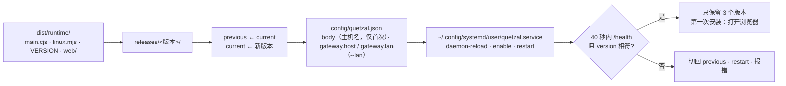

# cli 模块地图

整体原理见仓库根目录 [docs/ARCHITECTURE.md](../../docs/ARCHITECTURE.md) 第 10 节「进程与部署契约」。本文列出每个文件的职责。

```
src/
├── cli.ts        命令行入口：参数解析、子命令分发、status 输出（含局域网地址与证书指纹）、open（xdg-open 打开网页控制台；第一次安装后自动）、run（前台运行 current/main.cjs）、uninstall；Windows 上分派到 windows.ts（status / open / run / logs / start / stop / restart / rollback / uninstall）
├── install.ts    安装与升级流程：内置运行基座与网页控制台 → releases/<版本>/ → 切换 current → 网状层原生组件 → 缺省配置 → systemd → 健康检查 → 失败回滚 → 清理旧版本
├── mesh.ts       网状层的原生组件：识别平台（linux-<x64|arm64>-<gnu|musl>），按内置锁定文件下载核对 sha512 到 ~/.quetzal/mesh-modules/<版本>/，版本目录的 node_modules 为相对链接；失败不影响安装
├── lan.ts        局域网访问：开放判定（与运行基座一致）、https 地址（本机非回环 IPv4 + gateway.lanPort）、证书指纹（读 secrets/gateway-tls.crt）
├── layout.ts     家目录布局（与 Android 安装器一致）：putRelease（文件与整个子目录）/ switchTo / rollback / prune，配置读写，身体名字缺省
├── service.ts    systemd 用户服务：单元文件文本（纯函数；路径按 systemd 规则引用，% 与 $ 转义）、available / install / restart / stop / uninstall / logs、enable-linger
├── health.ts     /health 轮询（版本必须等于刚装的版本，防止读到旧进程）
└── windows.ts    Windows 的运维：ROOT（%LOCALAPPDATA%\Quetzal）布局、current.txt / previous.txt 指针读写与回滚、控制台位置、计划任务状态与启停（state\quit）、日志末尾与跟随、打开卸载程序
test/
├── windows.test.ts       Windows 的指针、回滚、控制台位置、schtasks CSV、日志末尾
├── windows-deps.test.ts  依赖锁的格式与官方地址、下载核对
├── windows-setup.test.ts 安装包构建的纯函数、装到用户机器上的脚本只含 ASCII、setup 辅助脚本的 PowerShell 测试（test/windows/setup.tests.ps1）
├── install-ps1.test.ts   install.ps1 与源文件一致；PowerShell 里的 Ed25519（RFC 8032 向量、发版签名格式）与升级日志（test/windows/install.tests.ps1）
├── winget.test.ts        winget 清单只取验过签名的哈希
├── layout.test.ts   放入、切换、回滚、清理；配置只改安装需要的键
├── service.test.ts  单元文件内容与路径转义
├── lan.test.ts      局域网开放判定（旧配置 host 0.0.0.0、lan、--lan / --no-lan）、地址、证书指纹
└── install-sh.test.ts  install.sh 的函数（去掉最后一行 main 后 source 进 bash）：发版清单验签与哈希（测试密钥对）、sha256 核对、sh / 桌面项 / crontab 转义、ELF 依赖检查
tool/bundle-runtime.sh   构建 ../runtime 并把 main.cjs、linux.mjs、VERSION、网状层组件的锁定文件与安装程序（mesh-modules.lock.json、install-mesh-modules.mjs）放进 dist/runtime/（校验版本号一致）；调用 ../console/tool/build-web.sh 把网页控制台放进 dist/runtime/web/
install.ps1              Windows 一行安装（irm https://quetzal.plutokeating.beer/install.ps1 | iex），由 windows/install.src.ps1 生成的纯 ASCII 文件；官网构建时复制为 /install.ps1
windows/
├── deps.lock.json       内嵌的 Node.js / Git / Python 官方安装包（x64、arm64）与 NSIS：地址、SHA-256、大小、哈希出处
├── fetch-deps.mjs       按锁定文件下载并核对（只用 Node 内置模块）
├── build-setup.mjs      暂存各部分并调用 makensis
├── install.src.ps1      install.ps1 的源文件（中文直接写）；gen-install-ps1.mjs 生成纯 ASCII 的 install.ps1
├── setup/quetzal.nsi    NSIS 安装与卸载（中英双语）
├── setup/quetzal-setup.ps1    以用户身份：找进程与关闭、查找依赖、一次提权、切换指针、启动、健康检查与回滚
├── setup/quetzal-machine.ps1  以管理员一次：静默安装缺的依赖、srt-win install、注册两个计划任务；卸载时反过来
├── setup/quetzal-supervise.ps1、quetzal.cmd   装进 ROOT\bin：计划任务的启动器与命令行入口
└── winget/              winget 清单模板与生成脚本
install.sh               一键安装脚本（curl -fsSL https://quetzal.plutokeating.beer/install | bash）：依赖 → nvm/Node（nvm 安装脚本核对固定 sha256，unofficial-builds 核对 SHASUMS256）→ 本包 → 守护（systemd 或自带守护循环）→ 桌面项（原生控制台验发版签名与 sha256）；不进 npm 包，官网构建时复制为 /install。见 README「一键安装脚本」
```

## 安装流程



与 Android 安装器（`console/assets/install/install.sh`）逐步对应：软件包一步换成 Node 版本检查（22.13+），runit 换成 systemd 用户服务，日志由 journald 接管。

## 设备上的文件

```
~/.quetzal/releases/<版本>/main.cjs、linux.mjs、web/   （web/ 为网页控制台，网关托管 current/web/）
（一键安装脚本另有 ~/.quetzal/npm/、~/.local/bin/quetzal、quetzal-console、quetzal.desktop 等，见 README）
~/.quetzal/current → releases/<版本>           运行中的版本
~/.quetzal/previous → releases/<版本>          上一版
~/.quetzal/mesh-modules/<版本>/node_modules/   网状层的原生组件（各版本共用；releases/<版本>/node_modules 是指过来的相对链接）
~/.config/systemd/user/quetzal.service        ExecStart=<安装时的 node> --enable-source-maps ~/.quetzal/current/main.cjs
                                              Environment=QUETZAL_HOME、QUETZAL_ADAPTER=~/.quetzal/current/linux.mjs
```

`QUETZAL_HOME` 可用 `--home` 或环境变量改；单元文件里写的是绝对路径。`ExecStart` 用安装时运行 npx 的那个 node（`process.execPath`），nvm 之类的用户级 Node 也能被服务找到。

## 约定

- 不碰运行基座的其他配置：模型、授权、飞书、灵魂仓库都在控制台里；这里只写 `body`（没有时）与 `gateway.host` + `gateway.lan`（显式 `--lan` 写 `0.0.0.0` 与 `true`，`--no-lan` 写 `127.0.0.1` 与 `false`）。局域网上运行基座只开 HTTPS / WSS（`gateway.lanPort`，默认 7789，自签名证书），明文 HTTP 只在 127.0.0.1；判定规则与运行基座一致（`lan` 为真或 `host` 不是回环地址）。
- 服务不依赖 npx 缓存：运行的文件全部在 `~/.quetzal/releases/` 里，npx 缓存被清掉也不影响。
- 没有 systemd 用户实例时不自造守护者：放好文件后提示 `quetzal run`，由容器编排或部署者自己的守护者负责重启。
- 令牌永不打印；配对码（连同证书短指纹）由适配器通知与服务日志承载。`status` 打印局域网的 https 地址（本机非回环的 IPv4，`os.networkInterfaces()`）与证书指纹（读 `secrets/gateway-tls.crt` 算 SHA-256（DER），证书是公开的；运行基座第一次启动后才有），给人在 App 与浏览器里核对。本机浏览器的登录由网关自己判定（`GET /auth/local`），命令行不经手令牌。
