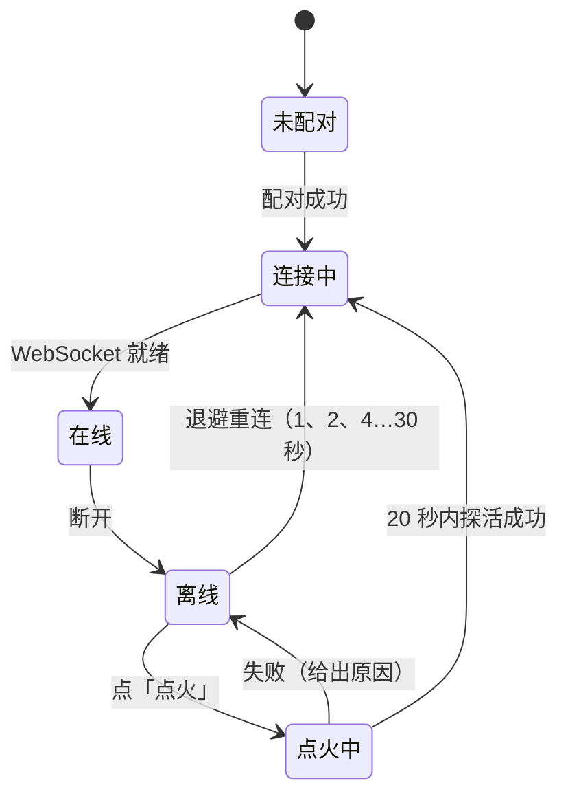
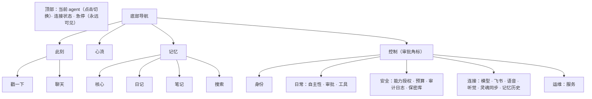

# 控制台：结构、用例与 UI/UX

## 1. 代码结构

```
lib/
├── main.dart          主题、外壳模式（按宽度：手机 / 桌面）、手机外壳（顶部连接状态 + 急停，底部 4 个 Tab）
├── api.dart           网关客户端：WebSocket RPC、推送事件、断线重连退避、探活、配对、本机登录（网页版）、点火
├── igniter.dart       Termux 桥：RUN_COMMAND 执行、三件套检测与版本、打开应用、电池优化 / 自启动管理页（安卓）
├── hearing.dart       听觉桥：启停原生的麦克风前台服务（HearingService，MethodChannel quetzal/hearing）、权限、服务事件；跟随基座 status.hearing.listening，只对本机的 agent（安卓；网页版只跟着状态显示）
├── installer.dart     安装器：127.0.0.1 临时 HTTP 服务（提供 assets/install/install.sh 与 assets/runtime/*，接收脚本回报的进度、令牌）、探测 Termux 是否接受指令（安卓）
├── updater.dart       App 自身的更新（安卓）：GitHub `releases/latest`（正式版；每次打开界面——启动与从后台回来——都问一次，正在检查时不重复）→ 比版本号 → 下载 `quetzal-<版本>-android-arm64.apk` 到缓存目录（进度）→ 核对 SHA256SUMS → 需要时带去「允许安装未知应用」→ 交给系统安装器（MethodChannel quetzal/updater）；记下「正在从哪个版本更新」，新 App 启动后直接进向导升级运行基座
├── widgets.dart       外壳模式（ShellScope）、页面框架（PageFrame：手机是 Scaffold + AppBar，桌面是主区里的一行标题）、面板宽度（PaneWidth）、底部面板 / 对话框（showSheet）、光团、驱动力条、连接状态、急停、离线横幅、分节卡片、提示
├── markdown.dart      完整 Markdown 渲染：GFM（表格、任务列表、代码块…）、LaTeX 公式（行内与独立）、Mermaid 图（platform/mermaid.dart）；
│                      RawOrMarkdown（工具输出：像 Markdown 才渲染，否则原样等宽）、plainPreview（一行预览去标记）
├── process.dart       一轮的执行过程与气泡（对话页与醒来记录页共用）：LiveTurn（进行中的一轮，快照 + 事件折叠）、ProcessView（工具卡片，点开看参数与结果）、Bubble
├── platform/          平台差异（条件导入，`*_io.dart` 安卓与 Linux 桌面 / `*_web.dart` 网页）：caps（hasBody 只有安卓为真；isDesktop：Linux / macOS / Windows 原生版，连本机网关免配对码）、net（HTTP：dart:io / XMLHttpRequest）、
│                      location（页面来源、URL #片段、标题）、fonts（网页版加载自带的中文子集）、mermaid（安卓 WebView / 网页 iframe，同一份 assets/mermaid/view.html，postMessage 桥；Linux 桌面版没有 WebView，退化为显示源码）
├── shell/
│   ├── nav.dart       桌面外壳的位置（区 / 子项 / 条目），网页版与 URL 的 #片段互相同步
│   └── desktop.dart   桌面外壳：导航栏 · 列表栏 · 主区（嵌套 Navigator）· 她此刻
└── pages/
    ├── pairing.dart   连接一个 agent：探活与配对；本机没有运行基座时的「在这台手机上安装」入口（安卓）；网页版先试本机登录
    ├── setup.dart     安装向导（也是升级 / 修复入口）：三件套 → 授权 → 在 Termux 粘贴一行开启外部调用 → 安装（分步进度）→ 保活引导（安卓）
    ├── agents.dart    多 agent 切换、身份资料、记忆历史与身体列表
    ├── home.dart      此刻：PresenceHead（光团 + 状态）、ThoughtLine、InnerSection、BodySection、poke；手机首页与桌面「她此刻」面板共用
    ├── sessions.dart  会话：SessionsList（列表、新建、重命名、归档与找回；进行中的会话带标记）与手机页
    ├── chat.dart      对话：ChatView（一个会话的完整内容：实时过程、附件、发送方式、保密输入、贴底与「新消息」；桌面 Enter 发送）与手机页
    ├── wake.dart      醒来记录（只读）：WakeView 与手机页；WakeWatch 跟踪进行中的醒来
    ├── flow.dart      心流：FlowFeed（时间线加载与筛选）、手机页（可展开的卡片）、FlowList（桌面列表栏）、FlowDistribution（醒来分布）
    ├── memory.dart    记忆：MemoryCore / JournalList / NotesList / MemorySearch / MarkdownDoc；手机 4 个 Tab，桌面索引在列表栏、内容在主区
    ├── control.dart   控制：controlItems（菜单清单，手机 Tab 页与桌面列表栏共用）、自主性、审批（ApprovalCard）、授权、预算、审计、保密库、飞书、语音、灵魂同步、服务
    ├── tools.dart     工具：她自己造的工具（定义、源码、技能文档）与灵魂仓库里的技能文档；停用 / 启用、删除
    ├── hearing.dart   听觉：开关、灵敏度、会话窗口、识别语言、麦克风权限；此刻在不在听、最近听到的话
    ├── providers.dart 模型（供应商、Key、模型选择、全局顺序）
    └── about.dart     关于（三种形态共用）：简介与链接、版本（控制台 / 运行基座 / GitHub 最新发布）、检查更新、升级——安卓用 updater.dart 的 AppUpdateSection 与安装向导，Linux 桌面版 / 网页版调网关 selfUpdate 让运行基座后台重跑安装脚本，桌面版升完可「重新打开控制台」
tool/
├── bundle-runtime.sh  把运行基座内置进 APK（assets/runtime/）
├── build-web.sh       网页版构建（build/web）
├── build-linux.sh     Linux 桌面版构建（build/quetzal-<版本>-linux-<架构>-console.tar.gz）
└── gen-cjk-font.py    网页版的中文字体子集（web/fonts/）
web/                   网页版的壳：index.html、manifest、图标、fonts/
linux/                 Linux 桌面版的运行壳（flutter create 生成，只改了：BINARY_NAME quetzal-console、APPLICATION_ID xyz.quetzal.console（GTK 以它作 Wayland app_id 与 X11 WM_CLASS，桌面项按它配图标）、窗口标题 Quetzal、1280×800、背景 #202020、图标名 xyz.quetzal.console）
```

状态管理只用 `ChangeNotifier`（全局 `api`、跟踪进行中醒来的 `wakes`、桌面位置 `nav`）+ `ListenableBuilder`，不引入额外框架。**同一份页面在两种外壳里都成立**：二级页面一律用 `PageFrame`，手机上它是 Scaffold + AppBar，桌面主区里它是一行标题；弹出面板一律用 `showSheet`，手机是底部面板，桌面是居中对话框；气泡与过程卡片按 `PaneWidth`（所在面板的宽度）而不是窗口宽度限制自己。

**凡是她写的文字都按完整 Markdown 渲染**：对话（她的与对方的气泡、中途叙述）、心流里的日记 / 回复、记忆页的人格 / 常驻记忆条目 / 未完成的念头 / 日记 / 笔记 / 搜索结果、首页她想分享的一句话（点开）、审批的理由、醒来记录页。
工具的参数与结果、审计日志的输出用 `RawOrMarkdown`：像 Markdown（笔记、说明）才渲染，shell 输出与 JSON 原样等宽显示。只能放一行的地方（会话列表、笔记摘要、首页折叠的一句话、通知条）用 `plainPreview` 去掉标记。



## 2. 信息架构与两种外壳

### 2.1 手机外壳（窄屏）



- **按"你想做什么"分页**：想看她 → 此刻；想知道她经历了什么 → 心流；想了解她是谁 → 记忆；想管她 → 控制。
- **由感性到理性**：此刻页没有技术术语；心流卡片默认只显示标题，展开才有理由、日记、工具调用；控制页从日常调节到运维逐级变技术。
- **高频操作一步到位**：戳一下、聊天、急停、审批。**危险操作二次确认**：解除急停、删除记忆条目、放弃模型修改、删除供应商、重启、重新配对。

### 2.2 桌面外壳（宽屏 ≥ 900：电脑浏览器、平板横屏）

手机上你一次只能**进入**一件事；电脑的横屏让你可以**陪着**她：一边说话，一边看见她此刻的样子和她正在做的事。所以桌面外壳不是把手机页面放大，而是从头排布的四栏（列表栏与「她此刻」的宽度可拖动，记在本机：列表 200–480、她此刻 260–520；主区至少 420——窗口不够宽时先把两侧压到最小，再收起「她此刻」，此时导航栏多一个「此刻」按钮点开对话框；窗口从窄变宽时，手机外壳推入的页面全部收起，桌面外壳按 `nav` 记录的位置接着显示——手机聊天页打开时就会把会话写进 `nav`）：

```
┌──────┬──────────────┬──────────────────────────────────────┬──────────────────┐
│ 导航  │ 列表栏        │ 主区                                  │ 她此刻            │
│ 72   │ 280          │ 自适应，内容最宽 820 居中               │ 320              │
│      │              │                                      │                  │
│ ● 薰  │ 会话          │ 新的对话                      新会话   │      （光团）      │
│      │  · 新的对话    │                                      │       醒着        │
│ 对话  │  · 关于名字    │   ┌ 对方的话 ┐                        │  「她想分享的一句话」│
│ 心流  │  · …         │   过程卡片 · 她中途说的话                │    [ 戳一下 ]     │
│ 记忆  │              │   她的回复（完整 Markdown）             │                  │
│ 控制  │              │                                      │ 正在发生          │
│      │              │                                      │  ◐ 她在做梦…      │
│      │              │                                      │ 待你决定          │
│      │              │                                      │  take_photo [批准] │
│      │              │   [在听 ·]                            │ 内在              │
│ ✋    │              │   📎 说点什么（Enter 发送）        ↑    │  好奇 ▬▬▬▬  52%   │
│ 在线  │              │                                      │ 身体  76% · 负载   │
└──────┴──────────────┴──────────────────────────────────────┴──────────────────┘
```

| 栏 | 内容 | 为什么在这里 |
|---|---|---|
| 导航栏 | 当前 agent（头像，点击切换）、对话 / 心流 / 记忆 / 控制（审批角标）、急停、连接状态 | 四个区与手机的四个 Tab 一一对应，手机的「此刻」变成右栏常驻；急停永远可见 |
| 列表栏 | 这一区的索引：会话列表 / 经历列表（筛选、分布）/ 记忆目录（核心、日记按天、笔记目录树、搜索）/ 控制菜单（分组） | 电脑的典型用法是「扫一眼列表，读其中一条」：列表与内容同时在场，不来回跳 |
| 主区 | 一个会话 / 一次醒来的完整过程 / 一篇日记或笔记 / 一页设置；二级页面（审计详情、工具详情、一次提交）在主区内推入与返回（嵌套 Navigator） | 内容最宽 820 居中，长文可读；对话的全部行为（实时过程、插话分段、附件、保密输入、贴底与「新消息」、她切会话时跟过去）与手机完全一致，另加 Enter 发送、Shift+Enter 换行 |
| 她此刻 | 光团与状态、「在听」、她想分享的一句话、正在进行的醒来（点开在主区看）、待审批（原地批准 / 拒绝）、戳一下、内在、身体 | **永远在那里，不随主区变化**——这就是陪伴感的来源：你在看日记或改模型时，她醒了、在想事情、请求批准，余光就能看见 |

设计原则（与官网设计系统「夜里的灯」同源）：

- **一盏灯**：整个界面只有一处持续在动的东西——右栏的光团；琥珀色只给「活着」的瞬间（光团、有人在说话、进行中的醒来、待审批、选中项），不做大面积底色。
- **线而不是框**：四栏之间只有一根低对比的竖线，不叠卡片；中性灰 `#202020` 底，与 App 一致。
- **列表栏是索引，不是内容**：一行一条，小字时间与种类；展开、详情、过程都在主区。
- **位置可收藏**：网页版的 URL 片段记录位置（`#/chat/<会话>`、`#/flow/<经历>`、`#/memory/notes/<笔记>`、`#/control/providers`），浏览器前进后退可用；标题随 agent 名字与所在区变化。
- **缺省不空白**：进对话打开最近的会话（没有就新建）；进心流选中最新一条经历；进控制停在身份页。
- **第一次连上之前不建页面**：主区等网关在线后再放页面（页面在 initState 里就会向她要数据），之后断线不拆，重连后页面自己补。

## 3. 页面设计

| 页面 | 内容 |
|---|---|
| 对话 | 每个会话一个页面，右上角新建会话、打开会话列表。**环境声音**（`role: ambient`，耳朵听到并识别的话）居中、小字、斜体显示，带耳朵图标：它既不是对方发的消息也不是她的话。耳朵在听时，识别中的文字（`hearing` 事件的 `partial`）流式显示在最底部，识别完成后等记录里出现这条消息；她判断不是对她说的（`ignored`）就自动消失，回应了就保留。输入框上方有一行聆听状态：在听（灰）→ 有人在说话 / 听到了，正在听清（主题色，带小转圈），让对方知道她在听。**环境输入**按通道显示：子 agent 的报告、她写的上下文摘要（`session_compact`）、切会话时的交接（`session_new`）以 Markdown 展开并带标题；她用 `session_new` 切会话时，打开的会话页收到 `session.switch` 自动切到新会话，回复落进去后再刷新。**插话分段**：对方插话或打断（文字或环境声音）到达的那一刻，之前的过程（工具卡片、中途的话）截断在插话消息上方，她接下来的过程从插话消息下面重新开出；已入库的回复同样按过程里的 `steer` 标记分段显示。界面以后端为准：打开、断线重连、从后台切回、每轮结束时，从后端取回记录与进行中的快照重建，实时进展增量更新，所以切到后台再回来卡片不会丢。她的回复按完整 Markdown 渲染：表格、公式、Mermaid 图；执行过程（工具卡片与中间叙述）随回复保存。附件：回形针一次最多 20 个文件，上传进度与移除，图片缩略图可放大，文档显示为文件卡片。她工作时，发送按钮右侧出现小三角：默认插话，可改为排队或打断，发送按钮图标随之变化，用户消息下标注方式。打开即在最底部；在底部时新内容自动跟随；上滑后右下角出现「回到底部」，有新内容时变亮并显示「新消息」。**保密输入**：她调用 `pass_secret` 时，输入框上方出现提示条（用途、要哪几项、已收到几项），此后每条消息都是一项保密值：不显示在对话里，只提示回执；输入框默认遮挡，点眼睛显示（多行的值如私钥需要显示后再粘贴）；「完成 / 重填 / 取消」按钮与发回结束口令等价；状态来自 `secret` 推送，重建界面时从 `secrets.pending` 取回 |
| 会话 | 按最近更新排序，显示条数、最后一句、是否进行中；新建、重命名、归档；「已归档」里找回 |
| 醒来记录（只读） | 她自己醒来思考、做梦（以及某一次对话）的完整过程，显示的内容与对话页一致：缘起（因为 / 想）、工具卡片（点开看参数摘要、完整参数与结果）、中途说的话、正在写的文字，结束后接上日记、心情与想分享的一句话。**没有输入框**：这是她自己的时间，只能看，不能插话；底部一行说明想说话去「聊天」。进行中的一轮从 `sessions.live` 快照重建，随 `activity` 事件增量更新，结束后自动接上时间线里保存的记录（`detail.process`）；断线重连、从后台切回都会重建。入口：首页与心流页顶部「她醒着，在想事情… / 她在做梦…」；心流里每条记录展开后的「完整过程」 |
| 控制 · 语音 | Azure 语音服务：密钥（只显示末四位）、区域或端点、音色（可从列表选择）、风格、语速、音调、音量、输出格式；试听。她也可以用 voice_config 自己修改 |
| 控制 · 听觉 | **App 是这具身体的耳朵**（第一次让 App 承担身体的一部分：Android 9 起只有前台服务能常驻拿麦克风，Termux:API 的录音只能定长录文件、切片会丢字，所以耳朵放在 App 里）。原生 `HearingService`：`VOICE_COMMUNICATION` 音源（通话路径，系统在这条路径上做声学回声消除）+ 系统 `AcousticEchoCanceler` / `NoiseSuppressor` / `AutomaticGainControl`，WebRTC VAD（android-vad，MIT，JitPack）逐 20ms 帧断句（停顿 1.5 秒算说完，前置 300ms，单段最长 120 秒），一段话开始就打开到本机网关 `/hear?stream=1` 的分块 POST，边采集边送 PCM（不经过 Flutter，App 退到后台照常），基座流式识别；通知栏常驻「Quetzal 在听」。页面：开关（`setHearing`）、灵敏度（迟钝 / 适中 / 灵敏 → VAD 模式）、会话窗口与最短字数、识别语言、麦克风权限引导；此刻在不在听（没在听的原因来自基座：未开启、急停、Azure 未配置、电量或温度）、最近一句。App 只在基座 `status.hearing.listening` 为真且 agent 在本机（127.0.0.1）时开麦克风，参数变化自动重启服务。**她的声音也由这个服务播放**：耳朵一开就向基座登记为播放器（`player.set`），基座推送 `speak`，服务从 `/media/<文件名>` 取合成语音，MediaCodec 解码后用 `AudioTrack`（`USAGE_VOICE_COMMUNICATION`）播放，回声消除器以它为参考把她自己的声音从麦克风里减掉——「收听音轨 = 麦克风音轨 − 扬声器音轨」；播放期间检测到持续 400ms 人声就是插嘴，本地立即停播并回报（`player.done`，带打断它的那句话的标识），状态行在她说话时显示「她在说话（可以直接插嘴）」。录音不保存。 |
| 控制 · 工具 | 她自己造的工具（`tool_write`）：名字、描述、能力类别、运行方式、超时、缺的依赖、是否停用；点开看参数 schema、源码（等宽）与技能文档 SKILL.md（Markdown）；开关停用 / 启用；删除时可选连技能文档一起删。灵魂仓库里有文档而本机没有实现的技能单列。**只看不编**：改代码由她自己来，技能文档的变更在「记忆历史」里可撤销 |
| 子 agent | 她派出的子 agent 的进展与「醒来记录」同一套只读界面（`origin` 为 `agent`）：首页与心流顶部出现「她派出的子 agent 在工作…」，点开看完整过程；完成后心流里的「子 agent」条目带报告 |
| 此刻 | 呼吸光团（睡着暗且慢，醒着亮，思考时出现环绕粒子，急停变红）；状态一句话；听觉开着时状态下方有一行克制的「在听」（有人说话的瞬间亮成主题色，耳朵没开时显示「耳朵没开」）；她想分享的一句话（由她用 share_thought 维护，不是机器状态；折叠三行，点开看完整 Markdown）；她正在思考 / 做梦时的只读入口；「戳一下」「聊天」（首屏，位于「内在」卡片上方）；驱动力、清醒度、困意条；醒来率与抑制原因；身体读数 Chip |
| 心流 | 筛选：分布 / 全部 / 思考 / 梦 / 对话 / 入睡 / 醒来 / 审批；进行中的醒来置顶；时间线卡片可展开：理由、对方的话与她的回复（气泡）、日记（Markdown）、心情、工具卡片（与对话页相同，点开看完整参数与结果）、「完整过程」进入只读的醒来记录页；「分布」视图：按小时的醒来次数柱状图与间隔统计，用于检验节律"均匀而不规则" |
| 记忆 | 核心：人格（Markdown 折叠预览，查看全文，全屏编辑）、MEMORY 与 USER 条目（Markdown，带容量条，点条目编辑或删除）、未完成的念头；日记（按天、含其他身体，Markdown）；笔记（Markdown）；搜索（结果 Markdown） |
| 控制 · 自主性 | 活跃度滑块、暂停自主、性格参数滑块 |
| 控制 · 模型 | 参考 GoGoGo 管理后台：统计卡（供应商 / 加密 Key / 已配置模型）、供应商搜索、可展开的供应商卡片（地址与协议、启用、Key 列表只显示末四位、模型勾选与搜索、「仅看已选」、刷新目录 / 从接口获取 / 自定义模型、逐个测试连通）、全局模型顺序（拖动排序、设为内省模型）、底部保存栏（有未保存修改 / 已同步，放弃 / 保存） |
| 控制 · 飞书 | 状态、启用开关、一键接入（在飞书中打开，或用另一台手机扫码）、手动填写凭据、菜单配置提示 |
| 控制 · 灵魂同步 | 本机状态、立即同步、显示部署公钥、填写仓库地址并接入、让 Hermes 接入的说明 |
| 控制 · 保密库 | 你通过保密输入交给她的值：名字、说明、时间、来源通道与大小，不显示内容；删除（二次确认） |
| 控制 · 审批 / 审计 | 审批：理由（Markdown）与参数（JSON）；审计日志：列表一行预览，点开看完整参数与输出 |
| 控制 · 服务 | 连接、版本、身体、系统资源、可用模型、App 内置的运行基座版本；「Quetzal App」一节（安卓）：当前版本、检查新版本、新版本的大小与「下载并安装」（下载进度 → 核对 → 系统安装器；首次要在系统设置里允许 Quetzal 安装应用，从设置页回来自动接着装）、发布说明、失败时去下载页；点火、升级 / 重装（进安装向导）、重启、重新配对。网页版没有点火与升级（那是安卓安装器的事，Linux 上再运行一次 `npx @plutokeating/quetzal` 即升级） |
| 安装向导 | 五步卡片：① 三件套（版本检测、下载链接）② 授权 RUN_COMMAND（系统弹窗）③ 在 Termux 粘贴一行开启外部调用（复制并打开 Termux；「检测」让 Termux 回连本机 HTTP 服务确认）④ 安装 / 升级（六个子步骤的进度、失败时显示脚本日志尾部与重试）⑤ 保活引导（忽略电池优化、电池优化名单、厂商自启动管理、打开一次 Termux:Boot）。安装完成时脚本把网关令牌交给控制台，自动连接，不需要配对码。App 升级后内置版本与运行中的不同时，外壳顶部出现「升级」横幅；App 自身有新版时（GitHub 最新正式版比运行中的 App 新）出现「Quetzal App 有新版本 X」横幅，「更新」进服务页，可关掉（本次运行内） |

视觉：Material 3，种子色取当前 agent 的主题色（默认 `#F0A35E`，与官网设计系统的琥珀 accent 一致），默认深色；暗色模式下主色（按钮、进度条）直接用 agent 的主题色、其上文字用设计系统的 accent-fg `#1A120A`，而不是 M3 从种子推导的淡色；暗色背景固定为中性灰 `#202020`（RGB 32,32,32），各层容器为同一灰阶，不随主题色偏色；光团是主题色提高饱和度与亮度后的发光体（集中高光、压暗边缘、外层光晕；睡着时略沉、思考时更亮、急停变红）；动效表达状态、少用文字；光团用 `RepaintBoundary` 隔离重绘。

## 4. 用户用例闭环

每个闭环都满足：触发 → 可见 → 可控 → 可回滚 → 留痕。

| # | 用例 | 流程 |
|---|---|---|
| U1 | 首次引导（本机） | 打开 App →「在这台手机上安装 Quetzal」→ 向导：装三件套 → 授权 → 在 Termux 粘贴一行 → 安装（几分钟）→ 自动连接 → 保活引导 → 进入此刻页配置模型 |
| U1b | 连接别处的 agent | 填网关地址 → 自动探活（找不到就「点火」）→ 申请配对码 → 系统通知里看到配对码 → 输入 → 进入此刻页 |
| U2 | 配置模型 | 控制 → 模型 → 添加供应商 → 添加 Key → 勾选模型 → 保存 → 测试 → 排序 → 她开始按自己的节律醒来（审计记录保存操作） |
| U3 | 日常旁观 | 此刻页看状态 → 心流里展开最近的醒来 → 记忆里看她记下了什么 |
| U4 | 她主动找你 | 表达欲或想念升高 → 醒来并决定找你 → 系统通知 + 飞书消息 → 你在飞书或控制台回复 → 驱动力回落，对话进入记忆 |
| U5 | 你找她 | 聊天：直接说话（她睡着会被叫醒）；戳一下：只推动她的内在状态，要不要回应由她决定 |
| U6 | 审批 | 某类能力设为「询问」→ 她想用时产生审批 → 控制 Tab 角标 + 飞书卡片 → 批准或拒绝 → 结果写入时间线与审计 |
| U7 | 调节节律 | 觉得她太吵或太安静 → 调活跃度 / 暂停自主 / 性格参数 → 心流「分布」视图对比前后 |
| U8 | 急停与恢复 | 顶部急停 → 一切行动冻结 → 查看心流与审计 → 修正授权或记忆 → 解除急停（二次确认） |
| U9 | 离线与点火 | 离线横幅 →「点火」→ Termux 启动服务 → 自动重连；失败时给出原因（未装 Termux、未授权、未开启外部调用） |
| U10 | 安全模式与回滚 | 反复崩溃 → 安全模式横幅 + 飞书通知 → 查看服务页 →「升级 / 重装」重新安装内置版本（安装脚本健康检查失败自动切回上一版） |
| U21 | 升级 | 外壳横幅「Quetzal App 有新版本 X」（或服务页「检查新版本」）→「更新」→ 服务页「下载并安装」→ 下载、核对 SHA256 →（首次：系统设置里允许 Quetzal 安装应用，回来点「安装」）→ 系统安装器装好 → 打开新 App → 连上后自动进向导第 4 步（没自动进时也有横幅「App 内置的运行基座是 X，正在运行的是 Y」→「升级」）→ 新版本启动、自检通过 → 记忆与配置原样保留。装不了 GitHub 时「去下载页」手动下载 APK，之后的步骤相同 |
| U11 | 修改记忆 | 记忆页编辑或删除条目 → 她的日记里写入「有人改了我的记忆」→ 她下次醒来知道 |
| U12 | 预算触顶 | 用量接近上限 → 醒来率被压到 5% → 预算页查看并调整上限 |
| U13 | 飞书接入 | 控制 → 飞书 → 开始 → 在飞书中确认 → 自动绑定 → 飞书单聊收到「此刻」卡片 |
| U14 | 共享灵魂 | 灵魂同步页 → 显示公钥并添加到仓库 → 填地址接入 → 人格与记忆在各身体间全自动同步 |
| U15 | 接入 Hermes / OpenClaw | 灵魂同步页复制现成的一句话 → 发给那台机器上的 agent → 它自行安装 soul-bridge → 在 GitHub 添加它给出的部署公钥 → 全自动同步，随时可拔出 |
| U16 | 多 agent | 点顶栏名字 → 连接新的 agent（网关地址 + 配对）→ 一键切换，界面称呼与主题色随之变化 |
| U17 | 身份 | 控制 → 身份 → 名字、代词、简介、主题色 → 保存后所有身体同步 |
| U18 | 记忆历史 | 控制 → 记忆历史 → 查看每次变更来自哪具身体、差异 → 必要时撤销 |
| U19 | 看她自己在做什么 | 首页光团出现粒子 / 心流顶部出现「她醒着，在想事情…」→ 点开只读的醒来记录页 → 工具卡片与文字实时更新 → 结束后自动接上日记 → 想说话回首页「聊天」（不能在她自己的时间里插话） |
| U22 | 用声音和她说话 | 控制 → 语音 填好 Azure → 控制 → 听觉 → 授权麦克风 → 开启 → 通知栏「Quetzal 在听」→ 对着手机说话 → 会话里出现环境声音 → 她判断是不是对她说的：回应（文字，可能同时念出来）或沉默 → 心流里「听见」记录没有回应的话 → 预算里的电量 / 温度限制与急停会自动停听 |
| U23 | 她造了一个工具 | 她在对话或醒来时用 `tool_write` 沉淀流程 → 心流「工具」记录 → 控制 → 工具里看定义、源码与技能文档 → 不放心就停用或删除 → 技能文档随灵魂同步，别的身体按文档自己实现 |
| U24 | 她改了自己的名字 | 她用 `edit_identity` → 顶栏称呼与主题色随 `state` 推送立即变化 → 心流「身份」记录 → 身份页里能看到她自选的颜色 |
| U25 | Linux 上第一次打开 | `npx @plutokeating/quetzal` 装好 → 浏览器自动打开 `http://127.0.0.1:7788/` → 页面向网关要令牌（`/auth/local`，同一台机器免配对码）→ 进入桌面外壳：对话区自动打开最近的会话（没有就新建）→ 控制 → 模型配置 → 她开始按自己的节律醒来；右栏「她此刻」始终可见 |
| U20 | 给她密钥 | 她需要令牌 / 密码 → 在对话里说明并发起保密输入 → 输入框上方出现提示条 → 每项发一条（遮挡输入，不进入对话）→ 点「完成」→ 存入保密库，她只拿到路径 → 控制 → 保密库可查看与删除 |
