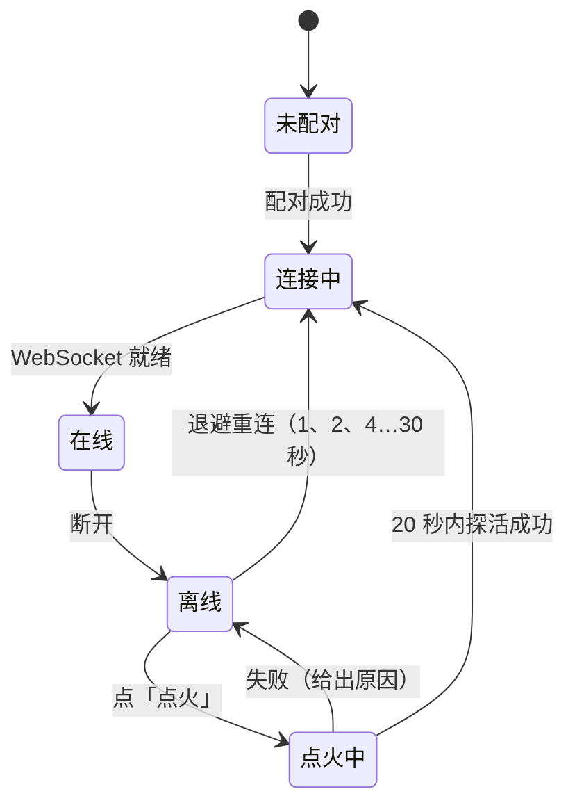
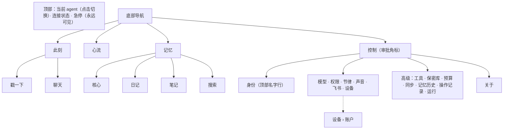

# 控制台：结构、用例与 UI/UX

## 1. 代码结构

```
lib/
├── main.dart          主题、外壳模式（按宽度：手机 / 桌面）、手机外壳（顶部连接状态 + 急停，底部 4 个 Tab）；App 更新后运行基座落后时在后台自动重启成内置版本（不进向导，失败才给「重试」）
├── api.dart           网关客户端（连接档案 Profile 带钉住的证书指纹 fp；加密配对 pairInfo / pairFinish）：WebSocket RPC（连上后第一条消息认证，旧版运行基座退回 ?token=）、推送事件、断线重连退避、探活、配对、本机登录（网页版）、点火；HTTP 令牌放请求头 X-Quetzal-Token
├── pins.dart          加密连接：网关证书指纹的钉住与配对时的捕获（Pins）、配对证明（PBKDF2，后台 isolate）、网关地址的写法（只填地址时别的机器用 https:7789）、旧的明文局域网档案的识别
├── links.dart         打开外部链接的唯一入口：只放行 https（http 只限本机回环地址）
├── igniter.dart       运行基座桥（MethodChannel quetzal/runtime）：App 内置运行基座的启动 / 重启 / 停止、状态、网关令牌、身体权限、电池优化 / 自启动管理页（安卓）
├── hearing.dart       听觉桥：启停原生的麦克风前台服务（HearingService，MethodChannel quetzal/hearing）、权限、服务事件；跟随基座 status.hearing.listening，只对本机的 agent（安卓；网页版只跟着状态显示）
├── installer.dart     安装器：重启 App 内置的运行基座 → 等 /health（第一次要解开运行环境，最长 180 秒）→ 从家目录读网关令牌，经 /health 与一次带令牌的 RPC 核对才算完成；端口上已有不是本 App 启动的运行基座（旧版 Termux 安装）时不再启动第二个，提示迁移
├── updater.dart       App 自身的更新（安卓）：先问官网镜像源 `quetzal.plutokeating.beer/api/releases/latest`（资产地址已改写为官网 `/dl/` 镜像，GitHub 连不上的网络也能用），失败退回 GitHub `releases/latest`（正式版；每次打开界面——启动与从后台回来——都问一次，正在检查时不重复）→ 比版本号 → 下载 `quetzal-<版本>-android-arm64.apk`（名字须合白名单）到缓存目录（进度）→ 用内置发布公钥核对 SHA256SUMS.sig、按 SHA256SUMS 核对 APK（缺任何一样都拒绝）→ 原生核对 APK 的签名证书与当前 App 一致 → 需要时带去「允许安装未知应用」→ 交给系统安装器（MethodChannel quetzal/updater）；记下「正在从哪个版本更新」；新 App 带着新版运行基座，装好后由 `MY_PACKAGE_REPLACED` 广播（或打开 App 时）重新启动
├── widgets.dart       外壳模式（ShellScope）、页面框架（PageFrame：手机是 Scaffold + AppBar，桌面是主区里的一行标题）、面板宽度（PaneWidth）、底部面板 / 对话框（showSheet）、光团、驱动力条、连接状态、急停、离线横幅、分节卡片、提示
├── markdown.dart      完整 Markdown 渲染：GFM（表格、任务列表、代码块…）、LaTeX 公式（行内与独立）、Mermaid 图（platform/mermaid.dart）；
│                      RawOrMarkdown（工具输出：像 Markdown 才渲染，否则原样等宽）、plainPreview（一行预览去标记）
├── process.dart       一轮的执行过程与气泡（对话页与醒来记录页共用）：LiveTurn（进行中的一轮，快照 + 事件折叠）、ProcessView（工具卡片，点开看参数与结果）、Bubble
├── platform/          平台差异（条件导入，`*_io.dart` 安卓与 Linux 桌面 / `*_web.dart` 网页）：caps（hasBody 只有安卓为真；isDesktop：Linux / macOS / Windows 原生版，连本机网关免配对码）、net（HTTP 与 WebSocket：dart:io / XMLHttpRequest）、pin（证书钉住：原生平台的 HttpOverrides，网页版什么都不做）、tray（桌面版右上角的托盘图标，以及换新版本：每分钟与运行基座重新连上时检查自己的可执行文件还是不是 console/current 那一个，不是了——窗口没开就以 --replace --background 悄悄换上新版本，窗口开着就在外壳顶部提示「新版本已装好 · 重新打开」；代表后台的运行基座：运行基座连得上就显示，连不上超过 20 秒收起，与控制台窗口开没开无关；菜单为打开 Quetzal（没有窗口就打开，有就提到最前）、急停 · 本机、急停 · 全部设备、退出（网关 quit：停掉后台服务，整个 Quetzal 退出）；控制台是单实例（linux/runner/my_application.cc：再次启动只把激活转给已在运行的那个，--background 只起托盘不开窗口，--replace 接管旧实例），登录桌面时由自启动项以 --background 拉起，关窗只是隐藏窗口；tray_manager 0.5.3 + window_manager，底层 libayatana-appindicator3，Linux 上单击图标就是弹出菜单，不调 Linux 不支持的 setToolTip；网页版空实现）、
│                      location（页面来源、URL #片段、标题）、fonts（网页版加载自带的中文子集）、mermaid（安卓 WebView / 网页 iframe，同一份 assets/mermaid/view.html，postMessage 桥；Linux 桌面版没有 WebView，退化为显示源码）
├── shell/
│   ├── nav.dart       桌面外壳的位置（区 / 子项 / 条目），网页版与 URL 的 #片段互相同步
│   └── desktop.dart   桌面外壳：导航栏 · 列表栏 · 主区（嵌套 Navigator）· 她此刻
└── pages/
    ├── pairing.dart   连接一个 agent：探活与配对（加密连接先取 /pair/info、显示证书指纹给人核对，再提交配对证明）；旧的明文局域网档案提示重新配对；安卓上本机没有运行基座而 App 内置了它时直接进安装向导；网页版先试本机登录
    ├── setup.dart     安装向导（也是升级 / 修复入口）：一次只展开一步——安卓上：安装（打开即开始）→ 权限（装好自动弹系统请求）→ 后台运行（能检测已允许）→ 登录（设备码，申请到就打开浏览器）→ 模型；电脑上（Linux 桌面版、网页版）只有登录与模型，第一次连上还没有模型时外壳打开一次（每个连接一次）；登录与后台运行可跳过；升级模式只有第一步，完成自动返回
    ├── agents.dart    多 agent 切换、身份资料（名字、代词、简介、语言、颜色；标识符不在界面上改）、记忆历史
    ├── home.dart      此刻：PresenceHead（光团 + 状态）、ModelNudge（还没有模型时唯一的入口）、ThoughtLine、InnerSection、BodySection、poke；手机首页与桌面「她此刻」面板共用
    ├── sessions.dart  会话：SessionsList（列表、新建、重命名、归档与找回；进行中的会话带标记）与手机页
    ├── chat.dart      对话：ChatView（一个会话的完整内容：实时过程、附件、发送方式、保密输入、贴底与「新消息」；桌面 Enter 发送）与手机页
    ├── wake.dart      醒来记录（只读）：WakeView 与手机页；WakeWatch 跟踪进行中的醒来
    ├── flow.dart      心流：FlowFeed（时间线加载与筛选）、手机页（可展开的卡片）、FlowList（桌面列表栏）、FlowDistribution（醒来分布）
    ├── memory.dart    记忆：MemoryCore / JournalList / NotesList / MemorySearch / MarkdownDoc；手机 4 个 Tab，桌面索引在列表栏、内容在主区
    ├── control.dart   控制：controlItems（菜单清单，手机 Tab 页与桌面列表栏共用；group：head 身份 · main 首屏 · end 高级与关于 · more 收进「高级」· hidden 从别的页进入）、controlItem（按 id 找页，旧 id approvals / hearing 映射到权限 / 声音）、MorePage（高级）、节律、权限（ApprovalCard 与能力授权）、预算、操作记录、保密库、飞书、同步（灵魂仓库、同步服务地址、心跳优先级）、运行（含命令沙箱 status.sandbox，none 时提醒）
    ├── account.dart   账户（从「设备」进入）：控制台登录（码、链接、二维码，申请到就打开浏览器），之后分四页——概览（agent 与设备、移除、删除 agent）、添加设备（输入码、核对、批准或拒绝）、已登录（退出）、设置（退出管理、删除账户）
    ├── mesh.dart      设备：账户入口、登录（设备码绑定，signInDevice 申请到码就打开浏览器；DeviceCodeView 显示核对表情、码、链接、二维码，向导与账户页共用）、设备列表（直连 / 中转、往返时间、心跳在哪、公钥变了时的「信任」）、这台设备退出登录
    ├── tools.dart     工具：她自己造的工具（定义、源码、技能文档）与灵魂仓库里的技能文档；停用 / 启用、删除
    ├── sound.dart     声音：她的声音（只要 Azure 密钥，区域由运行基座自动找出；音色、试听；区域与自定义端点收在「更多」，只发改过的）与听你说话（开关、灵敏度、麦克风权限、此刻在不在听）；语速音调、会话窗口、识别语言等由她自己用 voice_config / hearing_config 调
    ├── providers.dart 模型：ProvidersPage（默认）只有已接上的供应商一行一个，与「选供应商 + 粘贴 Key + 接上」（网关 providers.quick 自动挑模型、试通、排好）；ProvidersEditor（右上角「编辑」）是完整管理：多个 Key、手选模型、自定义供应商、全局顺序、轻量任务模型
    └── about.dart     关于（三种形态共用）：简介与链接，一张「版本」卡片（当前版本一行 + 此刻唯一的状态或动作：已是最新 / 升级到 x / 进度 / 重新打开）——安卓用 updater.dart 的 appUpdater 与安装向导，「最新版」先问官网的发布接口（已按 npm 上运行基座的版本封顶），不通时直连 GitHub 的发布列表并自己按 npm 封顶（updater.dart 的 directLatest）；Linux 桌面版 / 网页版调网关 selfUpdate（带上要升到的版本）让运行基座后台重跑安装脚本（桌面版装完自动换上新控制台，不等人点「重新打开」）、每 3 秒查 selfUpdateStatus（失败、卡住、跑完版本没变都说明原因并可重试），桌面版升完点「重新打开」（等新进程启动后才退出旧的）
tool/
├── android-runtime/   App 内置的运行环境（只装一个 App）：versions.env（termux-packages 的锁定提交、包名、要编的包、打进 jniLibs 的可执行文件白名单）、
│                      build-packages.sh（Docker 里以 App 的前缀从源码编 Node.js、git、openssh、proot 及依赖）、pack.sh（依赖闭包 → jniLibs/lib*.so + 原生资源 runtime-env/{rootfs.tar,manifest.json}）
├── bundle-runtime.sh  把运行基座内置进 APK（assets/runtime/：main.cjs、android.mjs、VERSION）
├── build-web.sh       网页版构建（build/web）
├── build-linux.sh     Linux 桌面版构建（build/quetzal-<版本>-linux-<架构>-console.tar.gz）
└── gen-cjk-font.py    网页版的中文字体子集（web/fonts/）
web/                   网页版的壳：index.html、manifest、图标、fonts/
android/app/src/main/kotlin/xyz/quetzal/console/
├── MainActivity.kt    Flutter 桥：运行基座（quetzal/runtime）、听觉（quetzal/hearing）、App 自身更新（quetzal/updater）
├── RuntimeService.kt  运行基座的前台服务（解开运行环境、复制运行基座、写设备配置、启动 node、退避重启、唤醒锁）与 BootReceiver（开机、App 升级后自启）
├── BodyServer.kt      身体接口：127.0.0.1 随机端口 + 256 位令牌（写进 QUETZAL_HOME/secrets/body.json），电池、传感器、通知、拍照、录音、定位、振动、手电、剪贴板、播放
├── Rootfs.kt          解开 rootfs.tar（GNU tar；路径限定在目标目录内）、在前缀里建指向 nativeLibraryDir/lib*.so 的链接、$PREFIX/bin/sh → /system/bin/sh；删目录一律用不跟随符号链接的 deleteTree（旧版本运行基座目录里的 node_modules 链接指向网状层组件，跟随链接删会把它们删光）；发现 node_modules 被删空就重新解压
└── HearingService.kt  耳朵：麦克风前台服务
linux/                 Linux 桌面版的运行壳（flutter create 生成，只改了：BINARY_NAME quetzal-console、APPLICATION_ID xyz.quetzal.console（GTK 以它作 Wayland app_id 与 X11 WM_CLASS，桌面项按它配图标）、窗口标题 Quetzal、1280×800、背景 #202020、图标名 xyz.quetzal.console）
```

状态管理只用 `ChangeNotifier`（全局 `api`、跟踪进行中醒来的 `wakes`、桌面位置 `nav`）+ `ListenableBuilder`，不引入额外框架。**同一份页面在两种外壳里都成立**：二级页面一律用 `PageFrame`，手机上它是 Scaffold + AppBar，桌面主区里它是一行标题；弹出面板一律用 `showSheet`，手机是底部面板，桌面是居中对话框；气泡与过程卡片按 `PaneWidth`（所在面板的宽度）而不是窗口宽度限制自己。

**凡是她写的文字都按完整 Markdown 渲染**：对话（她的与对方的气泡、中途叙述）、心流里的日记 / 回复、记忆页的人格 / 常驻记忆条目 / 未完成的念头 / 日记 / 笔记 / 搜索结果、首页她想分享的一句话（点开）、审批的理由、醒来记录页。
工具的参数与结果、审计日志的输出用 `RawOrMarkdown`：像 Markdown（笔记、说明）才渲染，shell 输出与 JSON 原样等宽显示。只能放一行的地方（会话列表、笔记摘要、首页折叠的一句话、通知条）用 `plainPreview` 去掉标记。



## 2. 信息架构与两种外壳

### 2.1 手机外壳（窄屏）



- **按"你想做什么"分页**：想看她 → 此刻；想知道她经历了什么 → 心流；想了解她是谁 → 记忆；想管她 → 控制。
- **由感性到理性**：此刻页没有技术术语；心流卡片默认只显示标题，展开才有理由、日记、工具调用；控制首屏只放常用的六项，偏技术、偶尔才看的都收进「高级」。
- **不贴说明书**：一页最多一句必要的话，选项本身就是说明；看不懂的参数不给用户调，交给她自己（见 [USER_JOURNEY.md](USER_JOURNEY.md)）。
- **高频操作一步到位**：戳一下、聊天、急停、审批（「她此刻」与「权限」页）。**危险操作二次确认**：解除急停、删除记忆条目、放弃模型修改、删除供应商、重启、重新配对。

### 2.2 桌面外壳（宽屏 ≥ 900：电脑浏览器、平板横屏）

手机上你一次只能**进入**一件事；电脑的横屏让你可以**陪着**她：一边说话，一边看见她此刻的样子和她正在做的事。所以桌面外壳不是把手机页面放大，而是从头排布的四栏（列表栏与「她此刻」的宽度可拖动，记在本机：列表 200–480、她此刻 260–520；主区至少 420——窗口不够宽时先把两侧压到最小，再收起「她此刻」，此时导航栏多一个「此刻」按钮点开对话框；窗口从窄变宽时，手机外壳推入的页面全部收起，桌面外壳按 `nav` 记录的位置接着显示——手机聊天页打开时就会把会话写进 `nav`）：

```
┌──────┬──────────────┬──────────────────────────────────────┬──────────────────┐
│ 导航  │ 列表栏        │ 主区                                  │ 她此刻            │
│ 72   │ 280          │ 自适应，内容最宽 820 居中               │ 320              │
│      │              │                                      │                  │
│ ● 薰  │ 会话          │ 新的对话                      新会话   │      （光团）      │
│      │  · 新的对话    │                                      │       醒着        │
│ 对话  │  · 关于名字    │   ┌ 对方的话 ┐                        │  「她想分享的一句话」│
│ 心流  │  · …         │   过程卡片 · 她中途说的话                │    [ 戳一下 ]     │
│ 记忆  │              │   她的回复（完整 Markdown）             │                  │
│ 控制  │              │                                      │ 正在发生          │
│      │              │                                      │  ◐ 她在做梦…      │
│      │              │                                      │ 待你决定          │
│      │              │                                      │  take_photo [批准] │
│      │              │   [在听 ·]                            │ 内在              │
│ ✋    │              │   📎 说点什么（Enter 发送）        ↑    │  好奇 ▬▬▬▬  52%   │
│ 在线  │              │                                      │ 身体  76% · 负载   │
└──────┴──────────────┴──────────────────────────────────────┴──────────────────┘
```

| 栏 | 内容 | 为什么在这里 |
|---|---|---|
| 导航栏 | 当前 agent（头像，点击切换）、对话 / 心流 / 记忆 / 控制（审批角标）、急停、连接状态 | 四个区与手机的四个 Tab 一一对应，手机的「此刻」变成右栏常驻；急停永远可见 |
| 列表栏 | 这一区的索引：会话列表 / 经历列表（筛选、分布）/ 记忆目录（核心、日记按天、笔记目录树、搜索）/ 控制菜单（分组） | 电脑的典型用法是「扫一眼列表，读其中一条」：列表与内容同时在场，不来回跳 |
| 主区 | 一个会话 / 一次醒来的完整过程 / 一篇日记或笔记 / 一页设置；二级页面（审计详情、工具详情、一次提交）在主区内推入与返回（嵌套 Navigator） | 内容最宽 820 居中，长文可读；对话的全部行为（实时过程、插话分段、附件、保密输入、贴底与「新消息」、她切会话时跟过去）与手机完全一致，另加 Enter 发送、Shift+Enter 换行 |
| 她此刻 | 光团与状态、「在听」、她想分享的一句话、正在进行的醒来（点开在主区看）、待审批（原地批准 / 拒绝）、戳一下、内在、身体 | **永远在那里，不随主区变化**——这就是陪伴感的来源：你在看日记或改模型时，她醒了、在想事情、请求批准，余光就能看见 |

设计原则（与官网设计系统「夜里的灯」同源）：

- **一盏灯**：整个界面只有一处持续在动的东西——右栏的光团；琥珀色只给「活着」的瞬间（光团、有人在说话、进行中的醒来、待审批、选中项），不做大面积底色。
- **线而不是框**：四栏之间只有一根低对比的竖线，不叠卡片；中性灰 `#202020` 底，与 App 一致。
- **列表栏是索引，不是内容**：一行一条，小字时间与种类；展开、详情、过程都在主区。
- **位置可收藏**：网页版的 URL 片段记录位置（`#/chat/<会话>`、`#/flow/<经历>`、`#/memory/notes/<笔记>`、`#/control/providers`），浏览器前进后退可用；标题随 agent 名字与所在区变化。
- **缺省不空白**：进对话打开最近的会话（没有就新建）；进心流选中最新一条经历；进控制停在身份页。
- **第一次连上之前不建页面**：主区等网关在线后再放页面（页面在 initState 里就会向她要数据），之后断线不拆，重连后页面自己补。

## 3. 页面设计

| 页面 | 内容 |
|---|---|
| 对话 | 每个会话一个页面，右上角新建会话、打开会话列表。**环境声音**（`role: ambient`，耳朵听到并识别的话）居中、小字、斜体显示，带耳朵图标：它既不是对方发的消息也不是她的话。耳朵在听时，识别中的文字（`hearing` 事件的 `partial`）流式显示在最底部，识别完成后等记录里出现这条消息；她判断不是对她说的（`ignored`）就自动消失，回应了就保留。输入框上方有一行聆听状态：在听（灰）→ 有人在说话 / 听到了，正在听清（主题色，带小转圈），让对方知道她在听。**环境输入**按通道显示：子 agent 的报告、她写的上下文摘要（`session_compact`）、切会话时的交接（`session_new`）以 Markdown 展开并带标题；她用 `session_new` 切会话时，打开的会话页收到 `session.switch` 自动切到新会话，回复落进去后再刷新。**插话分段**：对方插话或打断（文字或环境声音）到达的那一刻，之前的过程（工具卡片、中途的话）截断在插话消息上方，她接下来的过程从插话消息下面重新开出；已入库的回复同样按过程里的 `steer` 标记分段显示。界面以后端为准：打开、断线重连、从后台切回、每轮结束时，从后端取回记录与进行中的快照重建，实时进展增量更新，所以切到后台再回来卡片不会丢。她的回复按完整 Markdown 渲染：表格、公式、Mermaid 图；执行过程（工具卡片与中间叙述）随回复保存。附件：回形针一次最多 20 个文件，上传进度与移除，图片缩略图可放大，文档显示为文件卡片。她工作时，发送按钮右侧出现小三角：默认插话，可改为排队或打断，发送按钮图标随之变化，用户消息下标注方式。打开即在最底部；在底部时新内容自动跟随；上滑后右下角出现「回到底部」，有新内容时变亮并显示「新消息」。**保密输入**：她调用 `pass_secret` 时，输入框上方出现提示条（用途、要哪几项、已收到几项），此后每条消息都是一项保密值：不显示在对话里，只提示回执；输入框默认遮挡，点眼睛显示（多行的值如私钥需要显示后再粘贴）；「完成 / 重填 / 取消」按钮与发回结束口令等价；状态来自 `secret` 推送，重建界面时从 `secrets.pending` 取回 |
| 会话 | 按最近更新排序，显示条数、最后一句、是否进行中；新建、重命名、归档；「已归档」里找回 |
| 醒来记录（只读） | 她自己醒来思考、做梦（以及某一次对话）的完整过程，显示的内容与对话页一致：缘起（因为 / 想）、工具卡片（点开看参数摘要、完整参数与结果）、中途说的话、正在写的文字，结束后接上日记、心情与想分享的一句话。**没有输入框**：这是她自己的时间，只能看，不能插话；底部一行说明想说话去「聊天」。进行中的一轮从 `sessions.live` 快照重建，随 `activity` 事件增量更新，结束后自动接上时间线里保存的记录（`detail.process`）；断线重连、从后台切回都会重建。入口：首页与心流页顶部「她醒着，在想事情… / 她在做梦…」；心流里每条记录展开后的「完整过程」 |
| 控制 · 声音（她的声音） | Azure 语音服务：只填密钥（只显示末四位），区域自动找出；配好后可选音色（点开从列表选）与试听；「更多」里是区域与自定义端点（端点只有对方能改，不交给她）。风格、语速、音调、音量、输出格式不在界面上，由她用 voice_config 调 |
| 控制 · 声音（听你说话） | **App 是这具身体的耳朵**（第一次让 App 承担身体的一部分：Android 9 起只有前台服务能常驻拿麦克风，定长录文件再切片会丢字，所以耳朵是独立的常驻服务，不走身体接口的 `record_audio`）。原生 `HearingService`：`VOICE_COMMUNICATION` 音源（通话路径，系统在这条路径上做声学回声消除）+ 系统 `AcousticEchoCanceler` / `NoiseSuppressor` / `AutomaticGainControl`，WebRTC VAD（android-vad，MIT，JitPack）逐 20ms 帧断句（停顿 1.5 秒算说完，前置 300ms，单段最长 120 秒），一段话开始就打开到本机网关 `/hear?stream=1` 的分块 POST，边采集边送 PCM（不经过 Flutter，App 退到后台照常），基座流式识别；通知栏常驻「Quetzal 在听」。页面：开关（`setHearing`）、灵敏度（迟钝 / 适中 / 灵敏 → VAD 模式）、会话窗口与最短字数、识别语言、麦克风权限引导；此刻在不在听（没在听的原因来自基座：未开启、急停、Azure 未配置、电量或温度）、最近一句。App 只在基座 `status.hearing.listening` 为真且 agent 在本机（127.0.0.1）时开麦克风，参数变化自动重启服务。**她的声音也由这个服务播放**：耳朵一开就向基座登记为播放器（`player.set`），基座推送 `speak`，服务从 `/media/<文件名>` 取合成语音，MediaCodec 解码后用 `AudioTrack`（`USAGE_VOICE_COMMUNICATION`）播放，回声消除器以它为参考把她自己的声音从麦克风里减掉——「收听音轨 = 麦克风音轨 − 扬声器音轨」；播放期间检测到持续 400ms 人声就是插嘴，本地立即停播并回报（`player.done`，带打断它的那句话的标识），状态行在她说话时显示「她在说话（可以直接插嘴）」。录音不保存。 |
| 控制 · 高级 · 工具 | 她自己造的工具（`tool_write`）：名字、描述、能力类别、运行方式、超时、缺的依赖、是否停用；点开看参数 schema、源码（等宽）与技能文档 SKILL.md（Markdown）；开关停用 / 启用；删除时可选连技能文档一起删。灵魂仓库里有文档而本机没有实现的技能单列。**只看不编**：改代码由她自己来，技能文档的变更在「记忆历史」里可撤销 |
| 子 agent | 她派出的子 agent 的进展与「醒来记录」同一套只读界面（`origin` 为 `agent`）：首页与心流顶部出现「她派出的子 agent 在工作…」，点开看完整过程；完成后心流里的「子 agent」条目带报告 |
| 此刻 | 呼吸光团（睡着暗且慢，醒着亮，思考时出现环绕粒子，急停变红）；状态一句话；听觉开着时状态下方有一行克制的「在听」（有人说话的瞬间亮成主题色，耳朵没开时显示「耳朵没开」）；她想分享的一句话（由她用 share_thought 维护，不是机器状态；折叠三行，点开看完整 Markdown）；她正在思考 / 做梦时的只读入口；「戳一下」「聊天」（首屏，位于「内在」卡片上方）；驱动力、清醒度、困意条；醒来率与抑制原因；身体读数 Chip |
| 心流 | 筛选：分布 / 全部 / 思考 / 梦 / 对话 / 入睡 / 醒来 / 审批；进行中的醒来置顶；时间线卡片可展开：理由、对方的话与她的回复（气泡）、日记（Markdown）、心情、工具卡片（与对话页相同，点开看完整参数与结果）、「完整过程」进入只读的醒来记录页；「分布」视图：按小时的醒来次数柱状图与间隔统计，用于检验节律"均匀而不规则" |
| 记忆 | 核心：人格（Markdown 折叠预览，查看全文，全屏编辑）、MEMORY 与 USER 条目（Markdown，带容量条，点条目编辑或删除）、未完成的念头；日记（按天、含其他身体，Markdown）；笔记（Markdown）；搜索（结果 Markdown） |
| 控制 · 节律 | 活跃度滑块（安静 ↔ 活跃）、暂停（只在你找她时醒来）；性格参数不在界面上，由她用 adjust_self 调 |
| 控制 · 模型 | 默认：已接上的供应商（一行一个，下面是模型名）与「接上一个模型」——常用供应商一排（DeepSeek、Kimi、智谱、阿里云百炼、硅基流动、火山方舟、OpenRouter、OpenAI、Anthropic、Gemini，其余在「更多」里搜）、API Key、「接上」；Key 不对时显示原因、什么都不改。「编辑」：参考 GoGoGo 管理后台的完整编辑器（可展开的供应商卡片：地址与协议、启用、Key 列表只显示末四位、模型勾选与搜索、刷新目录 / 从供应商获取 / 自定义模型、逐个测试；全局顺序拖动排序、轻量任务模型；底部保存栏） |
| 控制 · 飞书 | 已接入时：连接状态与启用开关、绑定码；没接入时：「连接飞书」（在飞书中打开，或扫码）；有其他设备时「由哪台设备连接」；「手动填写」凭据折叠 |
| 控制 · 高级 · 同步 | 记忆的拉取 / 推送时间与立即同步、灵魂仓库（地址、钥匙方式：部署密钥 / 指定私钥 / 系统 ssh）、同步服务地址（留空用官方）、心跳优先级、让 Hermes / OpenClaw 接入的一句话。设备登录时这些都自动配好，只有自己部署才来 |
| 控制 · 设备 | 账户入口；没登录时「用 GitHub 登录」（申请到码就打开浏览器，显示核对表情、码、链接，扫码折叠）；设备列表（这台、其他设备的连接与路径、心跳在哪、公钥变了时「信任」）；这台设备退出登录。多台设备时：会话与对话来自所有设备（别处的回复标出「在 X 上」），心流标出发生在哪台，审批可以批准别处的请求，急停可选「所有身体」或「只停这具身体」 |
| 控制 · 高级 · 保密库 | 你通过保密输入交给她的值：名字、说明、时间、来源通道与大小，不显示内容；删除（二次确认） |
| 控制 · 权限 / 高级 · 操作记录 | 权限：待批准（理由 Markdown，参数折叠）在上，每类能力 允许 / 询问 / 禁止 在下；操作记录：列表一行预览（agent 显示为她的名字），点开看完整参数与输出 |
| 控制 · 高级 · 运行 | 连接、版本、设备与适配器、命令沙箱、系统资源；守护开关（开机自启，退出后自动重启）；重启、重装（安卓，进安装向导的升级模式）、重新配对。升级在「关于」里一键完成 |
| 安装向导 | 一次只展开一步，完成的收成一行：① 安装（打开即开始；端口被旧版 Termux 安装占着时提示迁移）② 权限（装好自动弹系统请求）③ 后台运行（能检测已允许，可跳过）④ 登录（设备码，可跳过）⑤ 模型；装好后随时可点「开始」。电脑上只有 ④ 登录与 ⑤ 模型 |

视觉：Material 3，种子色取当前 agent 的主题色（默认 `#F0A35E`，与官网设计系统的琥珀 accent 一致），默认深色；暗色模式下主色（按钮、进度条）直接用 agent 的主题色、其上文字用设计系统的 accent-fg `#1A120A`，而不是 M3 从种子推导的淡色；暗色背景固定为中性灰 `#202020`（RGB 32,32,32），各层容器为同一灰阶，不随主题色偏色；光团是主题色提高饱和度与亮度后的发光体（集中高光、压暗边缘、外层光晕；睡着时略沉、思考时更亮、急停变红）；动效表达状态、少用文字；光团用 `RepaintBoundary` 隔离重绘。

## 4. 用户用例闭环

每个闭环都满足：触发 → 可见 → 可控 → 可回滚 → 留痕。

| # | 用例 | 流程 |
|---|---|---|
| U1 | 首次引导（本机） | 打开 App → 自动进向导并开始安装 → 自动弹出权限请求 → 后台运行 →「用 GitHub 登录」（浏览器自动打开，新账户自动建 agent 与灵魂仓库）→ 选择模型 → 开始。完整旅程见 [USER_JOURNEY.md](USER_JOURNEY.md) |
| U1b | 连接别处的 agent | 填那台机器的地址（只填 IP 或名字，自动用 `https://…:7789`）→ 取 `/pair/info`，显示握手时看到的证书指纹 → 申请配对码 → 系统通知里看到配对码与证书短指纹，核对一致 → 输入（本机算出配对证明，码不上网络）→ 进入此刻页 |
| U2 | 配置模型 | 控制 → 模型（或首页「选择模型」、向导最后一步）→ 点一个供应商 → 粘贴 Key →「接上」→ 自动挑模型、试通、排好 → 她开始按自己的节律醒来（审计记录 providers.quick） |
| U3 | 日常旁观 | 此刻页看状态 → 心流里展开最近的醒来 → 记忆里看她记下了什么 |
| U4 | 她主动找你 | 表达欲或想念升高 → 醒来并决定找你 → 系统通知 + 飞书消息 → 你在飞书或控制台回复 → 驱动力回落，对话进入记忆 |
| U5 | 你找她 | 聊天：直接说话（她睡着会被叫醒）；戳一下：只推动她的内在状态，要不要回应由她决定 |
| U6 | 审批 | 某类能力设为「询问」→ 她想用时产生审批 → 控制 Tab 角标 / 权限页 + 飞书卡片 → 批准或拒绝 → 结果写入时间线与审计 |
| U7 | 调节节律 | 觉得她太吵或太安静 → 控制 → 节律 调活跃度或暂停；或直接告诉她，她用 adjust_self 调性格参数 → 心流「分布」视图对比前后 |
| U8 | 急停与恢复 | 顶部急停 → 一切行动冻结 → 查看心流与审计 → 修正授权或记忆 → 解除急停（二次确认） |
| U9 | 离线与启动 | 离线横幅 →「启动」（只对安卓本机的运行基座）→ App 重新启动前台服务 → 自动重连；失败时给出原因（运行基座日志在 `QUETZAL_HOME/data/runtime.log`） |
| U10 | 安全模式与回滚 | 反复崩溃 → 安全模式横幅 + 飞书通知 → 查看「高级 · 运行」 →「升级 / 重装」重启内置的运行基座（安卓没有自动回退；Linux 上安装脚本健康检查失败自动切回上一版） |
| U21 | 升级 | 外壳横幅「Quetzal App 有新版本 X」（或关于页「检查更新」）→「更新」→ 关于页的「版本」卡片「更新到 X」→ 下载、核对 SHA256 →（首次：系统设置里允许 Quetzal 安装应用，回来点「安装」）→ 系统安装器装好 → 新 App 收到「已更新」广播自动重新启动运行基座（厂商拦截时打开一次 App；运行中的版本与内置版本不同时有横幅「升级」）→ 新版本启动、自检通过 → 记忆与配置原样保留。装不了 GitHub 时「去下载页」手动下载 APK，之后的步骤相同 |
| U11 | 修改记忆 | 记忆页编辑或删除条目 → 她的日记里写入「有人改了我的记忆」→ 她下次醒来知道 |
| U12 | 预算触顶 | 用量接近上限 → 醒来率被压到 5% → 「高级 · 预算」查看并调整上限 |
| U13 | 飞书接入 | 控制 → 飞书 → 连接飞书 → 在飞书中确认 → 自动绑定 → 飞书单聊收到「此刻」卡片 |
| U14 | 共享灵魂 | 登录设备时自动接好；手动：高级 · 同步 → 显示公钥并添加到仓库 → 填地址保存 → 人格与记忆在各身体间全自动同步 |
| U24 | 几具身体连成一个她 | 每台设备的「设备」页点「用 GitHub 登录」（缺省用官方同步服务；自己部署的 `sync/` 在「高级 · 同步」填地址）→ 登录：在网页上用 GitHub 登录、输入短码、核对指纹、批准 → 身体之间直连（或经中转），对话、心跳、设置是同一份 → 在任何一具身体的控制台都能看到她在别处正在做的事、批准别处的请求 |
| U15 | 接入 Hermes / OpenClaw | 高级 · 同步 复制现成的一句话 → 发给那台机器上的 agent → 它自行安装 soul-bridge → 在 GitHub 添加它给出的部署公钥 → 全自动同步，随时可拔出 |
| U16 | 多 agent | 点顶栏名字 → 连接新的 agent（地址 + 核对证书指纹 + 配对）→ 一键切换，界面称呼与主题色随之变化 |
| U17 | 身份 | 控制 → 顶部名字行 → 名字、代词、简介、语言、颜色 → 保存后所有身体同步 |
| U18 | 记忆历史 | 控制 → 高级 → 记忆历史 → 查看每次变更来自哪具身体、差异 → 必要时撤销 |
| U19 | 看她自己在做什么 | 首页光团出现粒子 / 心流顶部出现「她醒着，在想事情…」→ 点开只读的醒来记录页 → 工具卡片与文字实时更新 → 结束后自动接上日记 → 想说话回首页「聊天」（不能在她自己的时间里插话） |
| U22 | 用声音和她说话 | 控制 → 声音 填好 Azure 密钥与区域 → 授权麦克风 → 打开「听你说话」 → 通知栏「Quetzal 在听」→ 对着手机说话 → 会话里出现环境声音 → 她判断是不是对她说的：回应（文字，可能同时念出来）或沉默 → 心流里「听见」记录没有回应的话 → 预算里的电量 / 温度限制与急停会自动停听 |
| U23 | 她造了一个工具 | 她在对话或醒来时用 `tool_write` 沉淀流程 → 心流「工具」记录 → 控制 → 工具里看定义、源码与技能文档 → 不放心就停用或删除 → 技能文档随灵魂同步，别的身体按文档自己实现 |
| U24 | 她改了自己的名字 | 她用 `edit_identity` → 顶栏称呼与主题色随 `state` 推送立即变化 → 心流「身份」记录 → 身份页里能看到她自选的颜色 |
| U25 | Linux 上第一次打开 | `npx @plutokeating/quetzal` 装好 → 浏览器自动打开 `http://127.0.0.1:7788/` → 页面向网关要令牌（`/auth/local`，同一台机器免配对码）→ 还没有模型时打开向导（登录、模型两步）→ 进入桌面外壳：对话区自动打开最近的会话（没有就新建）→ 她开始按自己的节律醒来；右栏「她此刻」始终可见 |
| U20 | 给她密钥 | 她需要令牌 / 密码 → 在对话里说明并发起保密输入 → 输入框上方出现提示条 → 每项发一条（遮挡输入，不进入对话）→ 点「完成」→ 存入保密库，她只拿到路径 → 控制 → 高级 → 保密库可查看与删除 |
