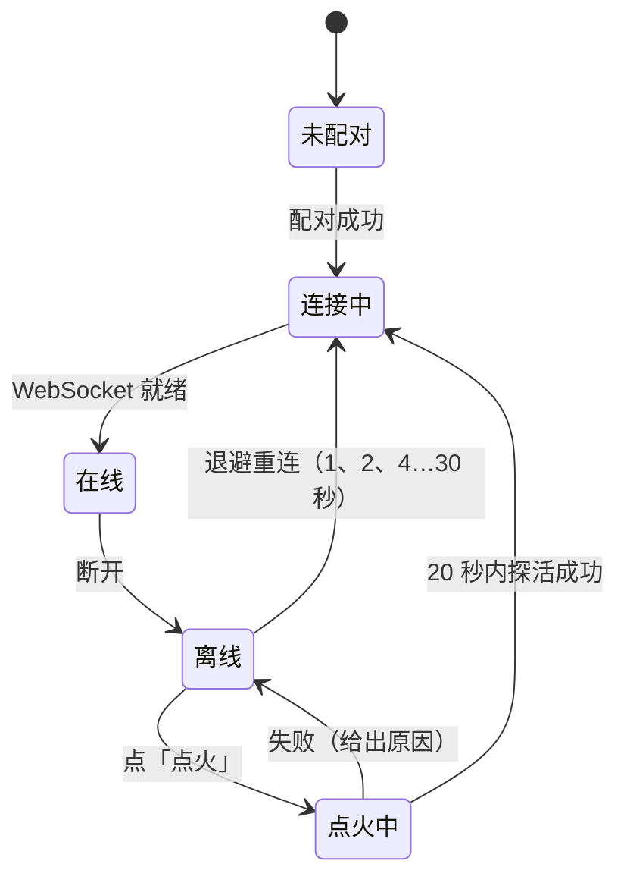
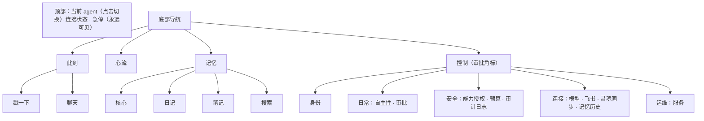

# 控制台：结构、用例与 UI/UX

## 1. 代码结构

```
lib/
├── main.dart          主题、外壳（顶部连接状态 + 急停，底部 4 个 Tab）
├── api.dart           网关客户端：WebSocket RPC、推送事件、断线重连退避、探活、配对、点火
├── igniter.dart       点火器（Termux RUN_COMMAND）
├── widgets.dart       光团、驱动力条、连接状态、急停、离线横幅、分节卡片、提示
├── markdown.dart      完整 Markdown 渲染：GFM（表格、任务列表、代码块…）、LaTeX 公式（行内与独立）、Mermaid 图（WebView + 内置 mermaid.js，点击全屏缩放）
└── pages/
    ├── pairing.dart   连接一个 agent：探活与配对
    ├── agents.dart    多 agent 切换、身份资料、记忆历史与身体列表
    ├── home.dart      此刻
    ├── chat.dart      对话
    ├── flow.dart      心流（时间线 + 醒来分布）
    ├── memory.dart    记忆（核心 / 日记 / 笔记 / 搜索）
    ├── control.dart   控制（自主性、审批、授权、预算、审计、飞书、灵魂同步、服务）
    └── providers.dart 模型（供应商、Key、模型选择、全局顺序）
```

状态管理只用 `ChangeNotifier`（全局 `api`）+ `ListenableBuilder`，不引入额外框架。



## 2. 信息架构与分页逻辑



- **按"你想做什么"分页**：想看她 → 此刻；想知道她经历了什么 → 心流；想了解她是谁 → 记忆；想管她 → 控制。
- **由感性到理性**：此刻页没有技术术语；心流卡片默认只显示标题，展开才有理由、日记、工具调用；控制页从日常调节到运维逐级变技术。
- **高频操作一步到位**：戳一下、聊天、急停、审批。**危险操作二次确认**：解除急停、删除记忆条目、放弃模型修改、删除供应商、重启、重新配对。

## 3. 页面设计

| 页面 | 内容 |
|---|---|
| 对话 | 实时显示她的回应过程：流式文字、中间叙述，以及每个工具执行中 / 执行后的单行卡片（名称 — 参数摘要 · 用时）；等待回复按「120 秒无进展」判定超时（心跳、流式文字、工具事件都会重置），超时或断线后回复一到自动补上。她的回复按完整 Markdown 渲染：表格；公式；流程图、时序图、甘特图、思维导图、框图、类图、状态图、饼图等 Mermaid 图；流式输出期间图表先显示为代码 |
| 此刻 | 呼吸光团（睡着暗且慢，醒着亮，思考时出现环绕粒子，急停变红）；状态一句话；最近的念头；「戳一下」「聊天」（首屏，位于「内在」卡片上方）；驱动力、清醒度、困意条；醒来率与抑制原因；身体读数 Chip |
| 心流 | 筛选：分布 / 全部 / 思考 / 梦 / 对话 / 入睡 / 醒来 / 审批；时间线卡片可展开；「分布」视图：按小时的醒来次数柱状图与间隔统计，用于检验节律"均匀而不规则" |
| 记忆 | 核心：人格（全屏编辑）、MEMORY 与 USER 条目（带容量条，点条目编辑或删除）、未完成的念头；日记（按天、含其他身体）；笔记；搜索 |
| 控制 · 自主性 | 活跃度滑块、暂停自主、性格参数滑块 |
| 控制 · 模型 | 参考 GoGoGo 管理后台：统计卡（供应商 / 加密 Key / 已配置模型）、供应商搜索、可展开的供应商卡片（地址与协议、启用、Key 列表只显示末四位、模型勾选与搜索、「仅看已选」、刷新目录 / 从接口获取 / 自定义模型、逐个测试连通）、全局模型顺序（拖动排序、设为内省模型）、底部保存栏（有未保存修改 / 已同步，放弃 / 保存） |
| 控制 · 飞书 | 状态、启用开关、一键接入（在飞书中打开，或用另一台手机扫码）、手动填写凭据、菜单配置提示 |
| 控制 · 灵魂同步 | 本机状态、立即同步、显示部署公钥、填写仓库地址并接入、让 Hermes 接入的说明 |
| 控制 · 服务 | 连接、版本、身体、系统资源、可用模型；点火、重启、重新配对 |

视觉：Material 3，种子色取当前 agent 的主题色（默认 `#7C6CF2`），默认深色；动效表达状态、少用文字；光团用 `RepaintBoundary` 隔离重绘。

## 4. 用户用例闭环

每个闭环都满足：触发 → 可见 → 可控 → 可回滚 → 留痕。

| # | 用例 | 流程 |
|---|---|---|
| U1 | 首次引导 | 打开 App → 自动探活（找不到就「点火」）→ 申请配对码 → 系统通知里看到配对码 → 输入 → 进入此刻页 |
| U2 | 配置模型 | 控制 → 模型 → 添加供应商 → 添加 Key → 勾选模型 → 保存 → 测试 → 排序 → 她开始按自己的节律醒来（审计记录保存操作） |
| U3 | 日常旁观 | 此刻页看状态 → 心流里展开最近的醒来 → 记忆里看她记下了什么 |
| U4 | 她主动找你 | 表达欲或想念升高 → 醒来并决定找你 → 系统通知 + 飞书消息 → 你在飞书或控制台回复 → 驱动力回落，对话进入记忆 |
| U5 | 你找她 | 聊天：直接说话（她睡着会被叫醒）；戳一下：只推动她的内在状态，要不要回应由她决定 |
| U6 | 审批 | 某类能力设为「询问」→ 她想用时产生审批 → 控制 Tab 角标 + 飞书卡片 → 批准或拒绝 → 结果写入时间线与审计 |
| U7 | 调节节律 | 觉得她太吵或太安静 → 调活跃度 / 暂停自主 / 性格参数 → 心流「分布」视图对比前后 |
| U8 | 急停与恢复 | 顶部急停 → 一切行动冻结 → 查看心流与审计 → 修正授权或记忆 → 解除急停（二次确认） |
| U9 | 离线与点火 | 离线横幅 →「点火」→ Termux 启动服务 → 自动重连；失败时给出原因（未装 Termux、未授权、未开启外部调用） |
| U10 | 安全模式与回滚 | 反复崩溃 → 安全模式横幅 + 飞书通知 → 查看服务页 → 由部署者回滚版本 |
| U11 | 修改记忆 | 记忆页编辑或删除条目 → 她的日记里写入「有人改了我的记忆」→ 她下次醒来知道 |
| U12 | 预算触顶 | 用量接近上限 → 醒来率被压到 5% → 预算页查看并调整上限 |
| U13 | 飞书接入 | 控制 → 飞书 → 开始 → 在飞书中确认 → 自动绑定 → 飞书单聊收到「此刻」卡片 |
| U14 | 共享灵魂 | 灵魂同步页 → 显示公钥并添加到仓库 → 填地址接入 → 人格与记忆在各身体间全自动同步 |
| U15 | 接入 Hermes / OpenClaw | 灵魂同步页复制现成的一句话 → 发给那台机器上的 agent → 它自行安装 soul-bridge → 在 GitHub 添加它给出的部署公钥 → 全自动同步，随时可拔出 |
| U16 | 多 agent | 点顶栏名字 → 连接新的 agent（网关地址 + 配对）→ 一键切换，界面称呼与主题色随之变化 |
| U17 | 身份 | 控制 → 身份 → 名字、代词、简介、主题色 → 保存后所有身体同步 |
| U18 | 记忆历史 | 控制 → 记忆历史 → 查看每次变更来自哪具身体、差异 → 必要时撤销 |
