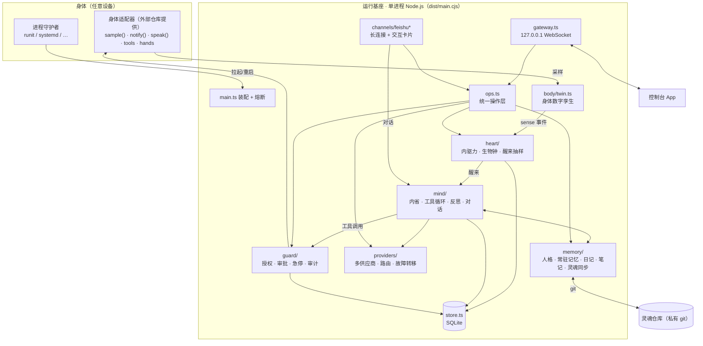
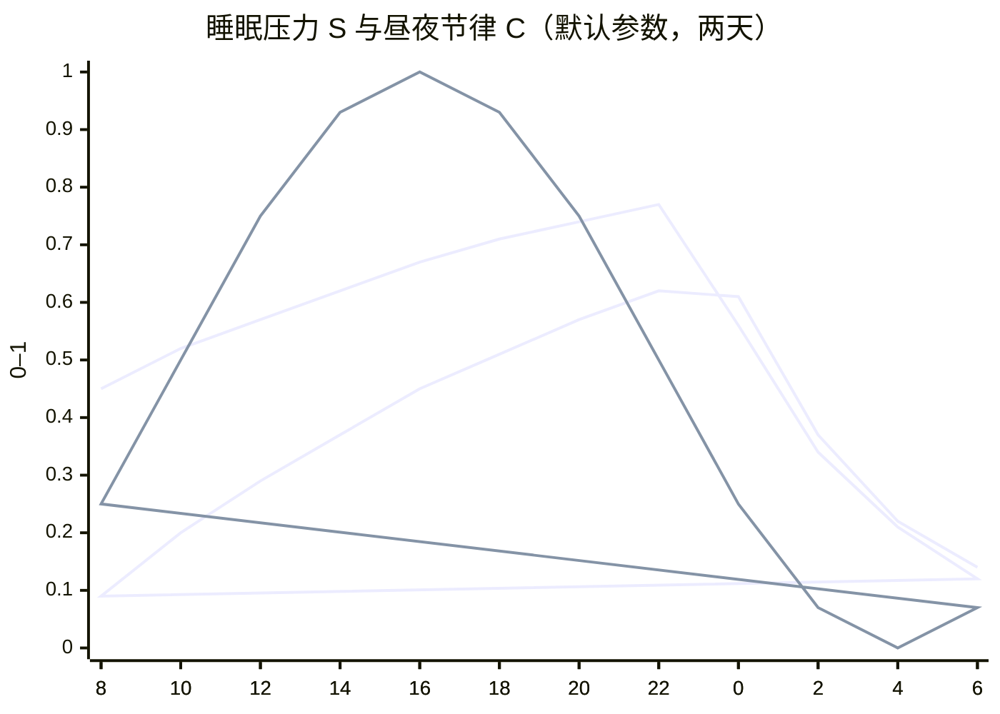
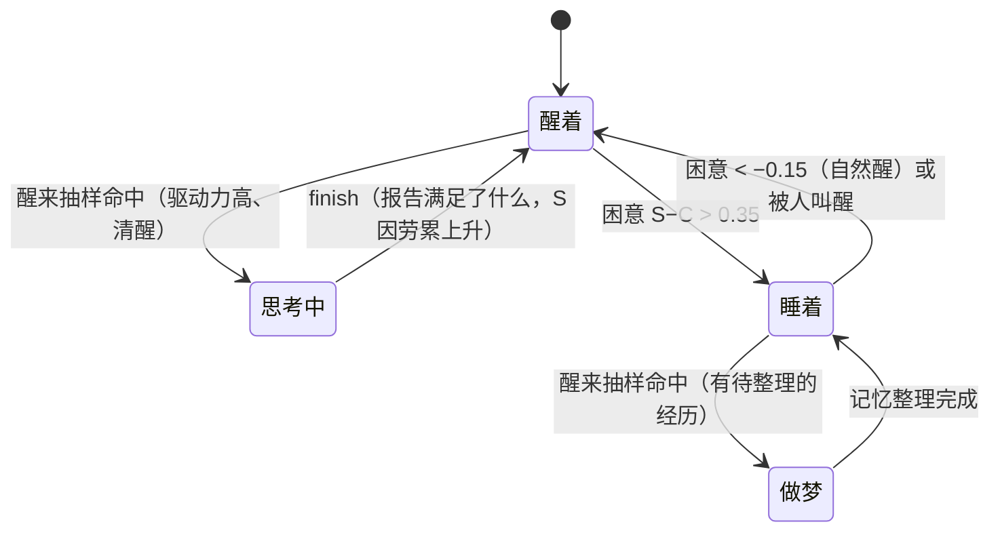
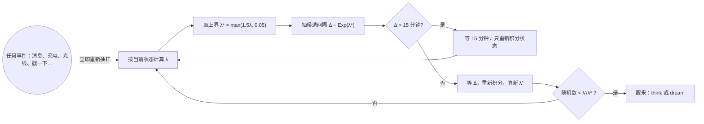
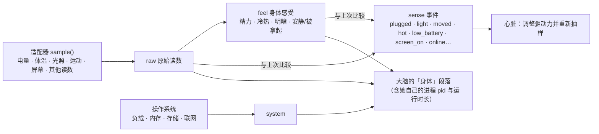
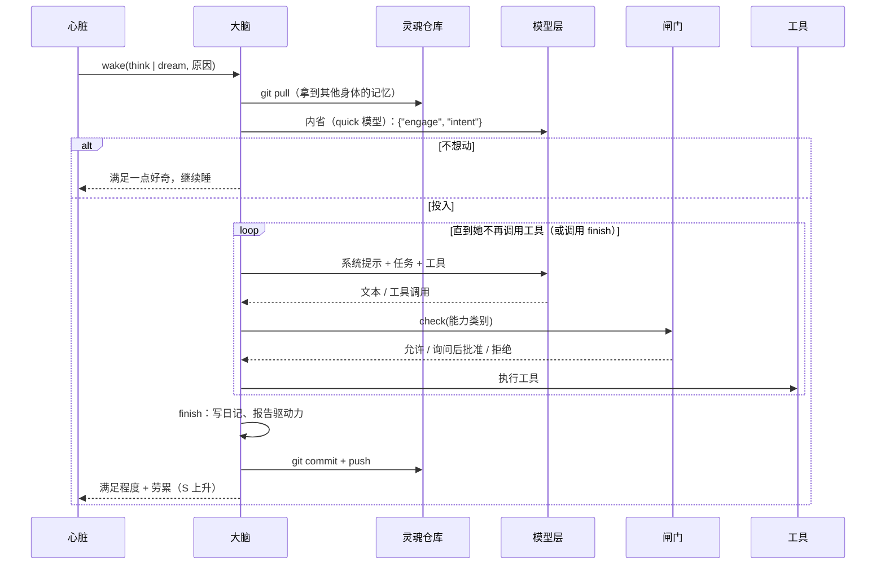
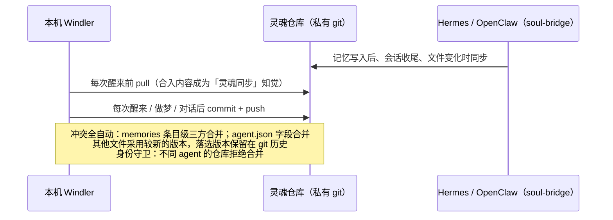
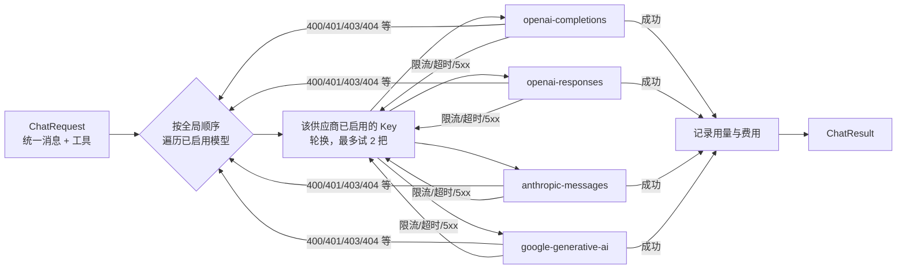

# 运行架构

本文用图文说明 Windler 运行基座的整体结构、每个部分的原理与实现方式。代码位置均相对于 `runtime/src/`。

## 1. 总体结构



设计原则：

- **单进程、模块化**：模块之间通过进程内事件总线（`bus.ts`）和少量函数调用耦合，便于单独测试。
- **设备无关**：核心只认识 `body/adapter.ts` 定义的接口；设备的一切（传感器、通知、相机、部署方式）由外部适配器提供。
- **状态全部落盘**：心脏状态、时间线、审计、用量在 SQLite，人格与记忆在灵魂目录。进程重启只相当于"睡了一觉"。
- **所有控制入口共用一个操作层**（`ops.ts`）：控制台和飞书的行为完全一致，都经过审计。

## 2. 家目录（`WINDLER_HOME`，默认 `~/windler`）

```
config/windler.json      运行配置（控制台可改）
config/providers.json    模型供应商（Key 为密文）
secrets/                 0700：master.key（Key 加密主密钥）、gateway.token、feishu_secret、soul_ed25519
data/windler.db          SQLite：kv / timeline / messages / audit / usage
data/catalog.json        公共模型目录缓存（models.dev）
soul/                    灵魂目录（git 仓库）
state/starts.json        启动记录（熔断用）
STOP                     急停标志：存在即冻结一切行动
```

## 3. 心脏：什么时候醒来

### 3.1 内驱力与生物钟

| 量 | 含义 | 动力学（`heart/model.ts`） |
|---|---|---|
| 好奇心 / 表达欲 / 想念 | 0–1 | 醒着时按各自的时间常数 τ 趋向 1：`d' = 1 − (1 − d)·e^(−Δt/τ)`；睡着时只以 30% 的速度增长 |
| 牵挂 | 0–1 | 未完成念头数 / 5 |
| 睡眠压力 S | 0–1 | 醒着时趋向 1（τ = 16 h），做事还会额外累积；睡着时指数回落（τ = 4 h） |
| 昼夜节律 C | 0–1 | `0.5 + 0.5·cos(2π(h − 16)/24)`，下午 4 点最清醒；夜里强光 +0.1，白天黑暗 −0.1 |
| 困意 | S − C | 超过 0.35 入睡；睡眠中低于 −0.15 自然醒 |

下图是默认性格参数下两天的模拟（`test/heart.test.ts` 中有同样的断言）：困意在 22:40 左右越过阈值入睡，睡眠中 S 回落、清晨 C 回升，7:50 左右自然醒——**没有任何时刻表**。





### 3.2 醒来率与抽样

瞬时醒来率（次/小时）：

- 醒着：`λ = base × urge(驱动力) × (0.2 + 0.8 × 清醒度) × 抑制`，其中 `urge = (加权平均驱动力)^γ`，γ 默认 2；
- 睡着：`λ = base × 0.5 × min(1, 待整理经历/10) × (S > 0.2 ? 1 : 0.3) × 抑制`（做梦）。

抑制系数来自身体与闸门：急停、暂停自主、未配置模型 → 0；过热 ×0.1、电量低且未充电 ×0.2、离线 ×0.5、预算用尽 ×0.05；再乘以活跃度旋钮。

下一次醒来用**非齐次泊松过程的稀疏化抽样（thinning）**决定：



15 分钟的上界有效期只是数值积分的步长，本身从不触发醒来。醒来间隔服从（时变的）指数分布，没有固定周期。

## 4. 身体数字孪生



- 感知采样（`startSenses`）不调用模型、不等于醒来，是"神经末梢"。间隔自适应：有显著变化时 2 分钟，平静时逐步拉长到 10 分钟。
- 显著变化对驱动力的影响：被拿起 → 想念 +0.3、好奇 +0.2；光线变化 → 好奇 +0.1；等等（`heart/heart.ts`）。

## 5. 大脑：一次醒来



系统提示按顺序组装（`mind/prompt.ts`）：人格 SOUL.md → 处境（多身体、无日程、当前时间、「我做过什么」的边界说明）→ 常驻记忆 MEMORY / USER → 记忆目录 → 自动检索到的相关记忆 → 想分享的一句话 → 身体 → 内在状态与未完成的念头 → 灵魂同步知觉 → 最近日记（含其他身体）→ 其他会话的近况。

内置工具（`mind/tools.ts`）：`memory`（与 Hermes 语义一致）、`note_save` / `note_read` / `note_list` / `note_move` / `note_delete`（笔记目录树）、`recall`（检索全部记忆）、`open_loop`、`recent_actions`（查审计：最近真实做过的工具调用的时间、参数与结果，用来核实自己「做没做过」）、`web_search`（依次尝试 360 搜索、百度 / 必应，识别验证码页，结果不相关时换引擎）/ `web_fetch`、`view_image`（看图：把本地图片——自己拍的照片、下载的图、之前对话里的附件——放进下一次模型调用，自动选用能看图的模型；这一轮已经在上下文里的图片不重复发送）、`read_document`（读取 Word / PPT / Excel / PDF / ODF / EPUB / HTML 等文档，分页）、`shell`（前台等待或 `background` 后台运行；输出为空而命令丢弃了 stderr 时提醒"可能是报错被吞了"）与 `shell_jobs`（查看后台任务输出、随时停止）、`processes`（直接读 `/proc` 列进程，不依赖 ps——有的沙箱里 ps 看不到进程；标出她自己、父进程与她的后台任务）、`voice_speak`（用自己的声音说话：Azure 语音合成，由身体播放）与 `voice_config`（自己选音色、风格，配置区域与密钥）、`send_message`（对话中调用时只出现在当前对话里；自己醒来思考时才作为主动消息发出，带「主动消息」标识）、`share_thought`（更新「想分享的一句话」，持续显示在控制台首页与飞书「此刻」卡片；醒来结束的 finish 也可顺带更新）、`adjust_self`（有界地修改自己的性格参数）、`rewrite_soul`；以及适配器提供的设备工具、预留的 `hands` 工具（看屏幕、点击、输入、打开应用）。

对话（`converse`）与醒来共用工具循环，但不需要 finish；有人说话会把她从睡眠中叫醒，聊完后想念与表达欲回落。

**节奏由她决定**：基座不限制步数。每一步由模型选择继续调用工具（可以边做边说，中间的文字也会实时呈现），或给出不带工具调用的文字作为这次的回复。防止失控的是时间墙与急停（每一步开始前检查）。

**会话与时间墙**（`mind/activity.ts`、`providers/adapters.ts`）：每次对话 / 醒来是一个会话，进展通过 `activity` 事件实时广播（步骤、流式文字、每个工具执行中 / 执行后、心跳、结束）。两道墙都按「无进展」计时，而不是绝对时长：

| 时间墙 | 常数 | 重置条件 | 超时后 |
|---|---|---|---|
| 模型调用 | `LLM_IDLE_MS` = 90 秒（另有 15 分钟绝对上限防死流） | 流式响应的每个数据块 | 本次调用失败，按路由换 Key / 换模型 |
| 会话 | `SESSION_IDLE_MS` = 120 秒 | 模型流的每个数据块、每一步开始、每个工具结束；执行工具与排队期间暂停计时 | 中止整个会话（打断进行中的模型调用、不再故障转移），给出说明 |

会话存续期间每 15 秒广播一次心跳，控制台据此判断基座仍在工作：客户端也只在 120 秒没有收到任何进展时才判定超时，超时后回复一到仍会补上。

**多个会话，彼此可见**（`mind/brain.ts`、`store.ts`）：对话分属不同会话，可以新建、打开、重命名、归档与找回。
- 同一会话内按顺序处理；不同会话并行。
- 会话之间不是隔离的，因为它们都是同一个她：每个会话的系统提示里有「其他会话」，包括其他会话最近的对话，以及此刻正在进行的轮次（在做第几步、用什么工具、正在写什么）。醒来思考时看到全部会话的近况。
- 会话自己的历史作为真正的多轮上下文（在预算内，约 16000 字，从新到旧）。每条消息带时间，插话 / 打断有标记；她自己的每条回复前附上那一轮的**过程记录**（`messages.process`：用过的工具、参数摘要、结果开头、中途说的话；最近 3 轮给每一步，更早的只给工具计数）。否则下一轮她只看得到回复的文字，不知道自己上一轮做过什么、看过什么，会凭印象多说或过度否认。系统提示的「处境」里说明了这条边界，并指向 `recent_actions`。
- 消息收到即入库，顺序即发送顺序。每一轮的进展折叠成快照（`sessions.live`），客户端随时可以从后端完整重建界面，包括断线、切到后台再回来。
- 并行的会话可能同时触发灵魂仓库的 git 操作，因此同步操作全部排队串行。

**她工作时对方发来消息**：
- 默认**插话**：消息立即入库，在这次模型调用结束后并入上下文，并提醒她注意；即使她本来要结束这一轮，也会接着处理。
- **打断**：立即中止正在进行的模型输出，已输出的部分保留并标注被打断，然后带着新消息继续；正在执行的工具不受影响，工具结束后立即处理。
- **排队**：作为下一轮。
- 她自己可以把耗时的命令放到后台，用 `shell_jobs` 随时停止。
- 飞书只用默认的插话：她工作时收到的消息在下一次模型调用前并入，只加一个表情表示收到，回复在进行中的那一轮里给出。飞书 SDK 默认按聊天串行投递消息，所以通道的处理函数立即返回，对话在后台进行，否则插话无法生效。飞书里发 `/new [标题]` 开启新会话。

**当前会话**：每条消息只属于它所在的会话。对话中她说的话（回复、中途的话、对话中调用 `send_message`）只进入当前会话，不会推送到其他会话或通道。只有自主醒来时的 `send_message` 才是主动消息：进入控制台的「主动消息」会话，在飞书里带「💭 主动消息」标识，并发送系统通知。

**附件**（`mind/attachments.ts`、`mind/documents.ts`）：控制台一次最多上传 20 个文件（`/upload`），随消息发送。
- 图片直接放进消息（多模态）；较大的图片（手机照片常有 5–10 MB）先缩到长边 1600 像素（依次尝试 ffmpeg、ImageMagick）。路由只选能看图的模型，判断顺序为手动设置 `vision`、公共目录（只看输入模态是否含 image）、模型名；一个都没有时去掉图片，并在消息里说明、保留本地路径。启动时若目录缓存是旧格式（没有看图信息），在后台自动刷新。
- 飞书里发来的图片和文件通过「消息资源」接口下载，作为附件交给她。
- 文本文件内联进消息，形成附件列表；过大的只给路径。
- 文档和其他文件只给本地路径，由她用 `read_document` 或命令自己读取。
- 历史轮次里的附件只保留名称与路径（标明是哪一时刻随哪条消息发来的），不重复发送图片。同一轮内，随消息附带过或 `view_image` 看过的图片记在会话的 `seen` 集合里，再次 `view_image` 同一路径只提示「就是同一张」，不再发送第二份。

## 6. 身份、记忆与灵魂同步

### 6.1 记忆可以无限增长，上下文保持有界（文本结构 RAG）

记忆的存储没有上限，每次放进上下文的只是一小部分。实现见 `memory/retrieval.ts`，不依赖向量模型，全部基于文本结构与目录结构：

| 层 | 存储 | 放进上下文的方式 |
|---|---|---|
| 常驻记忆（MEMORY / USER） | § 条目，不限长 | 预算内全部展开（4000 / 2000 字）；超出时优先展开与当前话题相关的条目，其余从新到旧补足，并注明「另有 N 条未展开，可检索」 |
| 笔记 | `notes/` 目录树（「分类/子分类/主题」，最多 4 层，每篇可带一句话摘要） | 只放「记忆目录」索引（约 2500 字）：分类、篇数、每篇的标题与摘要；较深较旧的分支自动折叠 |
| 日记 | 每具身体每天一个文件，按「## 时间 标题」分段 | 最近几天的摘录（约 3000 字） |
| 自动检索 | 以上全部 | 以当前话题为查询（对话内容，或醒来的原因与意图），把最相关的笔记与日记片段放进「可能相关的记忆」（约 3000 字） |

- **检索打分**：英文按词、中文按相邻二字分词；BM25 风格的词频饱和乘以 IDF，标题与路径命中加权，较新的略加分，再乘以查询词覆盖率。
- **工具**：`recall` 检索全部记忆；`note_save` 按路径保存并写摘要；`note_list` 浏览分支；`note_read` 读全文；`note_move` / `note_delete` 整理目录树。
- **整理**：做梦时，把细节从常驻记忆移进笔记，归类、合并、改名，让目录保持好找。基座不强制任何上限。

```
soul/
├── agent.json                  身份：id、name、displayName、pronouns、description、color、language（界面与称呼都来自这里）
├── SOUL.md                     人格（系统提示第一段；缺失时按身份生成种子人格）
├── memories/MEMORY.md          她自己的笔记（§ 分隔，运行基座不限长度）
├── memories/USER.md            关于你（§ 分隔，运行基座不限长度）
├── journal/<身体>/<日期>.md    情节记忆：每具身体各写各的
├── notes/<分类>/…/<主题>.md    语义记忆：共享的长期笔记，最多 4 层的目录树，可带一句话摘要
└── bodies/<身体>.json          身体登记
```

同步与版本管理由基座全自动完成（`memory/soul-repo.ts`，运行基座与灵魂桥共用），完整设计见 [SOUL_SYNC.md](SOUL_SYNC.md)。仓库结构与约束遵循 [灵魂仓库规范 v2](SOUL_REPO_SPEC.md)：接入时自动补齐固定目录树与固定文件；每次提交前检查禁止内容（私钥、令牌、API Key、MAC/IP 等），命中即拒绝；远端只允许 SSH 地址，并且只使用本身体专属的部署私钥。



同步完全由事件驱动（醒来、做梦、对话），没有定时同步。

## 7. 模型层



- 配置保存语义参考 GoGoGo 管理后台：整份草稿一次保存，带版本号（规范化 JSON 的 sha256），版本不符拒绝覆盖；修改 API 地址前必须先移除旧 Key。
- Key 用 AES-256-GCM 加密，供应商 id 作为附加认证数据；对外只返回末四位。
- 模型目录来自 models.dev（含上下文长度、价格），也可以从供应商的 models 接口拉取，或手动添加自定义模型。
- 可指定一个 quick（内省）模型，用于醒来时的轻量判断。
- **供应商兼容层**（`providers/compat/`）：个别供应商有额外约定，由独立的兼容模块处理，只在识别到对应供应商时自动生效，核心适配器保持通用。每次醒来或交谈生成一个会话标识，随请求传给兼容模块。目前有 **OpenCode Go**（[官方文档](https://opencode.ai/docs/go/)），在目录 ID 为 `opencode-go` 或地址为 `opencode.ai/zen/go` 时生效：
  - 端点规范化为 `https://opencode.ai/zen/go/v1`；
  - 每次对话携带稳定的 `x-opencode-session`，User-Agent 标识为本运行基座；
  - 按官方表格为每个模型选择接口：Grok / GPT / Muse Spark 走 Responses，MiniMax / Qwen 3.x 走 Anthropic Messages，其余走 Chat Completions；
  - 去掉模型名的 `opencode-go/` 前缀。

## 8. 闸门

- 能力类别：联网、执行命令、设备功能、相机、麦克风、定位、主动发消息、修改自身参数、改写记忆、操作屏幕与应用。每类「允许 / 每次询问 / 禁止」，默认全部允许。
- 询问：生成审批，推送到控制台与飞书（带按钮的卡片），30 分钟未处理视为拒绝。
- 急停：写入 `STOP` 文件，立即拒绝所有工具调用、醒来率归零；解除需人工确认。
- 审计：工具调用、配置修改、记忆修改、审批决定都写入 `audit` 表。

## 9. 控制入口

| 入口 | 方式 | 说明 |
|---|---|---|
| 控制台 App | 本地网关 WebSocket | 见 [console 文档](../console/docs/README.md) |
| 飞书 | 长连接（无需公网） | 单聊自动推送「此刻」卡片；机器人菜单事件；卡片按钮与表单直接调用操作层，原地刷新卡片 |
| 主机 | 端口转发到网关 | 与控制台同一套 API |

## 10. 进程与部署契约

- 基座只负责自身逻辑，**进程守护交给外部**（runit、systemd 等）：进程退出即被重新拉起。
- **熔断**：10 分钟内启动超过 5 次视为反复崩溃，进入安全模式（只开网关与飞书，不醒来、不调用模型），并主动告知。
- 部署者提供：Node.js 22+、`WINDLER_HOME`、可选的 `WINDLER_ADAPTER`（适配器模块路径）、进程守护者。
- **Android + Termux 部署约定**（控制台的点火器按此约定工作）：runit 服务目录 `$PREFIX/var/service/windler`，开机脚本 `~/.termux/boot/windler`，`termux.properties` 中 `allow-external-apps=true`。
