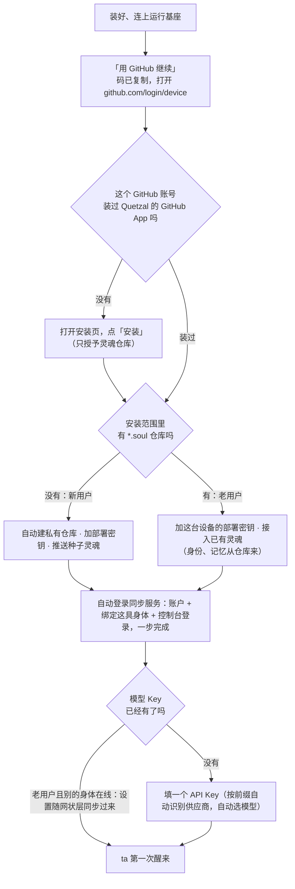

# 一键上手（设计说明）

> 状态：**已实现（1.1.0 起，1.2.0 补上一次登录与模型快速接入）**，实现与本稿有出入，以 [sync/docs/PROTOCOL.md §2.1](../sync/docs/PROTOCOL.md)、[console/docs/USER_JOURNEY.md](../console/docs/USER_JOURNEY.md) 与代码为准。本文保留为当时的设计记录。
>
> 与本稿不同的地方：
> - 没有设备上的 GitHub 设备授权，也没有 `POST /v1/auth/github` 与运行基座的 `onboard/` 模块。实际流程是：身体申请绑定码时带上部署公钥 → 人在网页（官网账户页或 App 打开的浏览器）批准 → 同一个标签页经 GitHub 用户授权跳一次（没装 App 先去安装页）→ 同步服务找到或新建 `<短名>.soul` 私有仓库、加这一把部署密钥、立即吊销令牌 → 身体轮询拿到令牌、灵魂仓库地址与控制台登录。
> - 1.4 起账号登录不再用 GitHub，改为 OpenID Connect（`sync/src/auth.ts`），§4 里「网页登录也换成同一个 GitHub App」与 §8 的回调地址不再成立：GitHub App 只用于链接灵魂仓库，账户第一次链接时记下所用的 GitHub 账户，之后必须是同一个。
> - GitHub App 的权限只有 Administration 写与默认的 Metadata 读（建仓库也由 Administration 写覆盖），见 `sync/src/github-app.ts`。同步服务不保存 App 私钥，从不以 App 身份调用。
> - 模型不按 Key 前缀识别供应商：用户点一个供应商、粘贴 Key，运行基座自动挑模型、试通、排好（`providers.quick`）。
> - 「跳过，先本地用」照旧可选。

## 0. 现状与问题

- 没有首次引导：装好、连上以后直接进主界面，模型、身份、灵魂仓库、多具身体、账户散在「控制」页里，顺序不受约束。
- 新用户要手动做 14 步，其中最难的三步：在 GitHub 上自己建私有仓库、把部署公钥贴进仓库设置并勾选写权限、在网页上输入绑定码并批准（控制台登录还要再批准一次）。
- **顺序隐患**：老用户在新设备上若先绑定、后接灵魂仓库，会以种子身份的 agent id 在账户下登记出一个新 agent，之后采用远端身份时没有重新绑定。新流程必须**先灵魂、后绑定**。

## 1. 用户看到的流程



- 新用户：**两个网页动作**（GitHub 上输入码、点安装）+ **一个输入框**（API Key）。
- 老用户：两个网页动作（装过 App 的只有一个），其余全自动。
- 「跳过，先本地用」始终可选：不接 GitHub，灵魂只在本机，以后在控制台补接（现有能力，见 §6）。

## 2. GitHub：用 GitHub App，不用 OAuth App

| | OAuth App | GitHub App（采用） |
|---|---|---|
| 建私有仓库、加部署密钥所需权限 | 只能 `repo`：完全控制用户**所有**私有仓库 | Repository creation 写 + Administration 写，且只作用于**安装范围内**的仓库 |
| 令牌吊销后部署密钥 | **随之删除**（GitHub 文档原文：「If the deploy key is created with an OAuth app token, revoking the token will also delete the deploy key」） | 不受影响 |
| 授权页观感 | 「Full control of private repositories」 | 只核验身份；仓库范围在安装页由用户选择 |
| 设备授权流程 | 支持，不需要 client secret | 支持，不需要 client secret |
| 令牌寿命 | 长期 | 8 小时；我们不保存 refresh token |

App 设置：Repository creation（写）、Administration（写）、Metadata（读，缺省）；开启令牌过期；勾选 Enable Device Flow；不要任何账户权限。App 创建出的仓库自动纳入安装范围（GitHub 文档：「If the app creates any repositories, the app will automatically be granted access to those repositories as well」）。

**令牌只在设备内存里存在几分钟**：建仓库、加部署密钥之后交给同步服务换账户，同步服务核验并立即吊销。长期保存的只有本机的部署私钥（`secrets/soul_ed25519`）与同步服务的令牌（`secrets/sync.json`、`secrets/sync-account.json`）。

附带修正：灵魂桥（`bridge/src/github.ts`）现在用 gh CLI（一个 OAuth App）的令牌加部署密钥，用户在 GitHub 上撤销对 gh 的授权时部署密钥会被一并删除。改为同一个 GitHub App 的设备授权。

## 3. 灵魂仓库：新用户与老用户

- **发现**：`GET /user/installations/{id}/repositories` 列出安装范围内的仓库，取名字以 `.soul` 结尾且私有的（规范 §2 约定 `<agent 短名>.soul`）。同步服务记得这个账户下各 agent 的显示名，用来给候选排序；最终以 clone 下来的 `agent.json` 与现有的身份守卫（`guardIdentity`）为准。
  - 一个：直接用。几个：请用户选一个（显示 agent 名与最近提交时间）。没有：新用户。
- **新用户**：`POST /user/repos {name, private: true}` 建仓库（重名加 `-2`、`-3`），`POST /repos/{o}/{r}/keys {read_only: false}` 加部署密钥（标题为身体名），推送种子灵魂。仓库名见 §8 待定 1。
- **老用户**：加这台设备的部署密钥，`git clone`（不是先 `init` 再合并），身份、记忆从仓库来。

## 4. 同步服务：用 GitHub 令牌一步换账户与绑定

新接口 `POST /v1/auth/github`：

```jsonc
// 请求（身体 → 同步服务）
{ "access_token": "ghu_…", "agent": {"id", "name"}, "body", "kind": "runtime", "nodeKey", "version" }
// 返回
{ "account", "agent": {"id", "name"}, "body", "access_token": "qsb_…", "console_token": "qsc_…", "console_expires_in" }
```

处理顺序：

1. `POST /applications/{client_id}/token`（client_id/secret 做 Basic 认证）**核验令牌确实是本 App 签发的**——只读 `/user` 不够：任何第三方 App 拿到的这个用户的令牌都能冒充他（混淆代理）。
2. 取 GitHub 用户 id，upsert 账户；upsert `(账户, agent.id)`；绑定身体（与设备码批准后相同的规则：同名身体旧令牌作废）；签发控制台登录。
3. `DELETE /applications/{client_id}/token` 吊销，然后返回。同步服务不记录、不保存这个令牌。

这样**不再需要网页上输入绑定码、核对指纹、再批准控制台登录**：身体令牌由用户亲自在设备上完成的 GitHub 授权担保，等价于「本人在这台设备上登录」。现有的设备码绑定与网页批准保留（自建同步服务、灵魂桥、没有 GitHub App 的部署仍用它）。

同步服务的网页登录也换成同一个 GitHub App（授权码 + PKCE 同样支持），用户表以 GitHub 数字 id 为键，已有账户不受影响。限流：每个地址 10 分钟内 10 次。

## 5. 运行基座与控制台

- **运行基座** 新增 `onboard/`：GitHub 设备授权客户端（只用 `fetch`，从 `bridge/src/github.ts` 移植并改为 GitHub App）、上手状态机、`onboard.*` 操作（`onboard.status`、`onboard.start`、`onboard.pickSoul`、`onboard.skip`），状态经 `onboard` 事件推送。状态存在 `data/onboard.json`：中途退出可以继续。
- **控制台**：配对或本机直连之后，`status.onboarded` 为假就进入上手页（全屏、一步一屏、只有一个主按钮），完成后进主界面；以后在「控制」里仍能单独修改每一项。网页版、Linux 桌面版、安卓 App 共用同一套页面。
- **模型 Key**：一个输入框，按前缀识别供应商（`sk-ant-` → Anthropic，`AIza` → Gemini，`sk-` → OpenAI 兼容并探测），自动选默认模型并测试一次；识别不了时展开现有的供应商表单。
- **名字**：不在上手时问。ta 第一次醒来时被告知自己还没有名字，可以自己起（`edit_identity`），也可以问你。

## 6. 网络与失败

- 设备端要访问 `github.com/login/device/code`、`github.com/login/oauth/access_token` 与 `api.github.com` 的少数几个接口。大陆网络不稳时经官网 Worker 中转（按路径与 client_id 白名单，不记录请求体；现有的 `/api/oauth/github/token` 中转扩展而来）。浏览器里打开的 GitHub 登录页与安装页**不中转**（代理 GitHub 登录页形同钓鱼），打不开时提示换网络。
- 码过期 → 重新开始；安装等待最长 15 分钟；部署密钥 422（公钥已被别处使用）→ 重新生成密钥；交给同步服务失败 → 灵魂照常可用，多具身体稍后在控制台补绑。
- 「跳过」：本地灵魂（现有行为），以后在「控制 → 设备」里一键用 GitHub 接上（同一套流程从 §3 开始）。

## 7. 实施顺序

1. 同步服务：`/v1/auth/github`、网页登录切到 GitHub App、测试（用伪造的 GitHub 接口）。
2. 运行基座：`onboard/` 与 GitHub 客户端、先灵魂后绑定、模型 Key 识别、测试。
3. 控制台：上手页（安卓、网页、Linux 桌面）。
4. 官网 Worker 中转白名单；灵魂桥改用 GitHub App。
5. 文档：快速开始、安装、第一步、多具身体、灵魂同步全部按「一次登录」重写；PROTOCOL、API、ARCHITECTURE 同步。
6. 之后再做安卓阶段 1（App 原生接管 Termux:API / Termux:Boot）与阶段 2（只装一个 App）。

## 8. 待定

1. **新仓库的名字**：建议 `quetzal.soul`（重名加序号），因为名字由 ta 以后自己起；仓库改名不影响同步。也可以上手时让用户给 ta 起名，以名字建仓库（多一个输入框）。
2. **需要所有者在 GitHub 上完成**（Agent 无法代办）：创建 GitHub App（权限见 §2，勾选 Enable Device Flow 与令牌过期，回调地址为同步服务的 `/login/callback`），把 client_id 与 client secret 写进同步服务器的 `.env`（不入库）。
3. **需要用测试账号实测**：名下一个仓库都没有时能否选「Only select repositories」安装（社区报告至少要选一个仓库，否则只能选「All repositories」）；只有 Repository creation、没有 Administration 时能否建仓库；设备授权每个 App 每小时 50 次网页提交的上限是否够用。
