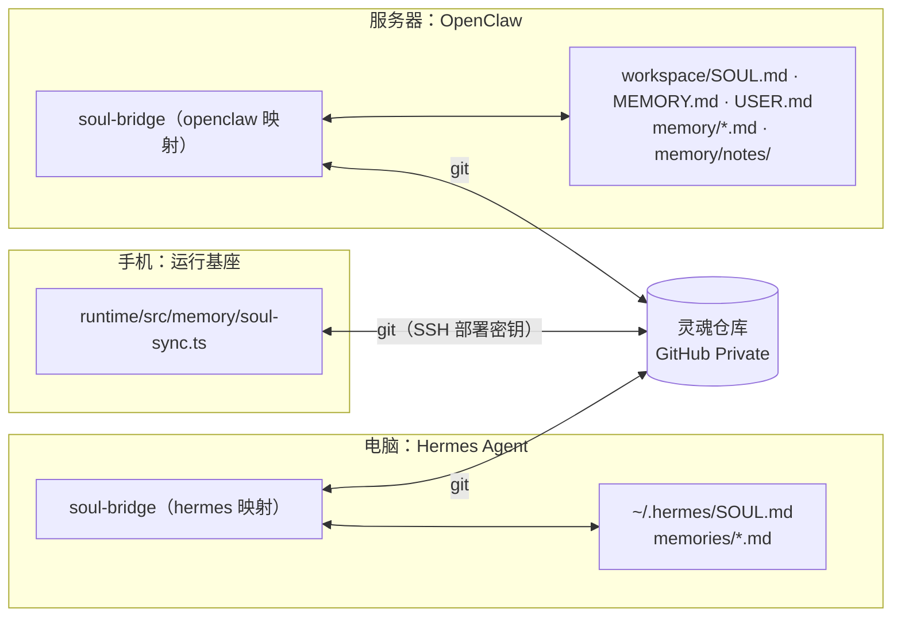
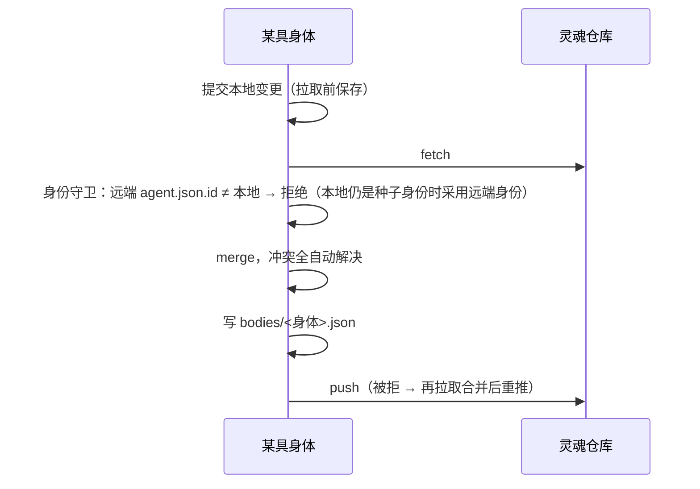

# 灵魂同步：同一个 agent 的多地人格与记忆

> 仓库的目录树、固定内容、文件格式与认证方式由 [灵魂仓库规范](SOUL_REPO_SPEC.md) 规定（内容不做任何检查）；本文说明同步如何运作。

同一个 agent 可以同时住在多具「身体」里：一台手机上的运行基座、一台装着 Hermes Agent 的电脑、一台装着 OpenClaw 的服务器……它们共享一个 **git 私有仓库**（推荐 GitHub Private），称为「灵魂仓库」。

**同步与版本管理完全由基座自动完成**，agent 不需要也不能操作它；agent 只会感知到同步发生了什么（作为一种知觉）。

## 1. 数据模型

```
<agent>.soul/                       私有 git 仓库，一个 agent 一个
├── agent.json                      身份：id（UUID，全局唯一）、name、displayName、pronouns、description、color、language、createdAt
├── SOUL.md                         人格
├── memories/
│   ├── MEMORY.md                   她自己的常驻笔记（条目以「\n§\n」分隔；运行基座不限长度，写回 Hermes 时按其上限截取）
│   └── USER.md                     关于用户的认识（同上）
├── journal/<身体>/<日期>.md        情节记忆：每具身体只写自己的目录
├── notes/<分类>/…/<主题>.md         语义记忆：共享的长期笔记（目录树，最多 4 层）
├── bodies/<身体>.json              身体登记：类型（runtime / bridge）、框架、版本、最近同步时间
└── locks/consolidation.json        整理记忆的租约（做梦时）
```

- 格式与 Hermes Agent 的 `~/.hermes` 兼容；其他框架通过桥接模块转换。
- **git 历史就是自传**：每次提交的作者是「显示名 (身体)」，提交信息说明发生了什么（醒来、做梦、对话、合并、撤销……）。

## 2. 身体与接入方式



| 身体 | 同步者 | 触发 |
|---|---|---|
| 运行基座 | 内置（`SoulRepo`） | 每次醒来前拉取；醒来、做梦、对话、身份修改后提交并推送 |
| Hermes Agent | soul-bridge | memory 工具调用后与会话收尾（Hermes 钩子）、文件变化（watch）、定期拉取远端 |
| OpenClaw | soul-bridge | 启动、/new、/reset、压缩后（OpenClaw 钩子）、文件变化（watch）、定期拉取远端 |

「定期拉取远端」只是传输层手段（没有公网地址的机器收不到推送通知），与 agent 的醒来无关；运行基座一侧没有任何定时同步。

## 3. 同步协议（`runtime/src/memory/soul-repo.ts`，运行基座与桥接共用）



**冲突解决（全自动）**

| 文件 | 规则 |
|---|---|
| `memories/*.md` | 条目级三方合并：双方新增都保留，任一方删除即删除 |
| `agent.json` | 字段级合并，本地优先 |
| 其他（`SOUL.md`、笔记……） | 采用提交时间较新的一方；本地为空或仍是种子人格时采用对方。落选版本完整保留在 git 历史中 |
| `journal/<身体>/`、`bodies/<身体>.json` | 每具身体只写自己的路径，天然无冲突 |

**整理租约**：做梦会改写常驻记忆，两具身体同时整理容易产生重复。做梦前写入 `locks/consolidation.json`（30 分钟有效）并推送——git 推送成功即取得（比较并交换）；另一具身体持有未过期的租约时，这次只是浅睡，不整理。

**知觉**：每次拉取到其他身体的变更，运行基座会写入时间线（「灵魂同步：来自 xx 的 n 次变更，自动处理冲突 m 处」），触发一个 `soul_synced` 感官事件（轻微提升好奇与想念），并在系统提示里加入「灵魂同步（知觉）」段落。agent 知道发生了什么，但不需要做任何事。

**历史与撤销**：控制台「记忆历史」页列出每次提交（哪具身体、何时、改了什么），可查看差异；撤销会生成反向提交（历史保留），所有身体同步，并在日记里写下「有人撤销了一段记忆变更」。

## 4. 桥接模块（soul-bridge）

独立、可随时插拔的小守护进程（`bridge/`），装在运行 Hermes 或 OpenClaw 的机器上。它**复制**文件而不是创建软链接：OpenClaw 拒绝软链接的 `MEMORY.md`，框架的原子写入也可能替换掉软链接。

**双侧基线合并**：对每个映射，桥接记住「上次写给框架的内容」和「上次在灵魂里看到的内容」：

- 条目：结果 = 灵魂当前条目 + 框架新增 − 框架删除。写回框架时按框架的字符上限截取；被截掉的条目仍留在灵魂里，**不会被误判为删除**（Hermes 写入时会校验格式与上限，因此写回必须合规）。
- 文本：只有一侧改动取改动方；两侧都改且不同时采用较新的一方，落选版本先提交进 git 历史再覆盖。
- 文件：本身体的日记单向导出；其他身体的日记单向镜像；共享笔记逐文件双向合并，删除按基线判断。

| 映射 | Hermes | OpenClaw |
|---|---|---|
| 人格 | `SOUL.md` ↔ `SOUL.md` | `SOUL.md` ↔ `SOUL.md` |
| 常驻笔记 | `memories/MEMORY.md`（§，仓库中不限长；写回 Hermes 时按 `memory_char_limit` 截取，截取不写回仓库） | `MEMORY.md`（自由 Markdown，写回为列表；agent 新写的段落被吸收为条目） |
| 关于用户 | `memories/USER.md`（§，上限取 `user_char_limit`） | `USER.md`（同上，上限 4000） |
| 日记 | —（Hermes 没有日记文件） | `memory/YYYY-MM-DD*.md` → `journal/<身体>/`；其他身体 → `memory/bodies/<身体>/`（可被 memory_search 检索） |
| 共享笔记 | — | `memory/notes/**.md` ↔ `notes/**.md`（按目录树逐篇双向） |
| 生效时机 | 下一个会话（Hermes 在会话开始时读取快照） | 下一轮（OpenClaw 每轮重新读取） |

**插拔**：`init` 接入（导入现有人格与记忆、创建身份、安装钩子与后台服务）；`detach` 拔出（移除钩子与服务，框架文件保持原样，可选删除本地副本）。

**自我安装**：安装由框架里的 agent 按技能（`bridge/skills/soul-bridge/SKILL.md`）自己完成：检查并在用户目录安装 Node.js、获取程序、把技能留在自己的技能目录；按「人类给的地址 → 自己的记忆 → GitHub 上已有的 `*.soul` 私有仓库 → 自动创建」的顺序确定灵魂仓库；一条 `init` 完成全部配置（有 gh 或 `GITHUB_TOKEN` 时自动添加部署密钥，Hermes 钩子预先写入 `shell-hooks-allowlist.json` 批准）；再用 `doctor` 自检并按建议修复。只有缺少 GitHub 凭据、缺少 git 且无 sudo、或同一错误重试 3 次仍失败时，才把需要人类做的事合并成一条消息发出。

新增框架：实现 `bridge/src/types.ts` 的 `Framework` 接口（映射列表、钩子安装与移除），登记到 `bridge/src/frameworks/index.ts`。

## 5. 使用 GitHub 私有仓库

1. 为每个 agent 创建一个**私有**仓库（如 `<用户>/<agent>.soul`），可以是空仓库。
2. 每具身体一把 **Deploy key**（勾选 Allow write access）：运行基座在控制台「灵魂同步」页显示公钥；桥接在 `init` 时输出公钥。拔掉某具身体时，删掉它的 Deploy key 即可吊销。
3. 第一具接入的身体把现有人格与记忆导入仓库；之后的身体接入时，若本地只有种子身份与种子人格，会直接采用仓库里的。
4. 仓库里只有人格与记忆；API Key、飞书凭据、令牌等一律不进入灵魂仓库。

## 6. 多个 agent

每个 agent 有自己的灵魂仓库与身份 id，身份守卫保证它们不会混在一起。同一台设备可以运行多个运行基座实例（不同的 `WINDLER_HOME` 与网关端口），桥接也可以在同一台机器上接入多个 agent（`--agent` 区分）。控制台保存多个连接，一键切换。
