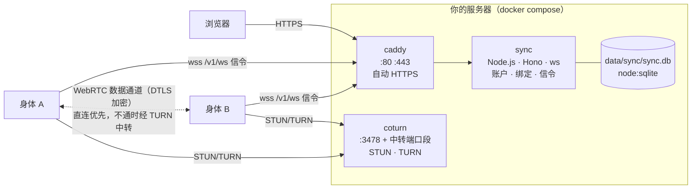

# 架构与安全

## 1. 组成



| 组件 | 选型 | 理由 |
|---|---|---|
| HTTPS | Caddy 2 | 自动申请与续期证书，默认配置安全；不自己实现 ACME。隧道模式下由服务器上已有的反向隧道（如 Cloudflare Tunnel）提供，STUN / TURN 用单独的直连主机名（`TURN_HOST`） |
| STUN / TURN | coturn 4.18 | 事实标准的 TURN 实现；用有时效的 HMAC 凭据（`use-auth-secret`），服务端不存密码 |
| Web 框架 | Hono | 自带 `secureHeaders`（CSP nonce、HSTS 等）、`csrf`（Origin + Sec-Fetch-Site）、`bodyLimit` |
| WebSocket | ws | Node 生态的标准实现；`maxPayload` 限制、关闭压缩 |
| GitHub 登录 | arctic | 轻量、维护良好的 OAuth 2.0 客户端 |
| 输入校验 | zod | 所有外部输入（接口请求体、WebSocket 消息、环境变量）都按 schema 校验 |
| 存储 | `node:sqlite` | Node 内置，没有原生依赖；预编译语句，没有拼接 SQL |
| 身体之间 | WebRTC（ICE / DTLS / SCTP） | 打洞、加密、可靠传输都是成熟标准；同步服务只转发信令 |

## 2. 代码

```
sync/
├── start.sh            一行启动：检查或安装 Docker、引导 .env、防火墙、构建、启动、健康检查
├── compose.yaml        三个服务（caddy 在 profile caddy 里）；coturn 的配置以 configs.content 内联（密钥来自 .env，不落在仓库里）
├── compose.tunnel.yaml 隧道模式：同步服务发布到 127.0.0.1:<SYNC_LOCAL_PORT>，不启动 Caddy，由已有的反向隧道对外
├── Caddyfile           反向代理到 sync:8080，不开访问日志
├── Dockerfile          node:24-alpine，只装生产依赖，以 node 用户运行
├── .env.example        配置模板（.env 不入库）
└── src/
    ├── main.ts         入口：读配置、启动、优雅退出
    ├── server.ts       装配：HTTP + WebSocket（/v1/ws）+ 定时清理；main 与测试共用
    ├── config.ts       环境变量的 zod 校验
    ├── db.ts           表结构与预编译语句
    ├── app.ts          路由：/v1/*（身体）与网页（人）
    ├── auth.ts         GitHub 登录（arctic）与会话
    ├── device.ts       设备码绑定（RFC 8628 的语义）
    ├── hub.ts          信令中心：认证、在场、转发、TURN 凭据、心跳
    ├── turn.ts         TURN REST API 凭据
    ├── pages.ts        网页的版式与中英文案
    └── util.ts         随机令牌、哈希、短码、指纹、限流、日志
```

## 3. 数据

| 表 | 内容 | 保留 |
|---|---|---|
| `users` | GitHub 数字 id、用户名、显示名、时间 | 直到删除账户 |
| `sessions` | 会话令牌的 SHA-256、到期时间 | 默认 30 天，滑动续期；过期每小时清理 |
| `agents` | (账户, agent id) → 显示名 | 直到删除 |
| `bodies` | 身体名、类型、版本、节点公钥、令牌的 SHA-256、最近在线 | 直到解绑 |
| `device_codes` | 设备码的 SHA-256、短码、待绑定的身体信息、状态 | 15 分钟 |

**不保存**：IP 地址、端点、ICE 候选、信令内容、GitHub 访问令牌、任何记忆或对话。限流用的客户端地址只在内存里。Caddy 不开访问日志，同步服务的日志不记 IP 和令牌。

## 4. 安全设计

**信任边界**：同步服务只是目录与信令，不是信任根。身体之间核对的是灵魂仓库里登记的节点公钥（见 [协议 §4](PROTOCOL.md#4-身体之间webrtc-数据通道)），所以同步服务被攻破也冒充不了身体；最坏的情况是身体之间连不上，这时它们退回只用 git 同步。

| 威胁 | 措施 |
|---|---|
| 令牌或会话从数据库泄露 | 会话、设备码、身体令牌都是 256 位随机数，库里只存 SHA-256 |
| 抢占别人的 agent | agent 登记按账户隔离：(账户, agent id) 唯一，不同账户互不可见、互不影响 |
| 骗人批准陌生身体 | 确认页显示 agent、身体名、类型和节点公钥指纹，提示与身体上显示的核对；批准只把身体加进你自己的账户 |
| 暴力猜短码 | 短码 8 位、约 34 位熵、15 分钟有效；每个账户 10 分钟内最多输错 10 次 |
| CSRF | 会话 Cookie 为 `SameSite=Lax`、`HttpOnly`、`Secure`，HTTPS 下用 `__Host-` 前缀；网页的 POST 校验 Origin 与 Sec-Fetch-Site；`/v1/*` 不用 Cookie |
| OAuth 回调伪造 | `state` 放在 10 分钟的 HttpOnly Cookie 里比对；不申请任何 scope，不保存访问令牌 |
| 开放重定向 | 登录后的回跳只接受本站的绝对路径（拒绝 `//`、`/\`、协议地址） |
| XSS / 点击劫持 | 页面没有脚本；模板自动转义；CSP `default-src 'none'`，样式用 nonce；`frame-ancestors 'none'` |
| 滥用 TURN 打进服务器内网（SSRF） | coturn 禁止中转到私有、回环、链路本地、保留与组播地址（IPv4 与 IPv6）；关闭 TCP 中转 |
| STUN 反射放大 | 关闭 RFC 5780 与软件版本属性，不带 MAPPED-ADDRESS；未认证请求每秒限 10 次 |
| TURN 凭据泄露 | 凭据 1 小时过期，只发给已认证的 WebSocket 连接；配额：每个用户 12 个、总共 1200 个分配 |
| 资源耗尽 | 请求体 16 KiB 上限、WebSocket 帧 64 KiB、每条连接 10 秒内 200 条消息、申请绑定码与登录按地址限流、10 秒内必须 hello、30 秒心跳清理半开连接 |
| 被解绑或删除后继续使用 | 解绑、删除 agent、删除账户都立即断开对应的连接，令牌作废 |
| 容器逃逸后的影响 | 同步服务：非 root、只读根文件系统、丢弃全部 capability、`no-new-privileges`、只在内部网络；Caddy 只保留 `NET_BIND_SERVICE` |

**已知限制**：

- TURN 只提供 UDP 与 TCP 3478，没有 TURN over TLS（443 已被 Caddy 占用）。中转的内容本身是 DTLS 加密的，TLS 只会多一层伪装；如果有身体所在的网络只放行 443，可以以后给 coturn 单独配一个域名和 5349 端口。
- 限流在单个进程的内存里，重启后清零。这个服务按单机部署设计。
