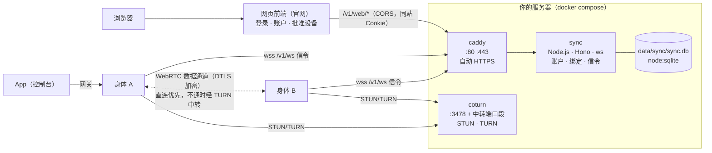

# 架构与安全

## 1. 组成



| 组件 | 选型 | 理由 |
|---|---|---|
| HTTPS | Caddy 2 | 自动申请与续期证书，默认配置安全；不自己实现 ACME。隧道模式下由服务器上已有的反向隧道（如 Cloudflare Tunnel）提供，STUN / TURN 用单独的直连主机名（`TURN_HOST`） |
| STUN / TURN | coturn 4.18 | 事实标准的 TURN 实现；用有时效的 HMAC 凭据（`use-auth-secret`），服务端不存密码；不记日志 |
| Web 框架 | Hono | 自带 `secureHeaders`（CSP nonce、HSTS 等）、`csrf`（Origin + Sec-Fetch-Site）、`bodyLimit` |
| WebSocket | ws | Node 生态的标准实现；`maxPayload` 限制、关闭压缩 |
| GitHub 登录 | arctic（随机数）+ 自己拼授权地址 | 用 arctic 生成 `state` 与 PKCE 的 `code_verifier`；它的 GitHub 提供方不支持 PKCE，授权地址（带 `code_challenge`，S256）与换令牌（`src/auth.ts` 的 `exchangeCode`，可经中转）在本服务里实现 |
| 输入校验 | zod | 所有外部输入（接口请求体、WebSocket 消息、环境变量）都按 schema 校验 |
| 存储 | `node:sqlite` | Node 内置，没有原生依赖；预编译语句，没有拼接 SQL |
| 身体之间 | WebRTC（ICE / DTLS / SCTP） | 打洞、加密、可靠传输都是成熟标准；同步服务只转发信令 |
| 给人看的页面 | 网页前端（`SYNC_WEB_URL`） | 官方部署由官网 quetzal.plutokeating.beer 提供登录、账户与批准设备（`website/app/routes/account/`）；同步服务只提供接口。自建且不配前端时退回自带的简单页面 |

## 2. 代码

```
sync/
├── start.sh            一行启动：检查或安装 Docker、引导 .env、防火墙、构建、启动、健康检查
├── compose.yaml        三个服务（caddy 在 profile caddy 里）；镜像按 tag@sha256 固定；coturn 的配置以 configs.content 内联（密钥来自 .env，不落在仓库里）
├── compose.tunnel.yaml 隧道模式：同步服务发布到 127.0.0.1:<SYNC_LOCAL_PORT>，不启动 Caddy，由已有的反向隧道对外
├── Caddyfile           反向代理到 sync:8080，不开访问日志，删掉客户端自带的 CF-Connecting-IP
├── Dockerfile          node:24-alpine，只装生产依赖，以 node 用户运行
├── .env.example        配置模板（.env 不入库）
└── src/
    ├── main.ts         入口：读配置、启动、优雅退出
    ├── server.ts       装配：HTTP + WebSocket（/v1/ws）+ 定时清理；main 与测试共用
    ├── config.ts       环境变量的 zod 校验
    ├── db.ts           表结构与预编译语句
    ├── app.ts          路由：/v1/*（身体）、登录、自带网页（人；配置了 SYNC_WEB_URL 时跳到网页前端）
    ├── web.ts          账户接口 /v1/web/*：网页前端（Cookie + CORS）与控制台登录（Bearer qsc_）共用
    ├── auth.ts         GitHub 登录（arctic）与会话
    ├── device.ts       设备码绑定（RFC 8628 的语义）与控制台登录
    ├── hub.ts          信令中心：认证、在场、转发（深度、字节、积压限制）、TURN 凭据（按身体缓存）、心跳
    ├── turn.ts         TURN REST API 凭据与每具身体的不透明标识
    ├── pages.ts        网页的版式与中英文案
    └── util.ts         随机令牌、哈希、短码、指纹、限流（有硬上限）、客户端地址（IPv6 按 /64）、JSON 深度、日志
```

## 3. 数据

| 表 | 内容 | 保留 |
|---|---|---|
| `users` | GitHub 数字 id、用户名、显示名、时间 | 直到删除账户 |
| `sessions` | 会话令牌的 SHA-256、到期时间、类型（`web` 网页 / `console` 控制台登录）、控制台登录来自的身体名与它所属 agent 的内部编号、创建与最近使用时间 | 网页 `SYNC_SESSION_DAYS`（默认 30）天、控制台 30 天，滑动续期；自创建起最长 90 天；发起控制台登录的身体被解绑即删除；过期每小时清理 |
| `agents` | (账户, agent id) → 显示名 | 直到删除 |
| `bodies` | 身体名、类型、版本、节点公钥、令牌的 SHA-256、最近在线 | 直到解绑 |
| `device_codes` | 设备码的 SHA-256、短码、待绑定的身体信息、状态 | 15 分钟 |

**不保存**：IP 地址、端点、ICE 候选、信令内容、GitHub 访问令牌（读完资料立即向 GitHub 吊销）、任何记忆或对话。限流用的客户端地址只在内存里。Caddy 不开访问日志，同步服务的日志不记 IP 和令牌，coturn 不记日志（配置里 `no-stdout-log`、`log-file=/dev/null`，compose 里日志驱动为 `none`）。

## 4. 安全设计

**信任边界**：同步服务只是目录与信令，不是信任根。身体之间核对的是灵魂仓库里登记的节点公钥（见 [协议 §4](PROTOCOL.md#4-身体之间webrtc-数据通道)），所以同步服务被攻破也冒充不了身体；最坏的情况是身体之间连不上，这时它们退回只用 git 同步。

| 威胁 | 措施 |
|---|---|
| 令牌或会话从数据库泄露 | 会话、设备码、身体令牌都是 256 位随机数，库里只存 SHA-256 |
| 抢占别人的 agent | agent 登记按账户隔离：(账户, agent id) 唯一，不同账户互不可见、互不影响 |
| 骗人批准陌生身体 | 确认页显示 agent、身体名、类型和节点公钥指纹，提示与身体上显示的核对；批准只把身体加进你自己的账户 |
| 暴力猜短码 | 短码 8 位、约 34 位熵、15 分钟有效；查询与批准（接口与自带表单）都计数：每个账户 10 分钟内最多输错 10 次、每个地址最多 30 次，用完后连对的码也返回 429；过期与不存在返回同一个错误 |
| CSRF | 会话 Cookie 为 `SameSite=Lax`、`HttpOnly`、`Secure`，HTTPS 下用 `__Host-` 前缀；自带网页的 POST 校验 Origin 与 Sec-Fetch-Site（配置了网页前端时这些表单整体关闭，只跳转）；给身体的 `/v1/*` 不用 Cookie；账户接口 `/v1/web/*` 只对网页前端放行 CORS（响应都带 `Vary: Origin`），用 Cookie 的改动请求必须带对的 Origin 且是 JSON（跨源必先预检） |
| 骗人批准控制台登录 | 只有已绑定的运行基座能申请（灵魂桥 403），只有那具身体所在账户的主人能批准；确认页给出发起它的那具身体的真实公钥指纹与绑定时间，写明批准后能管理整个账户；那具身体解绑或重新绑定后，旧码不能再批准；可随时吊销 |
| 控制台账户令牌泄露 | 256 位随机数、库里只存哈希、30 天滑动有效期且自创建起最长 90 天，只能用于账户接口；发起它的身体被解绑（网页解绑、身体自己解绑、同名重新绑定、删除 agent）时一并作废；运行基座把它放在密钥目录（0600），agent 的命令执行工具拦下对密钥目录的读取 |
| 网页会话被盗 | 滑动有效期且自创建起最长 90 天；`POST /v1/web/sessions/revoke-all` 一次作废这个账户的全部网页会话 |
| OAuth 回调伪造、授权码被截获 | `state` 放在 10 分钟的 HttpOnly Cookie 里比对；PKCE（S256），`code_verifier` 同样放在 Cookie 里；HTTPS 下这些临时 Cookie 都用 `__Host-` 前缀；不申请任何 scope，访问令牌只用来读一次资料，随即吊销 |
| 开放重定向 | 登录后的回跳只接受本站的绝对路径（拒绝 `//`、`/\`、协议地址），或网页前端同源下的地址 |
| XSS / 点击劫持 | 页面没有脚本；模板自动转义；CSP `default-src 'none'`，样式用 nonce；`frame-ancestors 'none'` |
| 滥用 TURN 打进服务器内网或本机（SSRF） | coturn 禁止中转到私有、回环、链路本地、保留与组播地址（IPv4 与 IPv6），也禁止中转到本机自己的中转地址与公网地址（同一台服务器上的其他服务）；关闭 TCP 中转 |
| STUN 反射放大 | 关闭 RFC 5780 与软件版本属性，不带 MAPPED-ADDRESS；未认证请求每秒限 10 次 |
| TURN 凭据泄露与滥用 | 凭据 1 小时过期，只发给已认证的 WebSocket 连接；用户名的标识部分是每具身体固定的不透明 HMAC（看不出 agent 与身体，别的账户撞不到），剩余有效期过半之前重复发同一个；每条连接每分钟最多刷新一次；配额：每具身体 4 个分配、全服务器不超过中转端口数；带宽：每个会话与全服务器都有上限（`.env` 可调） |
| WebSocket 消息拖垮进程 | 消息先数嵌套深度再解析（`signal.data` 最多 32 层），结构按 schema 校验；转发只序列化一次；每条连接的消息处理与关闭处理出错只断开这条连接（1011）；进程级兜底记录未捕获的异常并继续，1 分钟内超过 10 次才退出交给 Docker 重启 |
| 资源耗尽 | 请求体 16 KiB 上限、WebSocket 帧 64 KiB、每条连接 10 秒内 200 条消息且 512 KiB、接收方积压超过 1 MiB 断开（4408）；握手前按地址（IPv6 按 /64）限制：同时最多 20 条连接、每分钟 60 次握手；hello 之前只收一条消息、格式不对立即断开、10 秒内必须 hello；30 秒心跳清理半开连接；申请绑定码、轮询与登录按地址限流；限流器条目有硬上限 |
| 伪造客户端地址绕过限流 | 只在 `SYNC_TRUST_PROXY` 下看请求头：先 `CF-Connecting-IP`（Cloudflare 边缘设置；caddy 模式下 Caddy 删掉客户端自带的），否则 `X-Forwarded-For` 最右一项 |
| 被解绑或删除后继续使用 | 解绑、删除 agent、删除账户都立即断开对应的连接，令牌作废，作废从它发起的控制台登录与缓存的 TURN 凭据 |
| 容器逃逸后的影响 | 同步服务：非 root、只读根文件系统、丢弃全部 capability、`no-new-privileges`、内存 256 MiB 与 64 个进程上限、只在内部网络；coturn：以 nobody 运行、只读根文件系统（`/tmp` 与 `/var/lib/coturn` 为 tmpfs）、只保留 `NET_BIND_SERVICE`（镜像里的 turnserver 带这个文件 capability，没有它无法执行）、`no-new-privileges`、内存 256 MiB 与 128 个进程上限；Caddy 只保留 `NET_BIND_SERVICE` |
| 镜像被替换 | 三个镜像按多架构索引的 `sha256` 摘要固定；换镜像源时保留摘要，拉到的仍是同一份内容 |

**已知限制**：

- TURN 只提供 UDP 与 TCP 3478，没有 TURN over TLS（443 已被 Caddy 占用）。中转的内容本身是 DTLS 加密的，TLS 只会多一层伪装；如果有身体所在的网络只放行 443，可以以后给 coturn 单独配一个域名和 5349 端口。
- 限流在单个进程的内存里，重启后清零。这个服务按单机部署设计。
- 禁止中转到本机自己的地址后，**两端都只能走同一台 TURN 中转**（双方都只能经 TURN 出网）时连不上；一端能直连或有反射地址时不受影响（TURN 的许可只看对端 IP）。确实需要时在 `.env` 的 `TURN_ALLOWED_PEER_IP` 里放行本机地址（它优先于禁止列表），但同时放开了本机上其他 UDP 服务。
- coturn 不记日志，排查中转问题时可以临时在 compose 里改回 `log-file=stdout` 并去掉 `logging: driver: none`，查完改回。
- 隧道模式下 `CF-Connecting-IP` 只有 Cloudflare Tunnel 会可靠地设置；用别的隧道时要让它删掉或覆盖这个头，否则客户端可以伪造地址绕过按地址的限流（只影响限流）。
