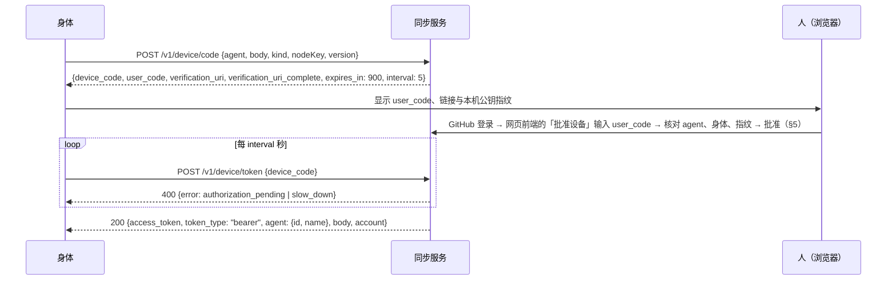
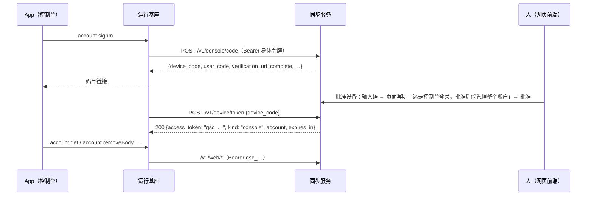

# 同步服务协议 v1

身体（运行基座、灵魂桥）与同步服务之间的接口。实现：服务端 `sync/src/`，身体端 `runtime/src/mesh/`。协议版本号为 `1`，不兼容的修改必须提升版本号。

同步服务是**目录与信令**，不是信任根：身体之间建立连接时，必须用灵魂仓库 `bodies/<身体>.json` 里登记的节点公钥核对对方（见 §4）。同步服务即使被攻破，也只能让身体连不上，不能冒充身体。

## 1. 身体的节点密钥

- 每具身体一把 **ed25519** 密钥，首次需要时在本机生成，私钥只在本机（运行基座：`QUETZAL_HOME/secrets/mesh_ed25519`，权限 0600）。
- 公钥写成 32 字节原始公钥的 base64url（43 个字符），称为 `nodeKey`。
- **指纹**：原始公钥字节的 SHA-256，取前 16 个十六进制字符，每 4 个一组用空格隔开（例如 `3f2a 9c01 77be d4e0`）。绑定时网页与身体两边各自显示，给人核对。

## 2. 绑定（OAuth 2.0 设备授权，RFC 8628 的语义）

| 字段 | 规则 |
|---|---|
| `agent.id` | `agent.json` 的 `id`（UUID） |
| `agent.name` | 显示名，1–80 字符 |
| `body` | `^[a-z0-9][a-z0-9-]{0,39}$`，与灵魂仓库里的身体名相同 |
| `kind` | `runtime`（运行基座）或 `bridge`（灵魂桥，只读成员） |
| `nodeKey` | §1 |
| `version` | 身体的软件版本，最长 32 字符 |

- `/v1/device/token` 的错误：`authorization_pending`（还没批准）、`slow_down`（轮询太快，间隔加 5 秒）、`access_denied`（被拒绝）、`expired_token`（15 分钟过期，需要重新开始）、`invalid_grant`（设备码不存在或已经用过）。
- 令牌（`access_token`，`qsb_` 开头）只在批准后第一次轮询时生成并返回一次，服务端只存它的 SHA-256。身体把它存进自己的密钥目录（运行基座：`QUETZAL_HOME/secrets/sync.json`，0600；灵魂桥：`~/.agent-soul/<agent>/sync.json`）。
- **agent 登记按账户隔离**：`(账户, agent.id)` 唯一。agent id 不是秘密，所以不能全局唯一，否则别人知道了就能抢先占住。同一个 agent 的身体要绑定到同一个账户下，才会互相看到。
- 同一 agent 下再次绑定同名身体：新令牌生效，旧令牌立即作废，旧连接被断开。
- 限流：每个客户端地址 10 分钟内最多申请 10 次绑定码；每个账户 10 分钟内最多输错 10 次短码。
- `verification_uri` 指向网页前端（配置了 `SYNC_WEB_URL` 时为 `<前端>/device`，否则为同步服务自带的 `/device`）。

其他接口：

| 方法 | 路径 | 说明 |
|---|---|---|
| GET | `/v1/health` | `{ok, service, version, protocol, login, turn, online}` |
| GET | `/v1/me` | 请求头 `Authorization: Bearer <令牌>` → `{agent, body, kind, account}`；令牌无效为 401 |
| DELETE | `/v1/me` | 身体自己解绑：删除登记、令牌作废 |
| POST | `/v1/console/code` | 控制台登录（§5.2）：`Authorization: Bearer <身体令牌>`，可带 `X-Quetzal-Version`；返回与 `/v1/device/code` 相同的结构 |

## 3. 信令：WebSocket `/v1/ws`

- 地址：`wss://<域名>/v1/ws`。连接建立后 10 秒内必须先发 `hello`，否则断开。
- 每条消息是一个 JSON 文本帧，最大 64 KiB；不支持二进制帧；不协商压缩。
- 服务端每 30 秒发一次 WebSocket ping，没有回 pong 就断开。身体可以发 `{"t":"ping"}` 测量往返时间，服务端回 `{"t":"pong","now":<毫秒>}`。
- 每条连接 10 秒内最多 200 条消息，超出回 `{"t":"error","code":"rate_limited"}`。

### 3.1 身体 → 服务

| 消息 | 说明 |
|---|---|
| `{"t":"hello","token","protocol":1,"version","agentName"?}` | 认证。`agentName` 有变化时更新登记的显示名 |
| `{"t":"signal","to"?,"id"?,"data"}` | 转发给同一 agent 的另一具在线身体（`to`），省略 `to` 则发给所有在线的其他身体。`data` 任意 JSON，服务端不解析 |
| `{"t":"turn"}` | 刷新 TURN 凭据（凭据到期前调用） |
| `{"t":"ping"}` | 测往返 |

### 3.2 服务 → 身体

| 消息 | 说明 |
|---|---|
| `{"t":"welcome","protocol","now","agent":{id,name},"body","account","peers":[Peer],"iceServers","ttl"}` | 认证成功。`now` 是服务端时钟，可用于估计时钟偏差 |
| `{"t":"peer","peer":Peer}` | 另一具身体上线、下线或重新绑定 |
| `{"t":"peer.removed","body"}` | 另一具身体被解绑 |
| `{"t":"signal","from","id"?,"data"}` | 来自另一具身体的信令 |
| `{"t":"turn","iceServers","ttl"}` | 新的 TURN 凭据 |
| `{"t":"error","code",…}` | `bad_message`、`rate_limited`、`offline`（`to` 不在线，带回 `to` 与 `id`）、`unauthorized`、`protocol`（带 `supported`）、`already_hello` |
| `{"t":"bye","reason"}` | 即将断开：`replaced`（同一身体的新连接顶替了这条）、`revoked`（被解绑） |

`Peer = {body, kind, nodeKey, version, online, lastSeen}`。

`iceServers` 的格式与 WebRTC 的 `RTCIceServer` 相同：`[{urls: ["stun:…"]}, {urls: ["turn:…?transport=udp", "turn:…?transport=tcp"], username, credential}]`。TURN 凭据采用 coturn 的 `use-auth-secret`：`username = "<到期 Unix 秒>:<标识>"`，`credential = base64(HMAC-SHA1(共享密钥, username))`，默认 1 小时有效。

WebSocket 关闭码：`4400` 帧格式错误、`4401` 未认证或认证失败、`4403` 被解绑、`4409` 被顶替、`4426` 协议版本不符、`1001` 服务关闭。

## 4. 身体之间：WebRTC 数据通道

服务端不参与这一层，这里只是约定：

- 两具身体用 WebRTC 建立连接：ICE 负责穿透（局域网、IPv6、STUN 反射地址，打不通时由 TURN 中转），DTLS 负责加密，SCTP 数据通道负责可靠有序传输。运行基座用 `node-datachannel`（libdatachannel）。
- **信令内容由身体签名**：`signal.data` 携带 `{sdp | candidate, from, to, ts, nonce, sig}`，`sig` 是发送方节点私钥对规范化 JSON（不含 `sig`）的 ed25519 签名。接收方：
  1. 用**灵魂仓库**里 `bodies/<from>.json` 的 `meshKey` 验证签名（不信任同步服务给的 `nodeKey`，两者不一致就拒绝并提醒）；
  2. 检查 `to` 是自己、`ts` 在 ±5 分钟内、`nonce` 没有见过（防重放）。
- SDP 里的 DTLS 证书指纹因此由节点密钥担保：中转者或同步服务无法插入中间人。数据通道打开后，双方再用节点密钥对 DTLS 指纹做一次挑战与应答，确认通道两端就是签名的两方。
- 经 TURN 中转的流量本身就是 DTLS 加密的，中转服务器看不到内容。

## 5. 账户接口：`/v1/web/*`

给人看的页面（登录、账户、批准设备）都在网页前端（`SYNC_WEB_URL`，官方部署为 https://quetzal.plutokeating.beer），同步服务只提供接口；App（控制台）经运行基座用同一套接口。没有配置 `SYNC_WEB_URL` 时，同步服务退回自带的简单页面（`/`、`/account`、`/device`）；配置了时这些地址一律跳到前端。

### 5.1 登录与身份

- **网页前端**：`GET /login?return_to=<前端上的地址>` 经 GitHub 登录，回到 `return_to`（只接受前端同源的地址，否则回到 `<前端>/account`；失败回到 `<前端>/account?login=failed`）。会话是同步服务自己的 Cookie（`__Host-quetzal_session`，HttpOnly、Secure、SameSite=Lax）；前端与同步服务必须同站（同一个可注册域名），用 `fetch(…, {credentials: "include"})` 调用。
- **控制台**：`Authorization: Bearer qsc_…`（§5.2），只认控制台登录的会话；身体令牌与网页会话的 Cookie 都不能当它用，它也不能当身体令牌或 Cookie 用。
- **CORS**：只对 `SYNC_WEB_URL` 与同步服务自己的源放行带凭据的请求（`GET`、`POST`，头 `Content-Type`）。
- **改动请求**：`POST`，`Content-Type: application/json`（跨源时必先预检）；用 Cookie 时必须带 `Origin` 且是上面两个源之一，否则 403。响应都带 `Cache-Control: no-store`。

| 方法 | 路径 | 请求体 | 返回 |
|---|---|---|---|
| GET | `/v1/web/session` | — | `{loginEnabled, user: {login, name} \| null}` |
| GET | `/v1/web/account` | — | `{user, limits: {agents, bodies}, agents: [{id, name, created, bodies: [{body, kind, version, created, lastSeen, online, fingerprint}]}], consoles: [{id, body, created, lastUsed, current}]}`；没登录 401 |
| POST | `/v1/web/device/lookup` | `{code}` | 待批准的码 `{code, agent: {id, name}, body, kind: runtime｜bridge｜console, version, fingerprint, replaces, newAgent, expires}`；错误 `bad_code`（404，计入输错次数）、`too_many`（429）、`expired` / `decided` / `too_many_agents` / `too_many_bodies` / `not_yours`（409） |
| POST | `/v1/web/device/decide` | `{code, approve}` | `{ok, approved}`；错误同上 |
| POST | `/v1/web/bodies/remove` | `{agent, body}` | 解绑一具身体（立即断开）；不是你的或不存在为 404 |
| POST | `/v1/web/agents/remove` | `{agent}` | 删除一个 agent 与它的所有身体 |
| POST | `/v1/web/consoles/revoke` | `{id}` | 吊销一个控制台登录（`id` 为 `consoles[].id`） |
| POST | `/v1/web/logout` | `{}` | 网页：清除 Cookie 会话；控制台：作废它自己的令牌 |
| POST | `/v1/web/account/delete` | `{confirm: true}` | 删除账户（级联删除会话、agent、身体、设备码，所有连接断开） |

### 5.2 控制台登录

App 只和自己的运行基座通信，没有浏览器 Cookie；身体令牌只代表这具身体。要在 App 里管理账户，运行基座代它申请一次控制台登录：

- 只有已绑定的身体能申请（请求要带身体令牌），且**只有这具身体所在账户的主人能批准**（别的账户批准时为 `not_yours`）：别人骗你批准，也得先控制你的一具身体。
- 令牌 `qsc_` 开头，256 位随机数，库里只存 SHA-256；有效期 30 天，滑动续期；`last_used` 记录最近使用。运行基座存进 `secrets/sync-account.json`（0600）。在网页或任何 App 的「控制台登录」里可以吊销，立即失效；运行基座遇到 401 就删除本地令牌、回到未登录。

