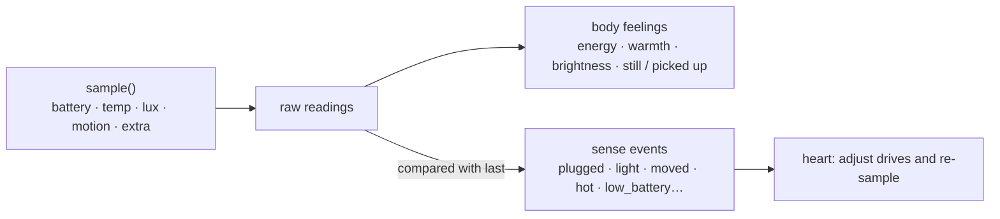

## What an adapter is

The runtime core does not know whether it runs on a phone, a Raspberry Pi or a server. Everything about the device — sensor sampling, system notifications, playing audio, device actions — comes from the **body adapter**. An adapter is an independently built ES module whose default export is a `BodyAdapter`.

The repository ships one platform-level reference implementation: `runtime/adapters/termux/` (any Android phone + Termux:API, sensors detected by name), built as `dist/termux.mjs`.

## The interface

```ts
import type { BodyAdapter, RawSample, AdapterTool } from "./adapter";   // import type only

const adapter: BodyAdapter = {
  name: "my-board",
  describe: "A dev board on the windowsill with a light sensor and a buzzer",
  async init() { /* optional: open devices, check dependencies */ },
  async sample(): Promise<RawSample> {
    return {
      battery: { level: 0.82, charging: true, tempC: 31 },
      lux: await readLux(),
      motion: 0,
      extra: { humidity: 46 },         // device-specific readings, passed to the twin as is
    };
  },
  async notify(title, text) { /* system notification: pairing codes, proactive messages */ },
  async playAudio(file) { /* play synthesized speech */ },
  tools: [
    {
      name: "beep",
      description: "Sound the buzzer once",
      parameters: { type: "object", properties: { ms: { type: "number" } } },
      permission: "device",            // must be a capability category the guard knows
      handler: async ({ ms }) => { await beep(ms ?? 200); return "beeped"; },
    },
  ],
};
export default adapter;
```

| Member | Required | Notes |
|---|---|---|
| `name` / `describe` | yes | `describe` is one sentence about this body, written into her self-image |
| `sample()` | yes | One physical sample; every field optional: report what you have |
| `init()` | no | Called once at start |
| `notify()` | no | Local system notification; without it pairing codes can only be read from the token file |
| `speak()` / `playAudio()` | no | Speak / play an audio file |
| `tools` | no | Device actions, each declaring its capability category (`device`, `camera`, `microphone`, `location`…) |
| `hands` | no | Reserved: see the screen, tap, type, open apps |

## Constraints

- An adapter may **only `import type`** from the interface file; it must not depend on any other part of the core. Types are erased at build time, so the output has no dependency on the core.
- A tool's `permission` must be a category the guard knows; otherwise it is treated as "allow".
- If loading fails, the core falls back to the generic adapter (no sensors) and says so in the log.

## Build and point at it

```bash
npx esbuild my-adapter.ts --bundle --platform=node --target=node22 --format=esm --outfile=my-adapter.mjs
WINDLER_HOME=~/windler WINDLER_ADAPTER=$PWD/my-adapter.mjs node --enable-source-maps main.cjs
```

The path can also go into the `adapter` field of `config/windler.json`.

## From samples to feelings



Sampling intervals adapt: two minutes while things change, stretching to ten when calm. Sampling never calls a model and is not a wake-up.

## What the Termux adapter provides (reference)

`sample()`: battery / charging / temperature / health, light and motion (sensors detected by name; absent ones are not reported); `notify()` (with an "Open Windler" button), `playAudio()`; tools `take_photo`, `record_audio`, `location`, `vibrate`, `torch`, `clipboard`, `read_sensor`. No `speak` (many phones have no system TTS); speech comes from the runtime's `voice_speak` (Azure Speech).

Full types in [Adapter interface](/docs/reference/adapter-interface).
