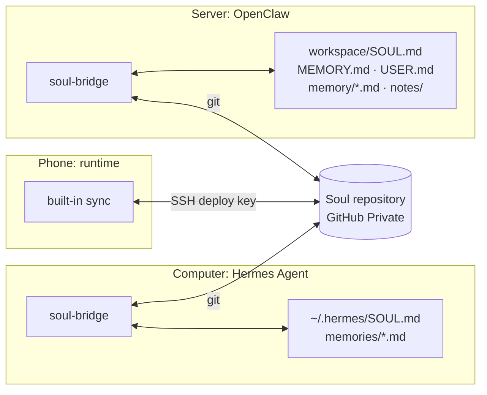

## What it is

**soul-bridge** is a small background program that you install on a machine running [Hermes Agent](https://hermes-agent.nousresearch.com/) or OpenClaw, and can remove again at any time. It syncs that framework's personality and memory files with the soul repository in **both directions**, so the agent on the phone and the one on the computer share the same soul.

## Installing: let it install itself

The **Hermes / OpenClaw** section of **Control → Advanced → Sync** has a ready-made message. Copy it and send it to the Hermes or OpenClaw agent on that machine. Following the skill, it will:

1. check for and install Node.js (22.18+) in the user directory, fetch the program and keep the skill in its own skills directory;
2. determine the soul repository: the address you gave → its own memory → an existing `*.soul` private repository on GitHub → create one;
3. run one `init` that does everything: generate a deploy key, add it with write access when `gh` or `GITHUB_TOKEN` is available, clone, import the existing personality and memory, install hooks and the background service, sync once;
4. run `doctor` and fix what it suggests.

It messages you only when GitHub credentials are missing, git is missing and there is no sudo, or the same error happens three times. It then sends one message with everything it needs, usually just **adding the deploy public key once on the GitHub website**.

> [!TIP]
> You never need to open a terminal.

## What is synced

| Mapping | Hermes | OpenClaw |
|---|---|---|
| Personality | `SOUL.md` | `SOUL.md` |
| Resident notes | `memories/MEMORY.md` (truncated to Hermes's character limit on write-back; the truncation is not written to the repository) | `MEMORY.md` (free Markdown; new paragraphs are absorbed as entries) |
| About the user | `memories/USER.md` | `USER.md` |
| Journal | — (Hermes has no journal) | `memory/YYYY-MM-DD*.md` both ways; other bodies' journals mirrored to `memory/bodies/<body>/` |
| Shared notes | — | `memory/notes/**.md` per file, both ways |
| Takes effect | Next session | Next turn |

The bridge **copies** files and remembers a baseline on both sides. Additions in the framework are kept and deletions are carried over. Entries cut by a character limit stay in the soul, because the bridge does not count them as deletions.

## When it syncs

Hermes: after memory tool calls, at session end, on file changes, plus periodic pulls. OpenClaw: on start, `/new`, `/reset`, after compaction, on file changes, plus periodic pulls. The periodic pull exists because that machine cannot receive push notifications; it has nothing to do with the agent's waking.

## Commands (for troubleshooting)

| Command | Purpose |
|---|---|
| `init` | Connect in one command |
| `doctor` | Self-check with fix suggestions |
| `sync` | Sync once now |
| `status` | Configuration, last sync result, public key |
| `attach` / `detach [--purge]` | Reinstall hooks and service / unplug (framework files are left as they are) |

Local data lives in `~/.agent-soul/<agent>/`: configuration, repository copy, baseline, deploy key, log.

## Unplugging

Have the agent there run `detach`, or delete its deploy key on GitHub so it can no longer write to the soul repository. The framework's files stay as they are.
