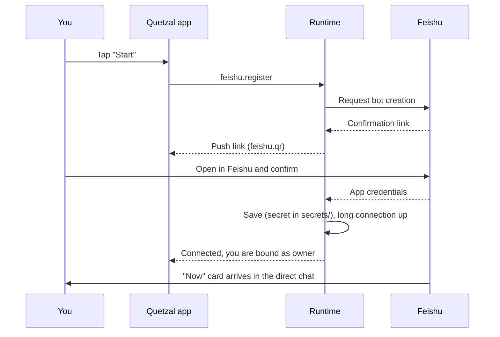

## What it gives you

With Feishu connected she has a second place to talk to you. Everything in Feishu happens through **interactive cards**; no commands.

- The direct chat receives a **"Now" card**: state, drives, the thought she wants to share.
- Chat: just message the bot. If she is working, your message is merged as an interjection by default.
- Approvals, permissions, pause and emergency stop are card buttons that call the same operations layer as the app.
- Messages she sends when waking on her own are marked "💭 proactive".

## One-tap setup

**Control → Feishu → Start**:

The bot is named after the agent's display name and the person who performed the setup is bound as its owner. It uses a **long connection**, so the phone needs no public address.

> [!NOTE]
> You can also enter an existing app's App ID and App Secret by hand (**Control → Feishu**). The secret is stored in the local `secrets/` directory and never enters the soul repository.

## Chatting in Feishu

- Just send messages. Her reply comes within the turn in progress; messages received while she is working get a reaction emoji and are merged before the next model call.
- Send **`/new [title]`** to start a new session.
- Images and files are downloaded through Feishu's message-resource API and handed to her as attachments.
- When she asks for a password or key she sends a **secret input** card (see [Passing secrets](/docs/guide/secrets)). Feishu does not let bots recall your messages, so **recall the ones containing secrets yourself** afterwards.

## Optional: bot menu

In the Feishu developer console, under "Bot → Custom menu", add push events `home` / `flow` / `memory` / `control` to open the corresponding card from the bottom of the chat with one tap.

## Status and troubleshooting

**Control → Feishu** shows connection state, errors and the owner. Common problems are in [Troubleshooting](/docs/advanced/troubleshooting).
