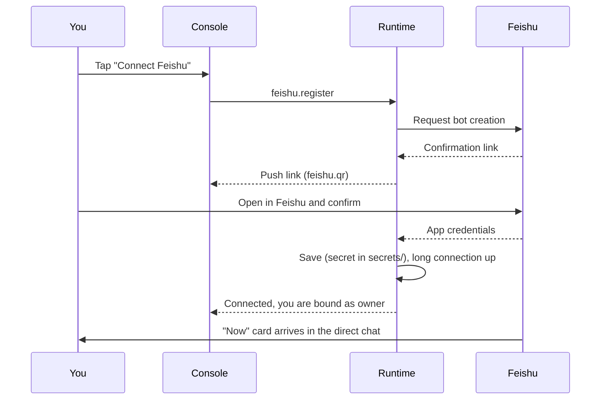

## What it gives you

Once Feishu is connected, the agent can talk to you in Feishu too. You do everything there with buttons on **interactive cards**, so there are no commands to learn.

- The direct chat receives a **"Now" card** with its state, its drives and a thought it wants to share.
- To chat, message the bot. If the agent is working, your message joins the current turn as an interjection by default.
- The card buttons for approvals, permissions, pause and emergency stop do the same as the matching actions in the app.
- Messages it sends after waking on its own are marked "💭 proactive".

## One-tap setup

**Control → Feishu → Connect Feishu**:

The bot takes the agent's display name, and whoever tapped **Connect Feishu** becomes its owner. It uses a **long connection**, so the phone needs no public address.

> [!NOTE]
> You can also enter an existing app's App ID and App Secret by hand (**Control → Feishu → Enter manually**). The secret is stored in the local `secrets/` directory and never enters the soul repository.

## Chatting in Feishu

- Send messages as usual, and it replies in the current turn. If a message arrives while it is working, it adds a reaction emoji to show it got the message, then adds it to the turn before the next model call.
- Send **`/new [title]`** to start a new session.
- Send **`/sandbox`** to take the current session out of the [real environment](/docs/guide/permissions#real-environment).
- When you send images and files, the runtime downloads them through Feishu's message resource API and hands them to the agent as attachments.
- When it asks for a password or key, it sends a **secret input** card (see [Passing secrets](/docs/guide/secrets)). Feishu does not let bots recall your messages, so afterwards **recall any message that contains a secret yourself**.

## Optional: bot menu

In the Feishu developer console, under "Bot → Custom menu", add the push events `home` / `flow` / `memory` / `control`. A menu then appears at the bottom of the chat, and one tap opens the matching card.

## Status and troubleshooting

**Control → Feishu** shows the connection state, errors and the owner. For common problems, see [Troubleshooting](/docs/advanced/troubleshooting).
