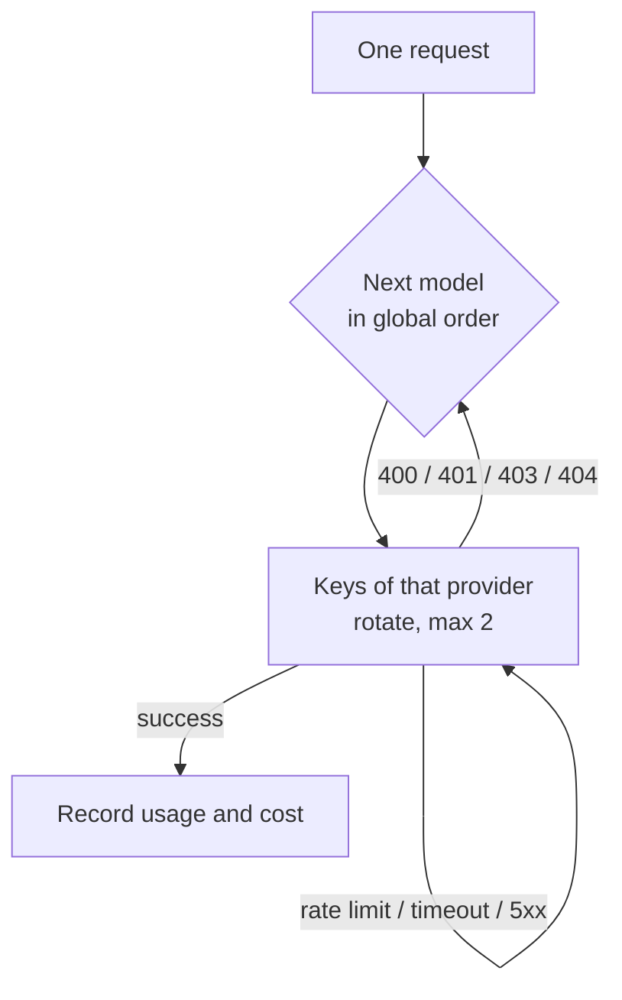

## Supported protocols

| Protocol | Use for |
|---|---|
| `openai-completions` | OpenAI Chat Completions and everything compatible with it (most providers, local inference servers) |
| `openai-responses` | The OpenAI Responses API |
| `anthropic-messages` | The Anthropic Messages API |
| `google-generative-ai` | Google Gemini |

## Configuring in the console (phone app or web version, the same interface)

**Control → Models**. The configuration is edited as a draft and saved as a whole:

1. **Add a provider**: from the catalog or custom (name, API URL including the version path such as `/v1`, protocol).
2. **Add keys**: several keys per provider are fine; they rotate.
3. **Choose models**: tick from the public catalog (models.dev, with context lengths and prices), fetch from the provider's models endpoint, or add a custom model by hand.
4. **Test**: shows latency and the result.
5. **Global model order**: all enabled models from all providers sit in one list you can drag.

> [!NOTE]
> Before changing an API URL you must remove its old keys, and saving carries a version number: if the configuration was changed elsewhere first (for instance from a Feishu card) the save is rejected and you are asked to reload. Both rules exist so a key is never sent to the wrong address.

## Call order and failover

Each call walks the **global order** of enabled models; within a provider, keys rotate with at most two attempts:

- Rate limits, timeouts, 5xx: try another key;
- 400/401/403/404 ("this model or configuration is wrong"): move to the next model;
- A streaming response with no data chunk for 90 seconds counts as failed (with a 15-minute absolute cap).

## Introspection model

You can nominate a **quick (introspection) model**. When she wakes she uses it first for a lightweight judgement: does she feel like doing anything, and what. A cheap, fast model here saves most of the cost of "woke up and went back to sleep".

## Models that can see images

When you send her pictures, routing only picks models that **accept images**. The order of evidence: your manual `vision` flag → the public catalog's input modalities → the model name. If none qualifies the image is dropped and the message says so.

## Special providers

A few providers have extra conventions handled by separate compatibility modules that activate automatically. Currently: **OpenCode Go**, activated when the catalog ID is `opencode-go` or the URL is `opencode.ai/zen/go`; it picks the right API per model and sends a session identifier. Nothing to configure.

## How keys are stored

- Keys are encrypted with **AES-256-GCM** on the phone; the master key lives in `QUETZAL_HOME/secrets/`;
- Every interface returns only the **last four characters**;
- Keys **never enter the soul repository**: they do not travel when she changes bodies; each body is configured separately.

## Usage and budget

Tokens and estimated cost per call are recorded locally and shown in **Now** and **Control → Advanced → Budget**. When the budget is spent her wake rate drops sharply (see [Permissions and safety](/docs/guide/permissions)).
