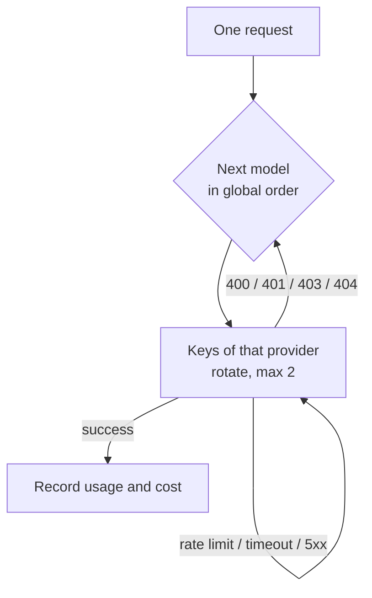

## Supported protocols

| Protocol | Use for |
|---|---|
| `openai-completions` | OpenAI Chat Completions and everything compatible with it (most providers, local inference servers) |
| `openai-responses` | The OpenAI Responses API |
| `anthropic-messages` | The Anthropic Messages API |
| `google-generative-ai` | Google Gemini |

## Configuring in the console (phone app or web version, the same interface)

Go to **Control → Models**, tap a provider, paste the key and tap **Connect**. The runtime picks the models, tests them and puts them in order for you (see [First steps](/docs/start/first-steps)).

To adjust the details, tap **Edit** in the top right. Your changes in the editor stay in a draft until you save, and then they all take effect together:

1. **Add a provider**: pick one from the catalog or add your own (name, API URL including the version path such as `/v1`, protocol).
2. **Add keys**: you can add several keys per provider, and calls take turns using them.
3. **Choose models**: tick them in the public catalog (models.dev, which lists context lengths and prices), fetch them from the provider's models endpoint, or add a custom model by hand.
4. **Test**: shows the latency and the result.
5. **Global model order**: the enabled models from every provider sit in one list. Drag them to change the order.

> [!NOTE]
> Two rules keep a key from being sent to the wrong address. Before you change an API URL, you must remove its old keys. And each save carries a version number: if someone changed the configuration elsewhere first (for instance from a Feishu card), the save is rejected and you are asked to reload.

## Call order and failover

Each call tries the enabled models in the **global order**. Within a provider, keys take turns, with at most two attempts:

- Rate limits, timeouts and 5xx errors: try another key;
- 400/401/403/404, which mean the model or configuration is wrong: move to the next model;
- A streaming response that sends no data for 90 seconds, or only keep-alives with no content for 180 seconds, counts as failed. An answer that is still streaming has no time limit.

## Introspection model

You can choose a **quick (introspection) model**. When the agent wakes, it first uses this model for a quick check: does it feel like doing anything, and what. Pick a cheap, fast model here, and the many times it wakes and goes back to sleep will cost very little.

## Models that can see images

When you send it pictures, the runtime only picks models that **accept images**. It decides whether a model can see images by checking, in this order: your manual `vision` flag → the input types in the public catalog → the model name. If no model can see images, the image is dropped and the message says so.

## Special providers

A few providers have extra rules, and the runtime handles them automatically with nothing for you to set. Today this covers **OpenCode Go**. It applies when the catalog ID is `opencode-go` or the URL is `opencode.ai/zen/go`, picks the right API for each model and sends a session identifier.

## How keys are stored

- Keys are stored on the phone, encrypted with **AES-256-GCM**. The master key lives in `QUETZAL_HOME/secrets/`;
- Every interface shows only the **last four characters**;
- Keys **never enter the soul repository**, so they do not move when the agent changes bodies. You set them up on each body separately.

## Usage and budget

The tokens and estimated cost of each call are recorded on the device and shown in **Now** and **Control → Advanced → Budget**. When the budget runs out, the agent wakes on its own far less often (see [Permissions and safety](/docs/guide/permissions)).
