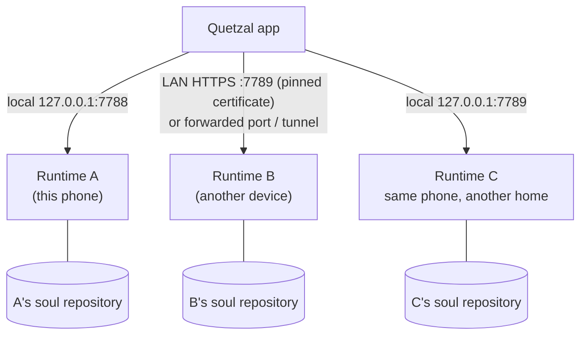

## One console, several agents

The console (the phone app, the Linux and Windows desktop versions, or the web version) keeps several connections. Each one leads to one runtime, which is one agent in one body. To open the **Switch** list, tap the name in the top bar on the phone, or the avatar in the top left corner on the web. When you switch, the app's wording and theme color change to match.

## Connecting a new agent

Tap the name in the top bar, then **Connect another**. You can also expand **Connect another device** on the connection page and enter the address there.

1. Enter the runtime's address.
   - For another device, enter only its IP or name (e.g. `192.168.1.8`), and the app uses the encrypted `https://…:7789`. That device must be open to the LAN (`--lan` on Linux, see [Other machines](/docs/advanced/other-machines)). If it is not, first forward its port to the phone and enter `127.0.0.1:<port>`.
   - For another runtime on the same phone, enter `127.0.0.1:<port>`.
2. Over an encrypted connection, the app shows that device's **certificate fingerprint** (e.g. `1a2b 3c4d 5e6f 7a8b`). Check that it matches the pairing notification (or `quetzal status`) on that device. From then on, this connection accepts only that certificate.
3. Tap **Get pairing code**. The code is eight letters and digits and is valid for five minutes. It appears with the certificate fingerprint in that device's system notification (sent by the body adapter's `notify`).
4. Enter the code and tap **Pair**. The app stores the token and reconnects automatically from then on. Over an encrypted connection the code itself never crosses the network. The app sends only a proof computed from the code and the certificate fingerprint.

> [!NOTE]
> Two cases need no pairing code. For a runtime the wizard installed on **this phone**, the install script hands the token straight to the app. The web console is logged in as soon as it opens when it connects to the runtime on **the machine that serves it**.

A code stops working after five wrong attempts or when it expires. Get a new one.

## Several agents on one device

Each runtime instance has its own home directory and gateway port. A second agent on the same device normally uses a different port (e.g. 7789). Each agent has its own soul repository and identity id, and the **identity guard** keeps their memories from mixing.

## One agent, several bodies

Here **one soul lives in several bodies**. The bodies share personality and memory through the soul repository, and each writes its own journal. See [Soul sync](/docs/guide/soul-sync) and [soul-bridge](/docs/advanced/soul-bridge).

## Removing a connection

You can remove a connection from the switch list. This removes it from the console only. The runtime and the agent's memory are still there.
