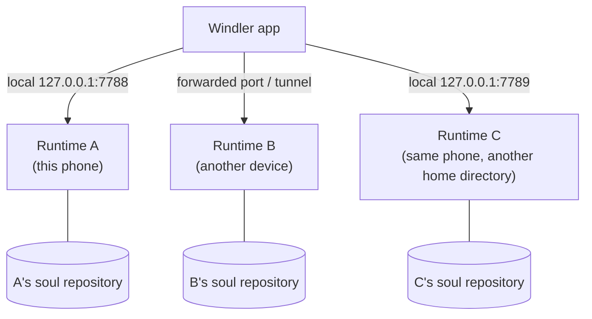

## One app, several agents

The Windler app keeps several connections, each to one runtime (one agent in one body). Tap the name in the top bar → **Switch agent**; wording and theme color follow.

## Connecting a new agent

Top-bar name → **Connect a new agent**:

1. Enter the runtime's **gateway address** (e.g. `http://127.0.0.1:7789`). The gateway listens only on localhost, so a runtime on another device must have its port forwarded to the phone first (see [Other machines](/docs/advanced/other-machines)).
2. **Request a pairing code**: six digits, valid for five minutes, delivered through that device's system notification (the body adapter's `notify`).
3. Enter the code → paired. The app stores the token and reconnects automatically from then on.

> [!NOTE]
> A runtime installed on **this phone** by the wizard needs no pairing code: the install script hands the token straight to the app.

A code becomes invalid after five wrong attempts or on expiry; just request a new one.

## Several agents on one device

Each runtime instance has its own home directory and gateway port. A second agent on the same device normally uses a different port (e.g. 7789). Each agent has its own soul repository and identity id; the **identity guard** keeps their memories from mixing.

## One agent, several bodies

That is a different thing: not several agents but **one soul in several bodies**. They share personality and memory through the soul repository and each writes its own journal. See [Soul sync](/docs/guide/soul-sync) and [soul-bridge](/docs/advanced/soul-bridge).

## Removing a connection

From the switch list you can remove a connection. This only removes it from the app; the runtime and its memory are untouched.
