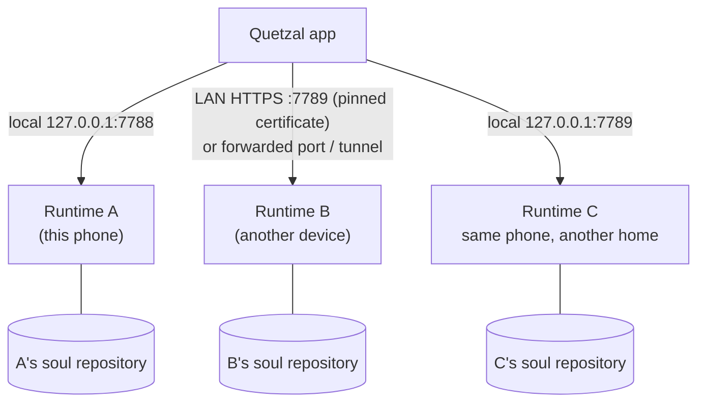

## One console, several agents

The console (the phone app, or the web version on a Linux machine) keeps several connections, each to one runtime (one agent in one body). Tap the name in the top bar on the phone, or the avatar in the top-left corner on the web → the **Switch** list; wording and theme color follow.

## Connecting a new agent

Top-bar name → **Connect another** (or expand **Connect another device** on the connection page and enter the address):

1. Enter the runtime's address. For another device enter just its IP or name (e.g. `192.168.1.8`) and the app uses the encrypted `https://…:7789`; that device must be open to the LAN (`--lan` on Linux, see [Other machines](/docs/advanced/other-machines)), otherwise forward its port to the phone first and enter `127.0.0.1:<port>`. Another runtime on the same phone is `127.0.0.1:<port>`.
2. Over an encrypted connection the app shows that device's **certificate fingerprint** (e.g. `1a2b 3c4d 5e6f 7a8b`): check it against the pairing notification (or `quetzal status`) on that device. From then on this connection accepts only that certificate.
3. **Get pairing code**: eight letters and digits, valid for five minutes, delivered with the certificate fingerprint through that device's system notification (the body adapter's `notify`).
4. Enter the code → **Pair**. The app stores the token and reconnects automatically from then on. Over an encrypted connection the code never travels over the network; the app sends only a proof computed from it and the certificate fingerprint.

> [!NOTE]
> A runtime installed on **this phone** by the wizard needs no pairing code: the install script hands the token straight to the app. Nor does the web console when it connects to the runtime on **the machine that serves it**: it is logged in as soon as it opens.

A code becomes invalid after five wrong attempts or on expiry; just get a new one.

## Several agents on one device

Each runtime instance has its own home directory and gateway port. A second agent on the same device normally uses a different port (e.g. 7789). Each agent has its own soul repository and identity id; the **identity guard** keeps their memories from mixing.

## One agent, several bodies

That is a different case: **one soul in several bodies**. They share personality and memory through the soul repository and each writes its own journal. See [Soul sync](/docs/guide/soul-sync) and [soul-bridge](/docs/advanced/soul-bridge).

## Removing a connection

From the switch list you can remove a connection. This only removes it from the console; the runtime and its memory stay as they are.
