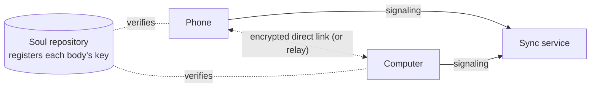

## What it is

A soul repository lets an agent's bodies share personality and memory. **Multiple bodies** go further: bodies that are online at the same time connect directly and become **one mind**:

| Shared | What it means |
|---|---|
| One conversation | Sessions, conversations and the flow are the same on every body. Start a topic on the phone and keep reading it on the computer's console; replies from elsewhere are marked "on X" |
| One heart | Only one body (the coordinator) decides when the agent wakes; the other bodies' sensations (picked up, plugged in…) flow to it |
| It chooses where | On waking, the agent sees each body's battery, temperature, ongoing work and where you last talked, and picks one body (or several at once) to think or dream on |
| Using another body | While thinking on the computer it can take a photo with the phone or run a command on the server (`body_call`), or move the whole turn to another body (`move_to`) |
| One set of settings | Models and keys, permissions, budget (a daily total), hearing and voice, and the emergency stop change everywhere at once |

Every console shows which body is talking with you right now; what you say to the same conversation elsewhere is forwarded automatically.

## What you need

1. **A sync service** that lets bodies find each other and relays when no direct path exists. It stores no conversations or memory — only accounts, agents and body registrations. You can host it yourself (`sync/` in the repository, one Linux server with a public address, one command), see [sync/README](https://github.com/PlutoKeating/Project.Quetzal/blob/main/sync/README.md).
2. **A soul repository** connected on every body (see [Soul sync](/docs/guide/soul-sync)). The public keys the bodies use to verify each other are registered there — it is the root of trust, so even a compromised sync service cannot impersonate your bodies.
3. **A GitHub account** to sign in and approve bodies on the sync service's website.

## Binding a body

**Control → Multiple bodies**:

1. Enter the sync service address (`https://…`) and save.
2. Choose "Bind to the sync service"; an 8-character code and a link (or QR code) appear.
3. Open the link in a browser, sign in with GitHub, enter the code, **check that the key fingerprint on the web page matches the one in the console**, and approve.
4. Within seconds the body connects to the sync service; other bound bodies that are online connect to it directly (LAN, IPv6, NAT traversal, or relayed through the server when nothing else works — relayed traffic is end-to-end encrypted too).

All bodies of one agent must be bound under **the same GitHub account** to see each other.

## Day to day

- **Who holds the heartbeat**: the Multiple bodies page shows "the heartbeat is on X". With several bodies online the one with the higher priority holds it; on a tie, a body on mains power and with longer uptime wins. Raise "coordinator priority" for an always-on server. If the holder goes offline, another body continues from the latest state.
- **"Placement" in the flow**: where the agent chose to wake.
- **Approvals**: requests waiting on other bodies show up here too (marked with the body) and can be approved anywhere.
- **Emergency stop**: with other bodies online, the stop asks whether to freeze "all bodies" or "only this body".
- **Feishu**: one Feishu bot can only be connected from one body. Choose "who holds Feishu" under Control → Feishu; proactive messages from the other bodies are sent through it.
- **Hearing**: when several phones hear the same sentence only one copy is kept; when the agent answers aloud, it speaks from the phone you talked to.
- **Hermes / OpenClaw**: a body with the [soul bridge](https://github.com/PlutoKeating/Project.Quetzal/blob/main/bridge/skills/soul-bridge/SKILL.md) can bind as a **read-only member** (give the sync service address to the agent there; it hands you a link and a binding code): it sees what the agent is doing on which body and the recent conversations, but cannot act on other bodies and is never chosen to think or dream.

## When disconnected

If the bodies cannot reach each other (offline, sync service down), each keeps running and memory still syncs through the soul repository; if they split into groups, each group has its own heart. When they reconnect, conversations catch up and the hearts merge.

## Security

- Bodies connect over WebRTC (DTLS encryption); signaling is signed with each body's node key, and receivers only trust the public keys registered in the **soul repository**.
- Model keys travel between bodies only over that encrypted channel and are re-encrypted with the receiver's own master key.
- The sync service stores only: GitHub username and display name, agent name and id, body name / kind / version / public key / last seen; tokens are stored as hashes. It keeps no IP or network addresses and cannot see conversations or memory.
- On the sync service's account page you can unbind a body or delete an agent or the whole account at any time.
