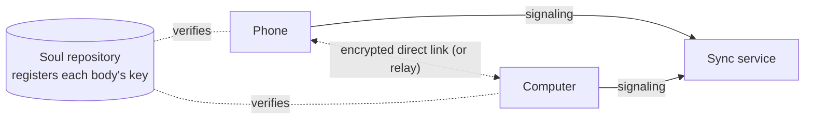

## What it is

**Multiple bodies** connect the bodies of one agent that are online at the same time, so they work as **one mind**. (The soul repository already lets them share personality and memory.) Once connected, they share these:

| Shared | What it means |
|---|---|
| One conversation | Sessions, conversations and the flow are the same on every body. Start a topic on the phone and keep reading it in the computer's console. Replies given on another body are marked "on X" |
| One heart | Only one body (the coordinator) decides when the agent wakes. What the other bodies sense (picked up, plugged in…) is passed to it |
| It chooses where | On waking, the agent sees each body's battery, temperature and current work and where you last talked, and picks one body (or several at once) to think or dream on |
| Using another body | While thinking on the computer it can take a photo with the phone or run a command on the server (`body_call`), or move the whole turn to another body (`move_to`). A photo taken on the phone can be viewed from the computer (`view_image` with the body name; only images can be fetched this way) |
| One set of settings | Change models and keys, permissions, budget (a daily total), hearing and voice, or the emergency stop on one body, and it changes on all of them |
| One thought to share | The thought shown on the home page is the same on every body. When the agent changes it on one body, the others follow; a body that was offline catches up when it connects |

Every console shows which body is talking with you right now. If you speak to the same conversation on another body, your message is forwarded automatically.

## What you need

1. **A sync service** helps bodies find each other and passes traffic between them when they cannot connect directly. It stores only accounts, agents and body registrations, and keeps no conversations or memory. By default Quetzal uses the official service, run personally by this project's author. You can also host it yourself (`sync/` in the repository, one Linux server with a public address, one command); see [sync/README](https://github.com/PlutoKeating/Project.Quetzal/blob/main/sync/README.md).
2. **A soul repository** connected on every body (see [Soul sync](/docs/guide/soul-sync)). The public keys the bodies use to check each other are registered there, so even someone who breaks into the sync service cannot pose as your bodies.
3. **An account** to sign in and approve bodies on the sync service's website. The official sync service uses a PlutoKeating account (the author's single account), and you can sign in with email, a passkey or GitHub. A sync service you host yourself uses the identity provider you configured. The GitHub app you install when the first soul repository is created can manage the repositories you chose; see [Trust and limits](/docs/guide/trust#what-the-github-app-can-do).
4. **The same version** of Quetzal on every body. 1.0.3 changed the protocol bodies use to connect, so bodies on different versions cannot connect, and the timeline says "Upgrade both sides to the same version to connect".

## Signing in a body

**Control → Devices**:

1. The sync service is set to the one this project runs, `https://sync.quetzal.plutokeating.beer`, so you do not need to enter anything. If you host your own, enter its address under **Sync service** in **Control → Advanced → Sync** and save. Clear the field to go back to the official one.
2. Tap **Sign in**, and the app opens the browser for you. The page also shows an 8-character code and a link, so you can scan it on another device. The Android setup wizard has this step too.
3. In the browser (the site's [Account → Add a device](/account/device)), sign in and enter or confirm the code. **Check that the key fingerprint on the web page matches the one in the console**, then approve.
4. Within seconds the body connects to the sync service, and other bound bodies that are online connect to it directly. They use the LAN, IPv6 or NAT traversal. When none of these work, traffic goes through the server, and that relayed traffic is end-to-end encrypted too.

All bodies of one agent must be signed in to **the same account** to see each other. To disconnect this body, tap **Sign out this device**.

## Day to day

- **Who holds the heartbeat**: the Devices page marks the body holding it with "heartbeat here". With several bodies online, the one with the higher priority holds it. On a tie, a body that is plugged in and has been running longer wins. For a server that is always on, raise its heartbeat priority under **Control → Advanced → Sync**. If the holder goes offline, another body continues from the latest state.
- **"Placement" in the flow**: where the agent chose to wake.
- **Approvals**: requests waiting on other bodies show up under **Control → Permissions** too, marked with the body, and you can approve them on any body.
- **Emergency stop**: with other bodies online, the stop asks whether to freeze "all bodies" or "only this body".
- **Feishu**: one Feishu bot can be connected from only one body. Choose which device connects it under **Control → Feishu**. Proactive messages from the other bodies are sent through that body.
- **Claims**: several conversations, including ones on other bodies, may want to do the same outside task at once, such as opening the same issue. The agent claims the task before starting, and other conversations that see the claim hold off. The body holding the heartbeat decides claims, and they expire on their own.
- **Hearing**: when several phones hear the same sentence, only one copy is kept. When the agent answers aloud, it speaks from the phone you talked to.
- **Where you said it**: the agent sees which body your message came in through: the body your console is connected to, the body that receives Feishu, or the phone whose ears heard you. With a single body this is left out.
- **Hermes / OpenClaw**: a body with the [soul bridge](https://github.com/PlutoKeating/Project.Quetzal/blob/main/bridge/skills/soul-bridge/SKILL.md) can join as a **read-only member**. Give the sync service address to the agent there, and it hands you a link and a binding code. That body can see what the agent is doing on which body and the recent conversations. It cannot act on other bodies and is never chosen to think or dream.

## When disconnected

If the bodies cannot reach each other (offline, sync service down), each one keeps running, and memory still syncs through the soul repository. If they split into groups, each group has its own heart. When they reconnect, conversations catch up and the hearts merge back into one.

## Account

All account settings are on the site's [Account](/account) page. In the app, the account row at the top of **Control → Devices** opens the same **Account** page:

| Sub-page | What it does |
|---|---|
| Overview | Every agent in the account and each of its devices, with online state, kind and version. Remove a device or delete an agent |
| Add a device | Enter the code a new device shows, check it, then approve or deny |
| Signed in | Which apps can manage this account. Sign out the ones you do not use at any time |
| Settings | Manage your account (email, password, passkeys, linked GitHub), sign out (of this browser, or of every browser at once), or delete the account |

**One sign-in**: once you sign a device in and approve it, the app on that device can manage the account too, with no second approval. That sign-in ends when you remove the device, and you can also sign it out under Signed in. The Account page asks you to tap **Sign in** again only with an older sync service that does not grant this.

## Security

- Bodies connect over WebRTC with DTLS encryption. Each body signs its signaling messages with its node key, and receivers trust only the public keys registered in the **soul repository**.
- Model keys travel between bodies only over that encrypted channel, and the receiving body encrypts them again with its own master key.
- The sync service stores only the account's id, username, display name and email; the id of the GitHub account used to link the soul repository; the agent's name and id; and each body's name / kind / version / public key / last seen time. Tokens are stored as hashes. It keeps no IP or network addresses and cannot see conversations or memory.
- On the Account page of the site or the app, you can remove a body, delete an agent or the whole account, or sign a console out at any time.
