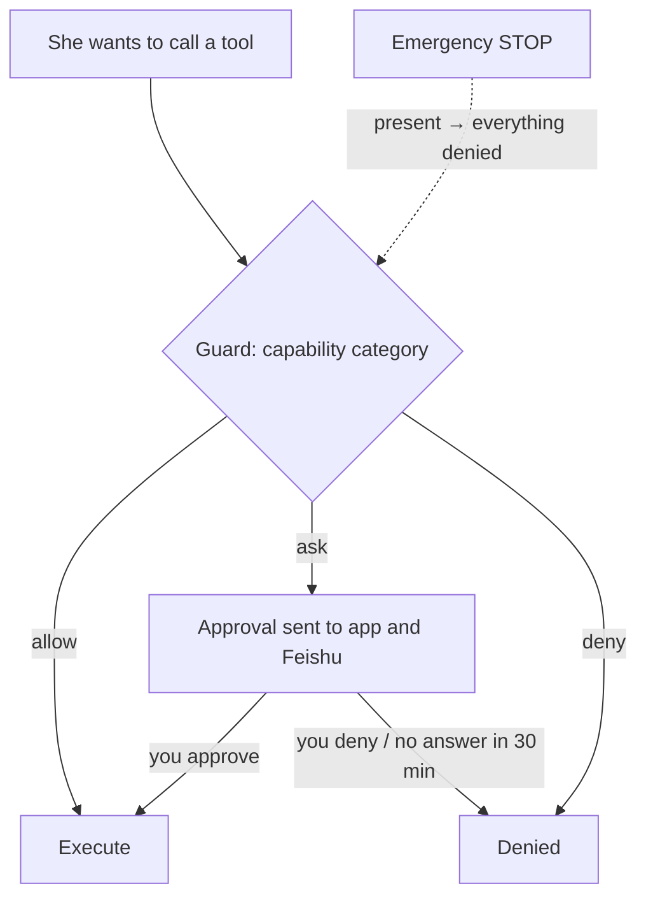

## Where the guard sits

Every capability she wants to use passes through the **guard**. You manage it under **Control**; Feishu cards can do the same, and both paths behave identically and write to the audit log.

## Capability categories

| Category | Default | Examples |
|---|---|---|
| Network | allow | Search, fetch web pages |
| Run commands | allow | Shell, background jobs |
| Device functions | allow | Vibrate, torch, clipboard, read sensors |
| Camera | **ask** | Take photos |
| Microphone | **ask** | Record audio |
| Location | **ask** | Get position |
| Proactive messages | allow | Messaging you when she wakes on her own |
| Adjust own parameters | allow | Bounded changes to her personality parameters |
| Rewrite memory | allow | Edit personality and resident memory |
| Screen and apps | **ask** | Reserved (hands) |
| Request secrets | allow | `pass_secret`, see [Passing secrets](/docs/guide/secrets) |

Each category has three levels: **allow / ask every time / deny**.

## Approvals

For "ask" categories she creates an approval when she wants to act. It is pushed to the app (badge on Control) and to Feishu (a card with buttons). Approve or deny, optionally with a note. **No answer within 30 minutes counts as denial.**

## Autonomy

**Control → Autonomy**:

- **Activity** (0–4): a knob multiplied into the wake rate.
- **Pause autonomy**: she stays online and answers you, but does not wake on her own.

## Budget and body limits

**Control → Budget**: daily token cap, daily cost cap, minimum battery, maximum temperature. Defaults: 2,000,000 tokens / 5 USD / 15% / 45 °C.

Exceeding them does not hard-stop her; it **inhibits**: budget spent ×0.05, overheating ×0.1, low battery and not charging ×0.2, offline ×0.5. She goes very quiet but still answers when you talk to her.

## Emergency stop

The stop button in the top bar is **always visible**. Pressing it immediately denies every tool call and sets the wake rate to zero; releasing it needs a second confirmation. Under the hood it is a `STOP` file in the home directory: if it exists, everything freezes.

## Audit log

**Control → Audit log**: every tool call (parameter summary and the start of the result), configuration change, memory edit and approval decision is recorded. She can query it herself (`recent_actions`) to verify whether she really did something.

## Idle walls

What prevents runaway behaviour is not a step limit but **no-progress timers**: a model call with no data for 90 seconds fails and fails over; a session with no progress for 120 seconds is aborted. She can work on something long, as long as it keeps moving.
