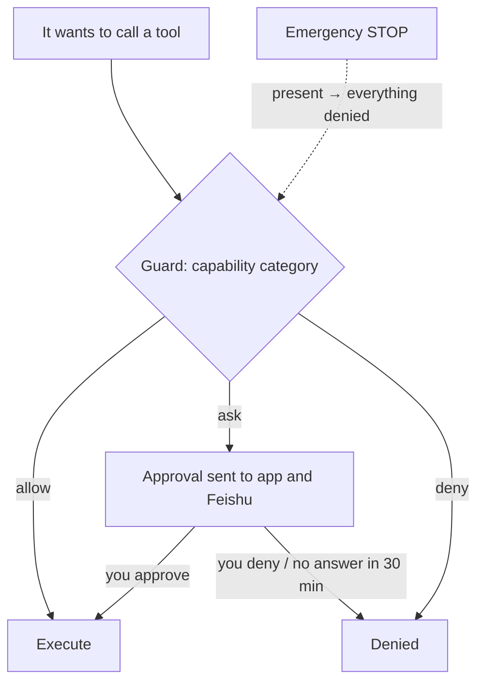

## Where the guard sits

Before the agent uses any capability, the **guard** checks it. You manage the guard under **Control**. Feishu cards can do the same things with the same effect, and both write to the activity log.

## Capability categories

| Category | Default | Examples |
|---|---|---|
| Network | allow | Search, fetch web pages |
| Run commands | allow | Shell, background jobs |
| Device functions | allow | Vibrate, torch, clipboard, read sensors |
| Camera | **ask** | Take photos |
| Microphone | **ask** | Record audio |
| Location | **ask** | Get position |
| Proactive messages | allow | Messaging you when it wakes on its own |
| Adjust own parameters | allow | Bounded changes to its personality parameters and its voice and hearing settings |
| Rewrite memory | allow | Edit personality and resident memory |
| Screen and apps | **ask** | Reserved (hands) |
| Request secrets | allow | `pass_secret`, see [Passing secrets](/docs/guide/secrets) |
| Sessions and subagents | allow | Start a new session, send a subagent to do a job |
| Cross-body actions | allow | Use another device's camera or shell (`body_call`), move to another device to continue (`move_to`), view an image, read a document or fetch a file for a command from another device by its uuid (`view_image` / `read_document` / `shell` with `body`; the device handing out the file also checks its own "run commands" category) |
| Build tools | **ask** | Write something it does often into its own tool (`tool_write`) |

Each category has three levels, **allow / ask / deny**, which you set one by one under **Control → Permissions**. When a tool belongs to several categories, the strictest one applies.

> [!WARNING]
> When **Run commands** is set to allow, the other categories cannot hold the agent back, because a command can do anything that device tools, network access and file edits can do. To tighten things, start by setting **Run commands** to ask.

## The command sandbox

The agent's commands, background jobs and the tools it builds all run in a sandbox. On a computer Quetzal tries bubblewrap, Landlock and proot in that order; on Android it uses proot. Inside the sandbox, the key directory and the console's login data cannot be seen. Before the first use, Quetzal tests the sandbox once to confirm the keys really are hidden. If no sandbox works, none of the agent's commands run, unless you allow running without isolation under **Control → Advanced → Runtime**.

The agent and the runtime are the same system user, so this sandbox does not stop everything. For the remaining risks and what we recommend, see [Trust and limits](/docs/guide/trust#what-it-can-reach). On Windows, the agent's commands run as a low-privilege user created at install time; see section 3 of [Windows](/docs/advanced/windows).

## Real environment

Things you signed in to on the computer do not work inside the sandbox. For example, if you ran `gh auth login` in a terminal, `gh` in the sandbox still says the token is invalid: the token is in the system keyring, which the sandbox deliberately keeps out of reach.

When it really needs to, the agent can ask to enter the **real environment** and must give a reason. The request shows at the top of the chat and under **Control → Permissions**; in Feishu it is an approval card, and the phone also shows a notification. Once you agree, the agent's commands in this chat stop going through the sandbox and run directly on this device. You can also turn it on yourself with the shield icon at the top right of the chat.

- **What it can do**: everything you can read and write, including the key directory, the vault and the runtime's configuration.
- **Scope**: this one chat on this one device. Commands from the agent's own wake-ups, from sub-agents, or called from another device still run in the sandbox.
- **Visible**: while it is on, a light red bar shows under the chat's title; when another chat is in the real environment, a bar also shows at the top of the app. Every command is in the activity log, marked as run in the real environment.
- **Leaving**: tap **Exit** on the bar, or send `/sandbox` in Feishu; the agent also leaves when it is done. Thirty minutes without a command, the emergency stop, or a runtime restart all bring it back to the sandbox.

If only a token is needed, a safer way is to have the agent ask you for a token with as few permissions as possible through [secret passing](/docs/guide/secrets), so commands stay in the sandbox.

## Approvals

When the agent wants to use a capability set to "ask", it creates an approval. The approval goes to the app (at the top of **Control → Permissions**, with a badge) and to Feishu (a card with buttons). Approve or deny it, and add a note if you like. **If nobody answers within 30 minutes, it counts as denied.**

## Rhythm

**Control → Rhythm**:

- **Reaching out to you** (less ↔ more): its wake rate is multiplied by this setting. Toward "more", it wakes more often and has more chances to message you about what comes to mind; toward "less", it is quieter. It only messages you on its own while awake, never while asleep at night.
- **Pause**: it stays online and answers you, but does not wake on its own. It wakes only when you reach out.

The agent adjusts its own personality parameters within set limits (`adjust_self`, under "Adjust own parameters"). These are the time constants of curiosity, the urge to share and missing you, plus sleepiness, sleep recovery and the hour it is most alert. They are not in the app. If you want it to change, tell it, e.g. "you've been too chatty lately".

## Budget and body limits

**Control → Advanced → Budget** sets a daily token cap, a daily cost cap, a minimum battery level and a maximum temperature. The defaults are 2,000,000 tokens / 5 USD / 15% / 45 °C.

Going past these limits **lowers how often it wakes on its own**: budget spent ×0.05, overheating ×0.1, low battery and not charging ×0.2, offline ×0.5. It goes very quiet, but it still answers when you talk to it, because the budget does not limit conversations.

## Stopping a turn

While the agent is working in a chat and the input box is empty, the send button becomes a stop button. Pressing it stops this turn, and any command that is running ends with it. On a computer you can also press Esc twice (the first press shows a hint). It only stops this turn in this chat; other chats are not affected.

## Emergency stop

The stop button in the top bar is **always visible**. Pressing it denies every tool call at once and sets the wake rate to zero. To release it, you confirm a second time. The stop works by placing a `STOP` file in the home directory, and while that file exists, the agent stays stopped.

## Activity log

**Control → Advanced → Activity log** records every tool call (a summary of the parameters and the start of the result), configuration change, memory edit and approval decision. The agent can search it too (`recent_actions`) to check whether it really did something.

## Idle walls

**No-progress timers** keep the agent from running out of control. A model call that receives no data for 90 seconds fails and moves to the next model. A session with no progress for 120 seconds is stopped. The agent can work on something for a long time as long as it keeps making progress.
