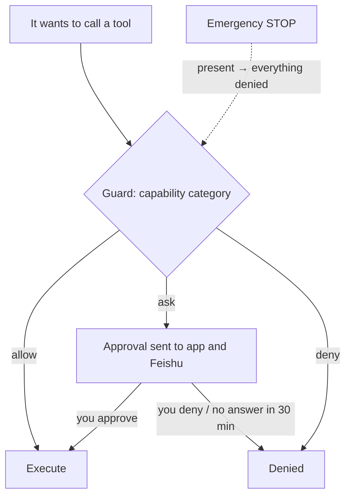

## Where the guard sits

Every capability it wants to use passes through the **guard**. You manage it under **Control**; Feishu cards can do the same, and both paths behave identically and write to the audit log.

## Capability categories

| Category | Default | Examples |
|---|---|---|
| Network | allow | Search, fetch web pages |
| Run commands | allow | Shell, background jobs |
| Device functions | allow | Vibrate, torch, clipboard, read sensors |
| Camera | **ask** | Take photos |
| Microphone | **ask** | Record audio |
| Location | **ask** | Get position |
| Proactive messages | allow | Messaging you when it wakes on its own |
| Adjust own parameters | allow | Bounded changes to its personality parameters and its voice and hearing settings |
| Rewrite memory | allow | Edit personality and resident memory |
| Screen and apps | **ask** | Reserved (hands) |
| Request secrets | allow | `pass_secret`, see [Passing secrets](/docs/guide/secrets) |
| Sessions and subagents | allow | Start a new session, send a subagent to do a job |
| Cross-body actions | allow | Use another device's camera or shell (`body_call`), move to another device to continue (`move_to`) |
| Build tools | **ask** | Write something it does often into its own tool (`tool_write`) |

Each category has three levels: **allow / ask / deny**, set one by one under **Control → Permissions**. When a tool belongs to several categories, the strictest one applies.

> [!WARNING]
> When **Run commands** is set to allow, the other categories cannot hold it back: a command can do anything that device tools, network access and file edits can do. To tighten things, set **Run commands** to ask first.

## The command sandbox

Its commands, background jobs and the tools it builds all run in a sandbox. On a computer Quetzal tries bubblewrap, Landlock and proot in that order; on Android it uses proot. Inside the sandbox the key directory and the console's login data do not exist. Before the first use, Quetzal tests the sandbox once to confirm the keys really are hidden. When no sandbox works, none of its commands run, unless you explicitly allow running without isolation under **Control → Advanced → Runtime**.

It and the runtime are the same system user, so this sandbox does not stop everything. For the remaining risks and what we recommend, see [Trust and limits](/docs/guide/trust#what-it-can-reach).

## Approvals

For "ask" categories it creates an approval when it wants to act. It is pushed to the app (at the top of **Control → Permissions**, with a badge) and to Feishu (a card with buttons). Approve or deny, optionally with a note. **No answer within 30 minutes counts as denial.**

## Rhythm

**Control → Rhythm**:

- **Activity** (quiet ↔ active, 0–4): a knob multiplied into the wake rate.
- **Pause**: it stays online and answers you, but does not wake on its own; it wakes only when you reach out.

Its personality parameters (the time constants of curiosity, urge to share and missing you, sleepiness, sleep recovery, the hour it is most alert) are not in the UI: it tunes them itself within bounds (`adjust_self`, under "Adjust own parameters"). If you want it to change, just tell it, e.g. "you've been too chatty lately".

## Budget and body limits

**Control → Advanced → Budget**: daily token cap, daily cost cap, minimum battery, maximum temperature. Defaults: 2,000,000 tokens / 5 USD / 15% / 45 °C.

Exceeding them **lowers how often it wakes on its own**: budget spent ×0.05, overheating ×0.1, low battery and not charging ×0.2, offline ×0.5. It goes very quiet but still answers when you talk to it; conversations are not limited by the budget.

## Emergency stop

The stop button in the top bar is **always visible**. Pressing it immediately denies every tool call and sets the wake rate to zero; releasing it needs a second confirmation. Under the hood it is a `STOP` file in the home directory: if it exists, everything freezes.

## Activity log

**Control → Advanced → Activity log**: every tool call (parameter summary and the start of the result), configuration change, memory edit and approval decision is recorded. It can query it itself (`recent_actions`) to verify whether it really did something.

## Idle walls

Runaway behaviour is prevented by **no-progress timers**: a model call with no data for 90 seconds fails and fails over; a session with no progress for 120 seconds is aborted. It can work on something long, as long as it keeps moving.
