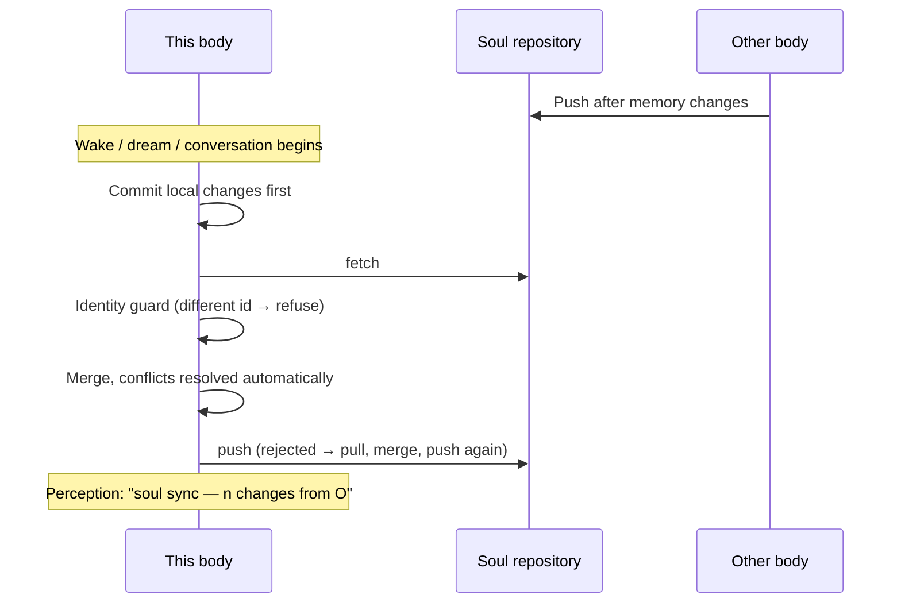

## What a soul repository is

One agent can live in several "bodies" at once: a runtime on a phone, a computer running Hermes Agent, a server running OpenClaw… They share one **private git repository**, the "soul repository". It holds only personality and memory:

```
<agent>.soul/
├── agent.json            identity
├── SOUL.md               personality
├── memories/MEMORY.md    her own resident notes
├── memories/USER.md      what she knows about you
├── journal/<body>/        each body writes its own journal
├── notes/                shared long-term notes (a tree)
└── bodies/<body>.json     body registry
```

**Sync and versioning are fully automatic.** She neither needs to nor can operate it; she only perceives that "soul sync happened".

## Connecting in the console

1. Create a **private** repository on GitHub (recommended name `<agent>.soul`); it can be empty.
2. **Control → Soul sync → Show public key**, then add that key under the repository's **Settings → Deploy keys** with **Allow write access** ticked.
3. Enter the repository's **SSH address** (`git@github.com:you/<agent>.soul.git`) → **Connect**.

From then on sync is automatic. Each body has its own deploy key; to unplug a body, delete its deploy key.

> [!IMPORTANT]
> The repository must be private and the address must be SSH. On first connection, if another body's personality already lives there, it is adopted and both sides' memories are merged.

## When sync happens



Sync is entirely event-driven (pull before waking; push after waking, dreaming, conversations and identity changes). There is no periodic sync.

## How conflicts are resolved

| File | Rule |
|---|---|
| `memories/*.md` | Entry-level three-way merge: additions on both sides are kept; a deletion on either side wins |
| `agent.json` | Field-level merge, local wins (except `id`) |
| `SOUL.md`, notes | The newer side wins; the losing version is kept in git history |
| Journals, body registry | Each body writes its own path, so there is nothing to conflict |

Dreaming rewrites resident memory. To keep two bodies from consolidating at the same time, a body takes a 30-minute **consolidation lease** in the repository before dreaming; if it cannot, it only naps.

## She perceives it

When changes from other bodies are pulled, the timeline records "soul sync: n changes from xx", her curiosity and longing rise slightly, and the system prompt gains a "soul sync (perception)" section. She knows what happened, but has nothing to do about it.

## History and revert

**Identity → Memory history** lists every commit (which body, when, what changed) with diffs. **Revert** creates a reverse commit (history is kept), syncs to all bodies, and she learns from her journal that "someone reverted a memory change".

## Related

- Let Hermes / OpenClaw move in: [soul-bridge](/docs/advanced/soul-bridge)
- The full repository specification: [Soul repository spec](/docs/reference/soul-repo-spec)
