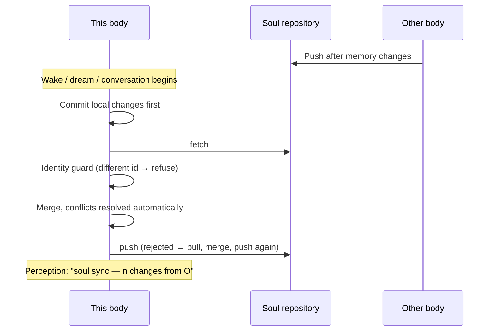

## What a soul repository is

The soul repository is a **private git repository** that holds the agent's personality and memory. One agent can live in several "bodies" at once, such as a runtime on a phone, a computer running Hermes Agent or a server running OpenClaw, and they all share this one repository. It holds only personality and memory:

```
<agent>.soul/
├── agent.json            identity
├── SOUL.md               personality
├── memories/MEMORY.md    its own resident notes
├── memories/USER.md      what it knows about you
├── journal/<body>/        each body writes its own journal
├── notes/                shared long-term notes (a tree)
└── bodies/<body>.json     body registry
```

**The runtime handles sync and versioning automatically.** The agent does not need to operate them and cannot; it only senses that "soul sync happened".

## Set up automatically when you sign in

In the setup wizard or under **Control → Devices**, tap **Sign in**, then sign in and approve this device on the website. The first time a soul repository is created, the same tab takes you to GitHub once. There you install the Quetzal app and choose which repositories it can manage. After that:

- **A new user**: a private repository is created under your GitHub account, this device gets a deploy key of its own, and the agent's first soul is pushed.
- **A new device for an existing user**: this device gets a deploy key and pulls down the agent's existing personality and memory.

Each account goes with one GitHub account. Keep using the GitHub account you used the first time.

For what this app can do and how to take it back, see [Trust and limits](/docs/guide/trust#what-the-github-app-can-do).

## Connecting your own repository by hand

If you do not sign in, or you want to keep the soul repository on a git host other than GitHub, connect it by hand:

1. Create a **private** repository on your git host (recommended name `<agent>.soul`); it can be empty.
2. Open **Control → Advanced → Sync** and tap **Show public key** under **Soul repository**. Add that key under the repository's **Settings → Deploy keys** with **Allow write access** ticked.

   Instead of **Deploy key**, you can pick **a specified private key** or **system ssh**. System ssh uses `~/.ssh/config` and ssh-agent on the machine running the runtime, and the address may use a Host alias from that config. The runtime runs as a background service and usually cannot reach your login session's ssh-agent, so set an IdentityFile for that Host.
3. Enter the repository's **SSH address** (`git@github.com:you/<agent>.soul.git`; other hosts work the same way) → **Save**.

From then on, sync is automatic. Each body has its own deploy key. To stop a body from syncing, delete its deploy key.

> [!IMPORTANT]
> The repository must be private and the address must be SSH. On the first connection, if another body's personality already lives there, this body takes it on and the memories from both sides are merged.
>
> Quetzal does not check what is in the repository, and whatever the agent writes gets committed. Give it passwords through [Passing secrets](/docs/guide/secrets); the vault never enters the repository.

## When sync happens



Sync runs when something happens. There is no sync on a timer:

- **Sync on every change**: after each tool call the agent makes (saving a note, editing memory, changing files directly with the shell…), the runtime checks the soul directory. It commits any change at once and pushes 3 seconds later, and the end of a turn pushes at once. Commit messages say what changed (for example "note_save: note body/hardware"), so the history is easy to read.
- Before the agent wakes and before conversations, the runtime pulls changes from other bodies.
- **Push failures**: the runtime first retries quietly a few times over about 4 minutes. If that still fails (or the runtime itself refused to sync, for example because the repository belongs to another agent), it adds a "runtime notice" with git's own error text to the turn that changed the memory. If that turn has ended, it starts a new turn in the same conversation. The changes stay in local commits and go out with the next successful push.

## How conflicts are resolved

| File | Rule |
|---|---|
| `memories/*.md` | Merged entry by entry: additions on both sides are kept, and a deletion on either side wins |
| `agent.json` | Field-level merge, local wins (except `id`) |
| `SOUL.md`, notes, skill documents | The newer version is used first so sync never stalls. When **both sides changed** the file, the other version is saved next to it as `<name>.incoming.md` (a conflict copy, not synced), and the agent is asked to decide. To keep the current version, it deletes the copy; to use the other version or combine the two, it edits the original and then deletes the copy. The version not chosen also stays in git history |
| Journals, body registry | Each body writes only its own path, so they never conflict |

Dreaming rewrites resident memory. To keep two bodies from sorting memory at the same time, a body takes a 30-minute **consolidation lease** in the repository before dreaming and renews it every 10 minutes while it is still sorting. If it cannot get the lease, it only naps.

## It perceives it

When changes from other bodies are pulled, the timeline records "soul sync: n changes from xx", and the agent's curiosity and longing rise slightly. The system prompt also gets a "soul sync (perception)" section that lists changes still waiting to be pushed and conflict copies waiting for a decision. Everyday sync needs nothing from the agent. The runtime asks it to step in only when a push fails or both sides changed the same file.

## History and revert

**Control → Advanced → Memory history** lists every commit (which body, when, what changed) with its diff. **Revert** creates a new commit that undoes the change, keeping the history, and syncs it to all bodies. The agent learns from its journal that "someone reverted a memory change".

## Related

- Let Hermes / OpenClaw move in: [soul-bridge](/docs/advanced/soul-bridge)
- The full repository specification: [Soul repository spec](/docs/reference/soul-repo-spec)
