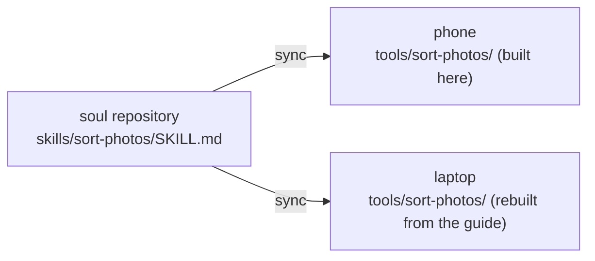

## What it is

When the agent has done the same thing a few times, the steps no longer change and it will need them again, it writes them into **its own tool**. From then on the tool sits in its tool list next to the built-in ones and runs in one step. While dreaming, it also looks back at what it did recently to see whether anything is worth keeping.

Every tool it makes has two halves:

| | Where it lives | Synced? |
|---|---|---|
| **The tool itself** (an executable script) | `tools/<name>/` in this body's home directory | No, it belongs to this body |
| **The guide** (a skill document, `SKILL.md`) | `skills/<name>/` in the soul repository | Yes, to every body |

## Why split it

Each body has a different environment. The phone has the app's small built-in environment, a Linux computer has a full Linux, and a Windows PC has PowerShell, each with its own commands and paths. A copied script would most likely not run. So only the **intent** is synced: the purpose, parameters, approach, dependencies, how to check the result and known pitfalls. On each body, the agent builds the tool itself from the guide.

When it wakes in a new body and finds a guide in its soul with no matching tool on this body, it knows it can build one.

Guides use the open [Agent Skills](https://agentskills.io/specification) format, so Hermes and OpenClaw with the [soul-bridge](/docs/advanced/soul-bridge) installed can read them directly.

## What you control

- **By default it asks you every time before it makes a tool.** A tool is code that will run later, so creating or rewriting one waits for your approval. You can change this to allow or deny under **Control → Permissions**.
- **Running a tool is checked the same way as running a command.** The category a tool declares cannot loosen that check.
- **It runs in a sandbox.** Like the agent's other commands, it cannot see the runtime's key directory. If it times out, its whole process group is stopped. Every call is written to the audit log.
- **Control → Advanced → Tools** lists this body's tools. You can disable, enable or delete them, and delete the guide along with a tool. You cannot edit the code on the phone.

## Implementation details

The file format (`tool.json` + `tool.sh` / `tool.mjs`), the validation rules and the permission checks are in the source repository's [ARCHITECTURE.md §5.2](https://github.com/PlutoKeating/Project.Quetzal/blob/main/docs/ARCHITECTURE.md) (Chinese). The skill document format is in the [soul repository spec](/docs/reference/soul-repo-spec).
