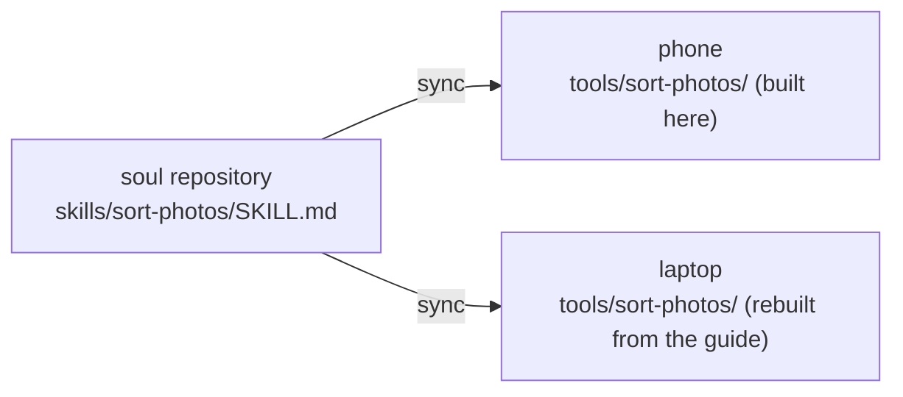

## What it is

When it has done the same thing a few times, the steps are stable and it will need them again, it writes them into **its own tool**. From then on the tool sits in its tool list next to the built-in ones and runs in one step. While dreaming it also looks back at what it did recently, to see whether anything is worth keeping.

Every tool it makes has two halves:

| | Where it lives | Synced? |
|---|---|---|
| **The tool itself** (an executable script) | `tools/<name>/` in this body's home directory | No, it belongs to this body |
| **The guide** (a skill document, `SKILL.md`) | `skills/<name>/` in the soul repository | Yes, to every body |

## Why split it

Bodies differ: the phone has the app's compact built-in environment, the laptop a full Linux, with different commands and paths. A copied script would most likely not run. So only the **intent** is synced — purpose, parameters, approach, dependencies, how to verify, pitfalls — and it builds the implementation on each body from the guide.

When it wakes in a new body and finds a guide in its soul without a matching tool here, it knows it can build one.

Guides use the open [Agent Skills](https://agentskills.io/specification) format, so Hermes and OpenClaw with the [soul-bridge](/docs/advanced/soul-bridge) can read them directly.

## What you control

- **Making a tool asks every time by default**: a tool is code that will run later, so creating or rewriting one waits for your approval. Change it under **Control → Permissions** to allow or deny.
- **Running a tool is checked as running a command**: the category a tool declares cannot loosen the gate.
- **It runs in a sandbox**: like its other commands, it cannot see the runtime's key directory; on timeout the whole process group is stopped; every call is audited.
- **Control → Tools**: see this body's tools, disable, enable or delete them (optionally with the guide). Code is not edited on the phone.

## Implementation details

The file format (`tool.json` + `tool.sh` / `tool.mjs`), validation rules and gating are in the source repository's [ARCHITECTURE.md §5.2](https://github.com/PlutoKeating/Project.Quetzal/blob/main/docs/ARCHITECTURE.md) (Chinese); the skill document format is in the [soul repository spec](/docs/reference/soul-repo-spec).
