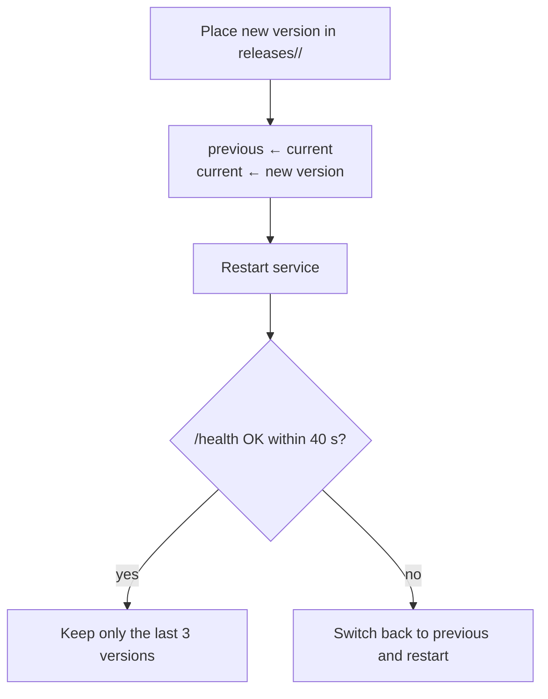

## Upgrading

**Linux machines**: rerun the install command `curl -fsSL https://quetzal.plutokeating.beer/install | bash` (or `npx @plutokeating/quetzal`). The new version (web console included) goes into a new version directory and only becomes current once the health check passes; otherwise it rolls back automatically. `quetzal rollback` reverts by hand.

**Phones**: two layers, both one tap inside the app.

1. **The app itself**: on launch the app asks GitHub for the latest release (once every 6 hours) and shows "A new Quetzal app version is available" at the top. Tap **Update** to reach **Control → Service → Quetzal App**, then **Download and install**: it downloads the APK, checks its SHA256 and hands it to the system installer. The first time, the system settings open so you can allow Quetzal to install apps; come back and tap **Install**. You can also **Check for updates** there any time; if GitHub is unreachable, **Download page** lets you fetch the APK by hand and the rest is the same.
2. **The runtime**: the Quetzal app bundles the runtime. When the new app opens and notices its bundled version is newer than the running one, it goes straight to the upgrade step of the setup wizard (or offers a **one-tap upgrade** on the home screen); you can also trigger it from **Control → Service → Upgrade / Reinstall**.

Upgrading runs the same idempotent script as installation:

- Her memory, configuration, keys and vault live in the home directory, separate from version directories, so **upgrades leave them untouched**.
- After an upgrade she wakes again on the new version, as if after a nap.

> [!TIP]
> The app version equals the runtime version. The Service page shows the running version and the version bundled in the app.

## Automatic rollback

If the new version does not pass the health check within 40 seconds, the script points `current` back to the previous version, restarts, and reports the reason in the wizard. Nothing for you to do.

## Manual actions

**Control → Service**:

- **Restart**: the process exits and runit brings it back at once (asks for confirmation).
- **Upgrade / Reinstall**: re-runs the install script; use it to repair a broken installation.
- **Ignite**: when the runtime is offline, the app re-runs the boot script through Termux.

## Circuit breaker and safe mode

More than five starts within ten minutes is treated as repeated crashing: the runtime enters **safe mode**, keeping only the gateway and Feishu up, not waking and not calling models, and tells you. See [Troubleshooting](/docs/advanced/troubleshooting).

## Releases on GitHub

Every production release is published on GitHub Releases with release notes. The [download page](/download) reads the latest and past versions live.
