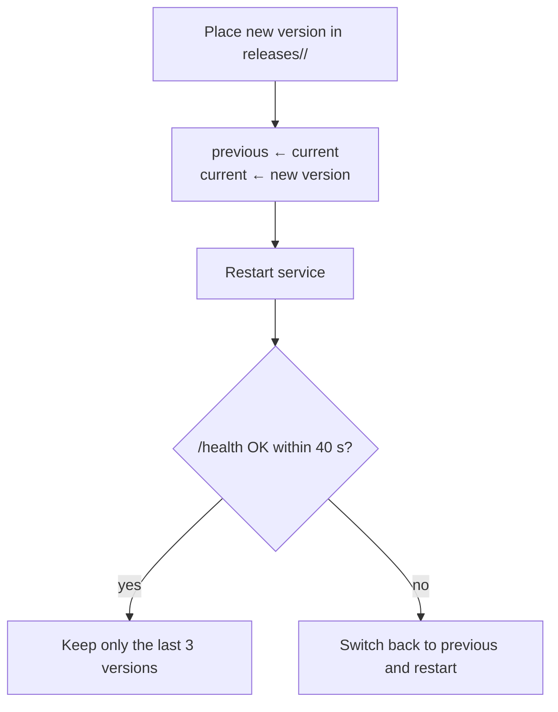

## Upgrading

**Start at "About"**: Control → About exists in all three forms (Android app, Linux desktop, web); its Version card shows the current version and, when there is a newer one, a single button. On Android "Update to x.y.z" updates the app itself (downloads the APK, verifies it, hands it to the system installer); on the Linux desktop and web versions "Update to x.y.z" makes the runtime rerun the installer in the background on its machine and restart once (about a minute); the desktop version then offers "Reopen".

**Linux machines**: you can also rerun the install command by hand `curl -fsSL https://quetzal.plutokeating.beer/install | bash` (or `npx @plutokeating/quetzal`). The new version (web console included) goes into a new version directory and only becomes current once the health check passes; otherwise it rolls back automatically. `quetzal rollback` reverts by hand.

**Phones**: two layers, both one tap inside the app.

1. **The app itself**: every time you open the app it asks GitHub for the latest release and shows "New version x.y.z" at the top. Tap **Update** to reach **Control → About**, then **Update to x.y.z** on the Version card: it downloads the APK, checks the release signature and its SHA256 (see [Release signatures and verification](/docs/start/install#release-signatures-and-verification)), makes sure the new APK is signed with the same certificate as the installed app, and only then hands it to the system installer; if any check fails it refuses to install. The first time, the system settings open so you can allow Quetzal to install apps; installation continues when you come back. You can also **Check for updates** there any time; if GitHub is unreachable, **Download page** lets you fetch the APK by hand and the rest is the same.
2. **The runtime**: the runtime and its environment (Node.js, git, ssh, proot) live inside the app, so **updating the app updates the runtime**. Once the new app is installed, the system's "app updated" broadcast restarts the runtime by itself and the app swaps in the new runtime in the background (a "Updating to x.y.z…" banner, no wizard; if it does not finish you get "Update not finished" with **Retry**); if your vendor system blocks background starts (autostart not allowed), open the app once.

> [!NOTE]
> There is no automatic rollback on phones: if the new runtime fails to start, the app keeps restarting it with backoff and writes the reason to the log (see [Troubleshooting](/docs/advanced/troubleshooting)).

On **Linux machines**, upgrading runs the same idempotent script as installation:

- Its memory, configuration, keys and vault live in the home directory, separate from version directories, so **upgrades leave them untouched**.
- After an upgrade it wakes again on the new version, as if after a nap.

> [!TIP]
> The app version equals the runtime version. **Control → Advanced → Runtime** shows the running version; **About** shows the app's.

## Automatic rollback (Linux)

If the new version does not pass the health check within 40 seconds, the install script points `current` back to the previous version, restarts, and reports the reason. Nothing for you to do.

## Manual actions

**Control → Advanced → Runtime**:

- **Restart**: the process exits and its supervisor brings it back at once (on phones the app's foreground service, on Linux systemd or the supervisor loop; asks for confirmation).
- **Reinstall** (phones): reinstalls the app's bundled runtime and checks the gateway. Use it to repair a broken installation. On Linux, rerun the install command instead.

When the runtime is offline, the offline banner on **Now** has a **Start** button (only on Android, for this phone's own runtime): the app starts its own foreground service again.

## Circuit breaker and safe mode

More than five starts within ten minutes is treated as repeated crashing: the runtime enters **safe mode**, keeping only the gateway and Feishu up, not waking and not calling models, and tells you. See [Troubleshooting](/docs/advanced/troubleshooting).

## Releases on GitHub

Every production release is published on GitHub Releases with release notes. The [download page](/download) reads the latest and past versions live.

Quetzal is still changing fast, and some days several versions come out. Before upgrading you can read what the new version changed. Upgrading leaves its memory alone, and every change to the soul repository format works with old repositories. Your bodies must run the same version to connect; see [Trust and limits](/docs/guide/trust#how-fast-updates-come).
