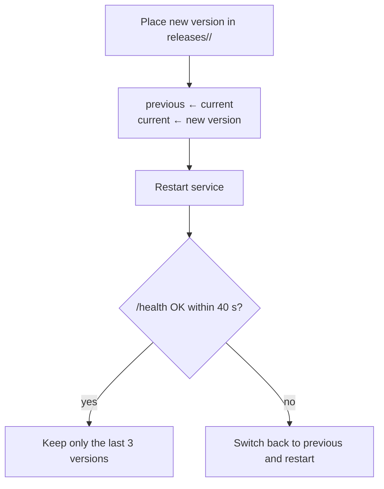

## Upgrading

**Start at "About"**: every form of the app (Android app, Linux and Windows desktop, web) has Control → About. Its Version card shows the current version and, when a newer one exists, an update button.

- On Android, "Update to x.y.z" updates the app itself: it downloads the APK, verifies it and hands it to the system installer.
- On the desktop and web versions, "Update to x.y.z" makes the runtime rerun the installer in the background on its machine and restart once, which takes about a minute. The desktop version then switches to the new console on its own.

**Linux machines**: you can also rerun the install command by hand, `curl -fsSL https://quetzal.plutokeating.beer/install | bash` (or `npx @plutokeating/quetzal`). The new version, web console included, goes into a new version directory and becomes current only after the health check passes. If the check fails, it rolls back automatically. `quetzal rollback` goes back by hand.

**Windows PCs**: update with one tap under About in the console. The installer closes the running Quetzal, and if the new version is not healthy within 40 seconds, it goes back to the previous one. `quetzal rollback` goes back by hand. See [Windows](/docs/advanced/windows).

**Phones**: two layers, both one tap inside the app.

1. **The app itself**: each time you open the app, it asks GitHub for the latest release and shows "New version x.y.z" at the top. Tap **Update** to go to **Control → About**, then tap **Update to x.y.z** on the Version card. The app downloads the APK and checks the release signature and its SHA256 (see [Release signatures and verification](/docs/start/install#release-signatures-and-verification)). It also makes sure the new APK is signed with the same certificate as the installed app. Only then does it hand the APK to the system installer, and if any check fails, it does not install. The first time, the system settings open so you can allow Quetzal to install apps, and the install continues when you come back. You can also tap **Check for updates** there at any time. If GitHub is unreachable, **Download page** lets you download the APK by hand, and the rest works the same way.
2. **The runtime**: the runtime and its environment (Node.js, git, ssh, proot) live inside the app, so **updating the app updates the runtime**. Once the new app is installed, the system's "app updated" broadcast restarts the runtime, and the app switches to the new runtime in the background. An "Updating to x.y.z…" banner shows at the top, and no wizard is needed. If it does not finish, you see "Update not finished" with **Retry**. If your phone maker's system blocks background starts (autostart not allowed), open the app once.

> [!NOTE]
> Phones have no automatic rollback. If the new runtime fails to start, the app keeps restarting it, waiting longer each time, and writes the reason to the log (see [Troubleshooting](/docs/advanced/troubleshooting)).

On **Linux machines**, upgrading runs the same script as installation, and running it again is always safe:

- The agent's memory, configuration, keys and vault live in the home directory, apart from the version directories, so **upgrades leave them untouched**.
- After an upgrade, the agent wakes again on the new version, as if after a nap.

> [!TIP]
> The app and the runtime share one version number. **Control → Advanced → Runtime** shows the running version, and **About** shows the app's.

## Automatic rollback (Linux)

If the new version does not pass the health check within 40 seconds, the install script points `current` back to the previous version, restarts it and reports the reason. You do not need to do anything.

## Manual actions

**Control → Advanced → Runtime**:

- **Restart**: the process exits and its supervisor starts it again at once. The supervisor is the app's foreground service on phones, and systemd or the supervisor loop on Linux. You confirm before it restarts.
- **Reinstall** (phones): reinstalls the app's bundled runtime and checks the gateway. Use it to repair a broken installation. On Linux, rerun the install command to repair it.

When the runtime is offline, the offline banner on **Now** has a **Start** button, which starts the app's foreground service again. It appears only on Android, for this phone's own runtime.

## Circuit breaker and safe mode

If the runtime starts more than five times within ten minutes, Quetzal treats it as crashing over and over and puts it in **safe mode**. Only the gateway and Feishu stay up; the agent does not wake or call models, and it tells you about the problem. See [Troubleshooting](/docs/advanced/troubleshooting).

## Releases on GitHub

Every production release is published on GitHub Releases with release notes. The [download page](/download) shows the latest and past versions, read live from there.

Quetzal still changes fast, and some days several versions come out. Before upgrading, you can read what the new version changed. Upgrading leaves the agent's memory alone, and every change to the soul repository format works with old repositories. Your bodies must run the same version to connect; see [Trust and limits](/docs/guide/trust#how-fast-updates-come).
