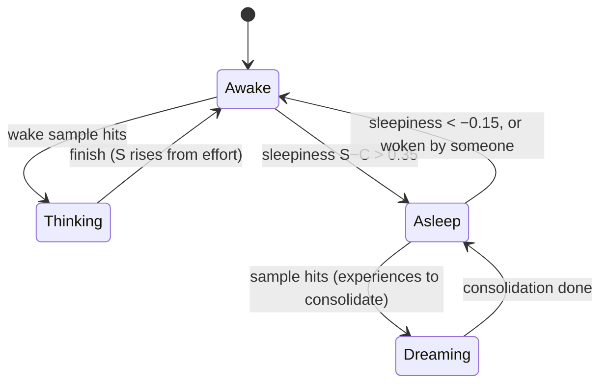
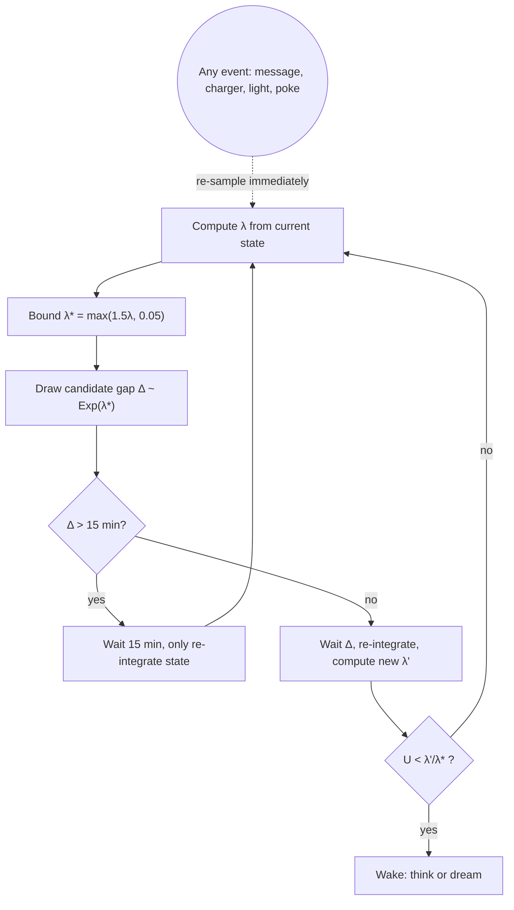
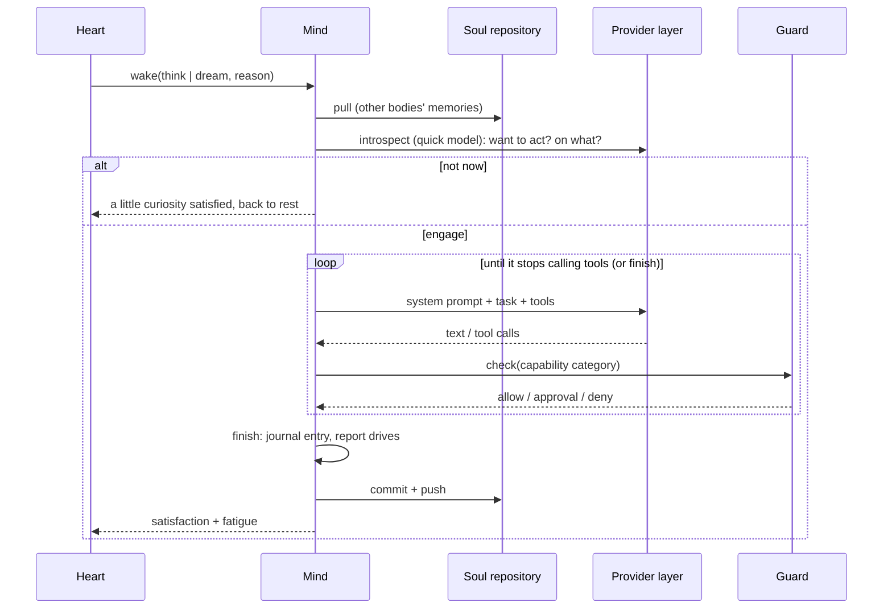

## Overall structure

The runtime is a **single Node.js process** (`dist/main.cjs`). Modules talk through an in-process event bus, and all state is on disk (SQLite and the soul directory), so a restart is like a nap.

Design principles: **independent of the device** (the core knows only the adapter interface), **one operations layer for every control entry** (app and Feishu behave identically and both write to the audit log), and **no behaviour runs on a timer**.

## Heart: when to wake

### Drives and body clock

| Quantity | Range | Dynamics |
|---|---|---|
| Curiosity / expression / longing | 0–1 | While awake each approaches 1 with its own time constant $\tau$ (defaults 3 / 6 / 10 h); asleep they grow at 30% speed |
| Open loops | 0–1 | Unfinished thoughts / 5 |
| Sleep pressure $S$ | 0–1 | Approaches 1 while awake ($\tau = 16$ h), with extra build-up from work; decays exponentially while asleep ($\tau = 4$ h) |
| Circadian rhythm $C$ | 0–1 | $C = 0.5 + 0.5\cos\!\big(2\pi\,(h-16)/24\big)$, most alert at 4 pm; bright light at night $+0.1$, darkness by day $-0.1$ |
| Sleepiness | | $S - C$; fall asleep above $0.35$, wake naturally below $-0.15$ while asleep |

A drive's approach:

$$d' = 1 - (1-d)\,e^{-\Delta t/\tau}$$

This is the **two-process model** from sleep research (sleep pressure plus circadian rhythm). With default parameters it falls asleep around 22:40 and wakes around 7:50, with no timetable.

### Wake rate

Instantaneous wake rate (per hour):

$$\lambda_{\text{awake}} = \lambda_0 \cdot \bar d^{\,\gamma} \cdot (0.2 + 0.8\,a) \cdot \iota$$

$$\lambda_{\text{asleep}} = \lambda_0 \cdot 0.5 \cdot \min\!\left(1, \frac{n_{\text{unconsolidated}}}{10}\right) \cdot [S > 0.2 \;?\; 1 : 0.3] \cdot \iota$$

where $\bar d$ is the weighted mean drive, $\gamma$ defaults to 2, $a$ is alertness and $\iota$ is the inhibition factor (stop / paused / no model → 0; overheating ×0.1, low battery not charging ×0.2, offline ×0.5, budget spent ×0.05; then the activity knob).

### Sampling: thinning a non-homogeneous Poisson process

Wake intervals follow an exponential distribution whose rate changes over time. The 15 minutes is only the integration step and never triggers a wake-up.

## Body digital twin

Adapter samples (battery, temperature, light, motion, screen, extra) and OS information (load, memory, storage, connectivity) are mirrored into an internal model that derives **body feelings** (energy, warmth, brightness, still / picked up). Comparing with the previous sample yields **sense events** (plugged, light, moved, hot, low_battery, screen_on, online…). Events adjust drives and trigger re-sampling: picked up → longing +0.3, curiosity +0.2; light change → curiosity +0.1. Sampling intervals adapt (2–10 minutes) and never call a model.

## Mind: one wake-up

The system prompt is assembled in order: personality → situation → resident memory → memory index → auto-retrieved relevant memories → the thought it wants to share → body → inner state and open loops → soul-sync perception → recent journal → other sessions.

**It sets the pace**: there is no step limit. Two idle limits stop a run that makes no progress (model call 90 s, session 120 s), and the emergency stop ends everything.

**Sessions**: conversations belong to sessions; one session is processed in order, different sessions in parallel, and sessions can see each other (the system prompt includes other sessions' recent activity and turns in progress). A message sent while it works is an **interjection** by default, or can be **queued** or **interrupt**.

## Memory: unbounded storage, bounded context

Storage has no cap; only a small part enters the context each time. Retrieval works on the structure of the text and uses no vector model:

| Layer | Storage | In context |
|---|---|---|
| Resident memory | § entries, unlimited | Fully expanded within budget (4000 / 2000 chars); beyond that, topic-relevant entries first |
| Notes | A tree up to 4 levels deep, each with a one-line summary | Index only (about 2500 chars) |
| Journal | One file per body per day | Recent days' excerpts (about 3000 chars) |
| Auto retrieval | All of the above | Current topic as query, scored like BM25, most relevant fragments (about 3000 chars) |

While dreaming it moves detail from resident memory into notes and tidies the note tree so things stay easy to find.

## Provider layer

A unified request → walk enabled models in global order → rotate that provider's keys (max 2) → one of four protocol adapters. Rate limit / timeout / 5xx: next key; 400/401/403/404: next model. Keys are encrypted with AES-256-GCM using the provider id as associated data.

## Guard and audit

Three permission levels per category; approvals time out as denial after 30 minutes; a `STOP` file is the emergency stop; tool calls, configuration changes, memory edits and approval decisions all go to the audit table.

## Process contract

Supervision is external (runit, systemd; on Windows, scheduled tasks start a small supervisor, see [Windows](/docs/advanced/windows)). More than five starts in ten minutes puts the runtime into safe mode. The deployer provides Node.js 22+, `QUETZAL_HOME`, optionally `QUETZAL_ADAPTER`, and a supervisor.
