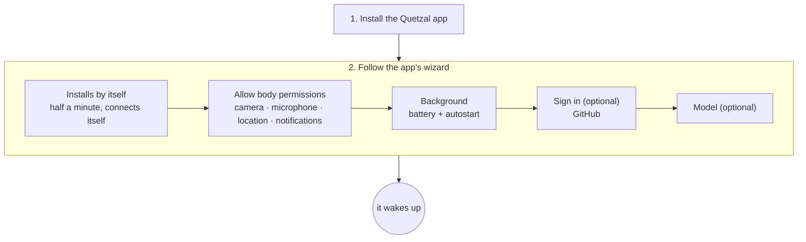

## Overview

Just one app. The runtime, Node.js, git and ssh all live inside the Quetzal app: no Termux, no command line. (Installing on a Linux computer or server is a different path: one line, `curl -fsSL https://quetzal.plutokeating.beer/install | bash`, see [Linux and other machines](/docs/advanced/other-machines).)



Requirements: an **Android 7+ arm64** phone.

## 1. Install the Quetzal app

Download the latest APK from the [download page](/download) and install it. You may need to allow installing from unknown sources the first time. To make sure the APK has not been tampered with, see [Release signatures and verification](#release-signatures-and-verification) below.

## 2. Follow the wizard

Open Quetzal: when there is no runtime on this phone yet, the app goes straight into the setup wizard (you can also reach it with **Install on this phone** on the connection page). It has five steps:

1. **Install**: starts by itself as soon as the wizard opens. The app unpacks its bundled runtime environment, starts the runtime and checks the gateway; it takes about half a minute, and the console **connects automatically**, no pairing code needed. The runtime runs in the app's own foreground service (a permanent "lives on this phone" notification).
2. **Permissions**: once installed, the system permission prompts appear by themselves; accept camera, microphone, location (and notifications on Android 13+). Missed one? Tap "Allow" to ask again. This is only the system-level grant; every use still passes the [permissions](/docs/guide/permissions) you set in the app (camera, microphone and location ask every time by default).
3. **Background**: add Quetzal to the **battery optimization ignore list** and **allow** it in your vendor's autostart settings.
4. **Sign in** (skippable): tap **Sign in with GitHub**; the app opens the browser for you and you approve there. See [Multiple bodies](/docs/guide/multi-body). You can also sign in later under **Control → Devices**.
5. **Model** (skippable): tap **Choose a model** to set up a provider and key; see [First steps](/docs/start/first-steps).

> [!IMPORTANT]
> Many vendor systems (EMUI, MIUI, ColorOS…) do not let an app be woken in the background unless it is allowed to autostart: without that, it will not wake by itself after a reboot or an app update until you open the app once.

> [!WARNING]
> Phones with a lock screen password: Android's file-based encryption keeps the app's data unavailable until you **unlock once after a reboot**, so it only wakes after that first unlock.

### Coming from the Termux version

If you installed the older Termux-based way: in the old console make sure the soul has been pushed to the soul repository (**Control → Soul sync** in the old version), then uninstall the old Quetzal and the three Termux apps and install the new app. Once installed, **do not change the identity first**: connect the same soul repository under **Control → Advanced → Sync**, and its personality and memory come back. Conversations are not in the soul repository and do not move over.

## After installing

Open Quetzal's **Now** page to see its state and drives. It will not wake until you configure a model. Continue with [First steps](/docs/start/first-steps).

**Upgrading**: when a new release is out, the app says so at the top; tap **Update** to reach **Control → About**, then **Update to x.y.z** installs the new app in one tap; the new app carries the new runtime and swaps it in silently in the background (open the app once if your vendor blocks that). See [Upgrade and rollback](/docs/guide/upgrade).

## Release signatures and verification

Besides the packages, every release page carries two files:

- **`SHA256SUMS`**: the SHA-256 of every package in the release (Android APK, Linux native console tarballs), plus one line `commit <commit hash> v<version>` naming the repository commit it was built from.
- **`SHA256SUMS.sig`**: the project's Ed25519 release-key signature over `SHA256SUMS` (base64). The private key exists only in the release pipeline.

Release public key (raw 32 bytes, base64url):

```text
QbWLzC1yhOWroLTHtHiAAvVWq1UtWDiQP--D9wHaLU8
```

The app's self-update, the Linux one-line installer and the soul bridge's `self-update` all embed this key and refuse to install when the signature or a hash does not match. You can check a manual download yourself: put the package and both files in one directory; Node.js 15+ is all you need:

```bash
# 1. Check the signature: SHA256SUMS really comes from the project's release pipeline
node -e 'const c=require("crypto"),f=require("fs");const k=c.createPublicKey({key:{kty:"OKP",crv:"Ed25519",x:"QbWLzC1yhOWroLTHtHiAAvVWq1UtWDiQP--D9wHaLU8"},format:"jwk"});process.exit(c.verify(null,f.readFileSync("SHA256SUMS"),k,Buffer.from(f.readFileSync("SHA256SUMS.sig","utf8").trim(),"base64"))?0:1)' && echo signature valid
# 2. Check the package: hash lines only (the commit line is not a hash and sha256sum would warn); files you did not download are skipped
grep -E '^[0-9a-f]{64}  ' SHA256SUMS | sha256sum -c --ignore-missing
```

Only when both pass (step 1 prints "signature valid", step 2 shows `OK` for your file) is the package unmodified. If either fails, do not install it.
