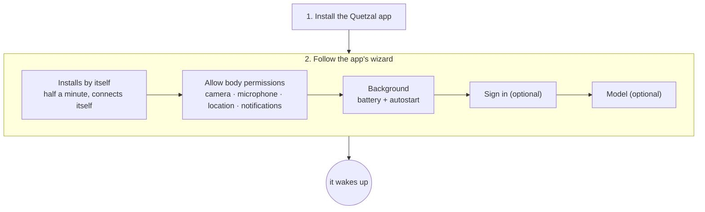

## Overview

You install one app. The runtime, Node.js, git and ssh all live inside the Quetzal app, so you need no Termux and no command line. (A computer takes a different path. On a Linux computer or server, run `curl -fsSL https://quetzal.plutokeating.beer/install | bash`; see [Linux and other machines](/docs/advanced/other-machines). On a Windows 10 (1809 or later) or Windows 11 PC, x64 or arm64, run `irm https://quetzal.plutokeating.beer/install.ps1 | iex` in PowerShell or use the installer from the [download page](/download); see [Windows](/docs/advanced/windows).)



Requirements: an **Android 7+ arm64** phone.

## 1. Install the Quetzal app

Download the latest APK from the [download page](/download) and install it. The first time, you may need to allow installing apps from unknown sources. To check that nobody has changed the APK, see [Release signatures and verification](#release-signatures-and-verification) below.

## 2. Follow the wizard

Open Quetzal. If this phone has no runtime yet, the app goes straight to the setup wizard. You can also reach it with **Install on this phone** on the connection page. The wizard has five steps:

1. **Install**: this starts by itself when the wizard opens. The app unpacks its bundled runtime environment, starts the runtime and checks the gateway. It takes about half a minute, and the console then **connects automatically** with no pairing code. The runtime runs in the app's own foreground service, which shows a permanent "lives on this phone" notification.
2. **Permissions**: after the install, the system permission prompts appear by themselves. Accept camera, microphone and location, plus notifications on Android 13 and later. If you miss one, tap "Allow" to see the prompt again. This only grants access at the system level. Each time the agent uses one of these, it still goes through the [permissions](/docs/guide/permissions) you set in the app, and by default camera, microphone and location ask you every time.
3. **Background**: add Quetzal to the **battery optimization ignore list** and **allow** it in your phone maker's autostart settings.
4. **Sign in** (optional): tap **Sign in**. The app opens the browser, where you sign in and approve. The first time, it sends you through GitHub once to create your private soul repository. See [Multiple bodies](/docs/guide/multi-body). You can also sign in later under **Control → Devices**.
5. **Model** (optional): tap **Choose a model** to set up a provider and key. See [First steps](/docs/start/first-steps).

> [!IMPORTANT]
> Many phone makers' systems (EMUI, MIUI, ColorOS…) block apps from starting in the background unless you allow autostart. Without it, the agent will not wake by itself after a reboot or an app update until you open the app once.

> [!WARNING]
> If the phone has a lock screen password, Android's file encryption keeps the app's data locked until you **unlock the phone once after a reboot**. The agent wakes only after that first unlock.

### Coming from the Termux version

If you installed the older version that runs in Termux:

1. In the old console, make sure the soul has been pushed to the soul repository (**Control → Soul sync** in the old version).
2. Uninstall the old Quetzal and the three Termux apps, then install the new app.
3. Once it is installed, **do not change the identity yet**. Connect the same soul repository under **Control → Advanced → Sync**, and the agent's personality and memory come back.

Conversations are not stored in the soul repository, so they do not move over.

## After installing

Open Quetzal's **Now** page to see the agent's state and drives. It will not wake until you configure a model. Continue with [First steps](/docs/start/first-steps).

**Upgrading**: when a new release is out, the app tells you at the top. Tap **Update** to go to **Control → About**, then tap **Update to x.y.z** to install the new app. The new app carries the new runtime and switches to it in the background. If your phone maker blocks that, open the app once. See [Upgrade and rollback](/docs/guide/upgrade).

## Release signatures and verification

Every release page has two files besides the packages:

- **`SHA256SUMS`**: the SHA-256 of every package in the release (Android APK, Linux native console tarballs, Windows installers), plus one line `commit <commit hash> v<version>` that names the repository commit the release was built from.
- **`SHA256SUMS.sig`**: the signature of `SHA256SUMS`, made with the project's Ed25519 release key (base64). The private key exists only in the release pipeline.

Release public key (raw 32 bytes, base64url):

```text
QbWLzC1yhOWroLTHtHiAAvVWq1UtWDiQP--D9wHaLU8
```

The app's self-update, the Linux one-line installer and the soul bridge's `self-update` all carry this key and refuse to install when the signature or a hash does not match. You can check a manual download yourself. Put the package and both files in one directory; you only need Node.js 15 or later:

```bash
# 1. Check the signature: SHA256SUMS really comes from the project's release pipeline
node -e 'const c=require("crypto"),f=require("fs");const k=c.createPublicKey({key:{kty:"OKP",crv:"Ed25519",x:"QbWLzC1yhOWroLTHtHiAAvVWq1UtWDiQP--D9wHaLU8"},format:"jwk"});process.exit(c.verify(null,f.readFileSync("SHA256SUMS"),k,Buffer.from(f.readFileSync("SHA256SUMS.sig","utf8").trim(),"base64"))?0:1)' && echo signature valid
# 2. Check the package: hash lines only (the commit line is not a hash and sha256sum would warn); files you did not download are skipped
grep -E '^[0-9a-f]{64}  ' SHA256SUMS | sha256sum -c --ignore-missing
```

The package is unmodified only when both steps pass: step 1 prints "signature valid" and step 2 shows `OK` for your file. If either step fails, do not install it.
