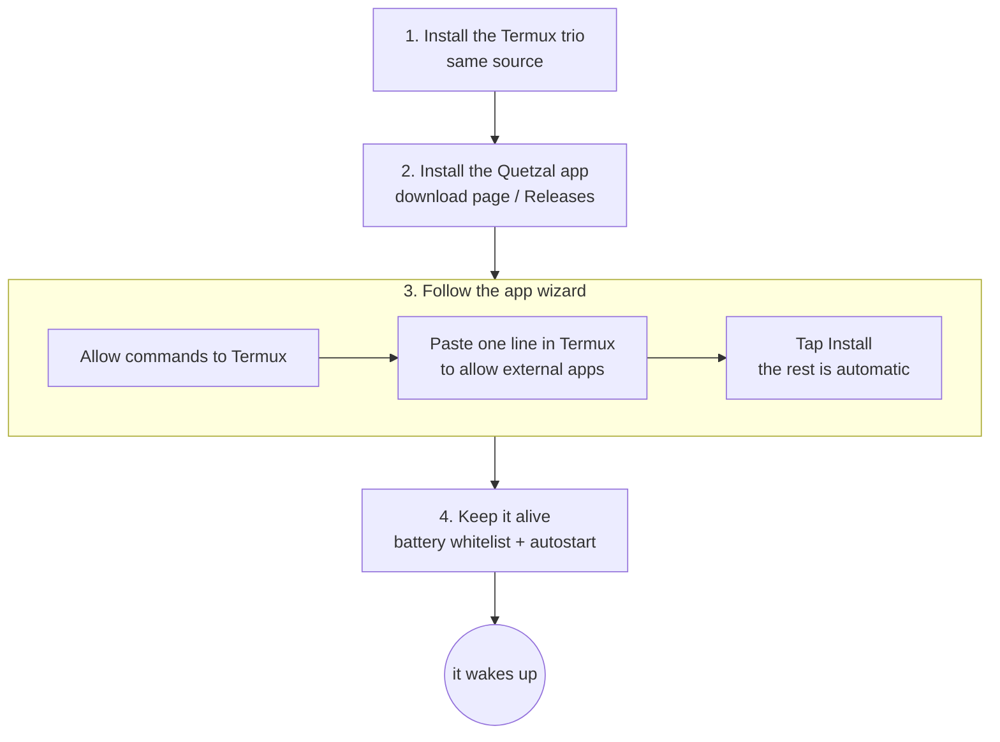

## Overview

Four steps: install the Termux trio → install the Quetzal app → install the runtime from the app's wizard → keep the system from killing it. It takes a few minutes and a few tens of megabytes. (Installing on a Linux computer or server is a different path: one line, `curl -fsSL https://quetzal.plutokeating.beer/install | bash`, see [Linux and other machines](/docs/advanced/other-machines).)



## 1. Install the Termux trio

All three come from F-Droid. These are direct links to pinned versions, so you can download them all at once without the F-Droid client:

- **Termux** · 0.119.0-beta.3 · 110 MB

  The Linux environment the runtime lives in.

  [Download APK](https://f-droid.org/repo/com.termux_1022.apk) [F-Droid page](https://f-droid.org/packages/com.termux/)

- **Termux:API** · 0.53.0 · 3.9 MB

  Battery, sensors, notifications, camera, microphone, location, clipboard; without it she cannot feel her body.

  [Download APK](https://f-droid.org/repo/com.termux.api_1002.apk) [F-Droid page](https://f-droid.org/packages/com.termux.api/)

- **Termux:Boot** · 0.8.1 · 26 KB

  Start on boot; without it you must ignite manually after a reboot.

  [Download APK](https://f-droid.org/repo/com.termux.boot_1000.apk) [F-Droid page](https://f-droid.org/packages/com.termux.boot/)

> [!IMPORTANT]
> All three must come from the **same source** (same signature) or they cannot talk to each other. The direct links above and the F-Droid pages are the same source. The Termux on Google Play is deprecated; do not use it.

After installing, **open Termux once** and wait for it to finish initializing (the first launch unpacks the environment and takes a little while).

## 2. Install the Quetzal app

Download the latest APK from the [download page](/download) or GitHub Releases and install it. You may need to allow installing from unknown sources the first time. To make sure the APK has not been tampered with, see [Release signatures and verification](#release-signatures-and-verification) below.

## 3. Install the runtime with the wizard

Open Quetzal and choose **"Install Quetzal on this phone"** on the home screen. The wizard walks you through:

1. **Install the Termux trio**: it checks that all three are installed and their versions match, and links to anything missing.
2. **Allow Quetzal to send commands to Termux**: the system shows a "Run commands in Termux" permission request; allow it.
3. **Allow external apps in Termux (the only manual step)**: tap "Copy and open Termux", then in Termux **long-press → Paste → Enter**. Go back to Quetzal and tap "I ran it, check". That line does exactly one thing: it writes `allow-external-apps=true` into Termux's settings so Quetzal can ask Termux to run the install script.
4. **Install the runtime**: tap "Install". Inside Termux the wizard installs Node.js, runit, the Termux:API command-line tools and git; places the runtime bundled in the app; registers the runit service, logging and boot script; writes the body name and timezone; starts it and runs a health check. You see step-by-step progress. When done the app **connects automatically**; no pairing code is needed.

> [!NOTE]
> On networks where package downloads are slow (mainland China), the wizard picks a mirror automatically based on your system language. Keep Quetzal in the foreground during installation: the runtime files are served from the app.

## 4. Keep her alive

Android kills background apps. The last wizard step guides you to:

- add **Termux, Termux:Boot, Termux:API and Quetzal** to the **battery optimization ignore list**;
- **allow** them in your vendor's "autostart / background" manager;
- **open Termux:Boot once** so the system registers it.

> [!WARNING]
> Phones with a lock screen password: Android's file-based encryption means Termux's data is unavailable until you **unlock once after a reboot**, so she only wakes after that first unlock. This is not a Quetzal limitation; it applies to anything running in Termux.

## After installing

Open Quetzal's **Now** page to see her state and drives. She will not wake until you configure a model. Continue with [First steps](/docs/start/first-steps).

**Upgrading**: when a new release is out, the app says so at the top; **Control → Service → Quetzal App → Download and install** installs the new app in one tap, and the new app then upgrades its bundled runtime. See [Upgrade and rollback](/docs/guide/upgrade).

## Release signatures and verification

Besides the packages, every release page carries two files:

- **`SHA256SUMS`**: the SHA-256 of every package in the release (Android APK, Linux native console tarballs), plus one line `commit <commit hash> v<version>` naming the repository commit it was built from.
- **`SHA256SUMS.sig`**: the project's Ed25519 release-key signature over `SHA256SUMS` (base64). The private key exists only in the release pipeline.

Release public key (raw 32 bytes, base64url):

```text
QbWLzC1yhOWroLTHtHiAAvVWq1UtWDiQP--D9wHaLU8
```

The app's self-update, the Linux one-line installer and the soul bridge's `self-update` all embed this key and refuse to install when the signature or a hash does not match. You can check a manual download yourself: put the package and both files in one directory; Node.js 15+ is all you need:

```bash
# 1. Check the signature: SHA256SUMS really comes from the project's release pipeline
node -e 'const c=require("crypto"),f=require("fs");const k=c.createPublicKey({key:{kty:"OKP",crv:"Ed25519",x:"QbWLzC1yhOWroLTHtHiAAvVWq1UtWDiQP--D9wHaLU8"},format:"jwk"});process.exit(c.verify(null,f.readFileSync("SHA256SUMS"),k,Buffer.from(f.readFileSync("SHA256SUMS.sig","utf8").trim(),"base64"))?0:1)' && echo signature valid
# 2. Check the package: hash lines only (the commit line is not a hash and sha256sum would warn); files you did not download are skipped
grep -E '^[0-9a-f]{64}  ' SHA256SUMS | sha256sum -c --ignore-missing
```

Only when both pass (step 1 prints "signature valid", step 2 shows `OK` for your file) is the package unmodified. If either fails, do not install it.
