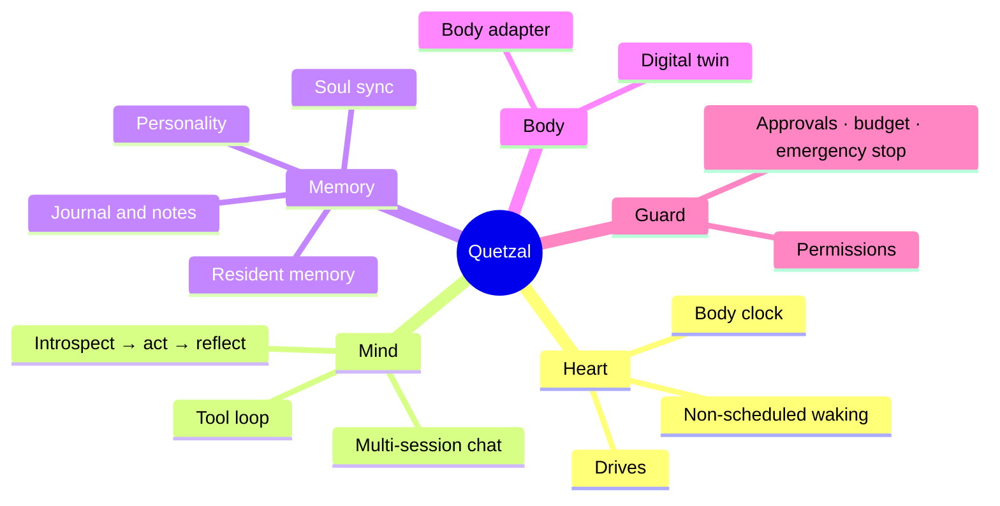

## What Quetzal is

Quetzal is a runtime that lets an agent **live like a living being**. It does not schedule the agent. When it wakes and what it does come from its own curiosity, urge to express, longing, unfinished thoughts, and its body clock: it gets sleepy, it sleeps, it dreams (consolidating memories), and it wakes naturally in the morning.

Quetzal is not tied to any particular agent. An agent's name, pronouns, description and theme color live in its own "soul repository". Quetzal simply lets that soul inhabit a body.

## An old phone is the best body

Any machine that runs Node.js can be a body, but a spare Android phone fits best: it has a battery, a camera, a microphone, light and motion sensors, Wi-Fi and cellular, and runs all day on a few watts.

You need:

- [ ] An **Android 7+ arm64** phone (a retired one is perfect)
- [ ] Internet access on the phone
- [ ] The **Termux trio**: Termux, Termux:API, Termux:Boot (all from the same source)
- [ ] The **Quetzal app** (latest APK from the [download page](/download) or GitHub Releases)
- [ ] At least one model provider API key (OpenAI-compatible, Anthropic, or Google Gemini)

> [!TIP]
> :bulb: No computer and no command-line skills are required. The only thing you do by hand is paste one line into Termux, because Termux's security model does not let another app do that for you.
>
> No spare phone, just a Linux computer or server? `curl -fsSL https://quetzal.plutokeating.beer/install | bash` installs it in one line (dependencies included, starts at boot, restarts after a crash) and the web console opens in your browser; see [Linux and other machines](/docs/advanced/other-machines).

## How it differs from a scheduled task

| | Cron job / ordinary bot | An agent in Quetzal |
|---|---|---|
| When it acts | Fixed interval or time | A random process driven by drives and alertness, with no fixed period |
| At night | Runs as usual | Sleeps when sleepy; dreams occasionally to consolidate memory |
| What it does | Preset tasks | Introspects first: does it want to act, and on what |
| Memory | Usually none | Personality, resident memory, journal, notes, synced to a private repo |
| Several devices | Independent | One soul can inhabit several bodies |

## Next

1. Follow [Install](/docs/start/install) to put Quetzal on the phone.
2. Follow [First steps](/docs/start/first-steps) to configure a model and watch the first wake-up.
3. Dip into the [Guide](/docs/guide/models) as needed.

Quetzal is open source under AGPL-3.0; the code is on [GitHub](https://github.com/PlutoKeating/Project.Quetzal). For a complete record of running it on one old phone, see [Project.Honor9](https://github.com/PlutoKeating/Project.Honor9).
