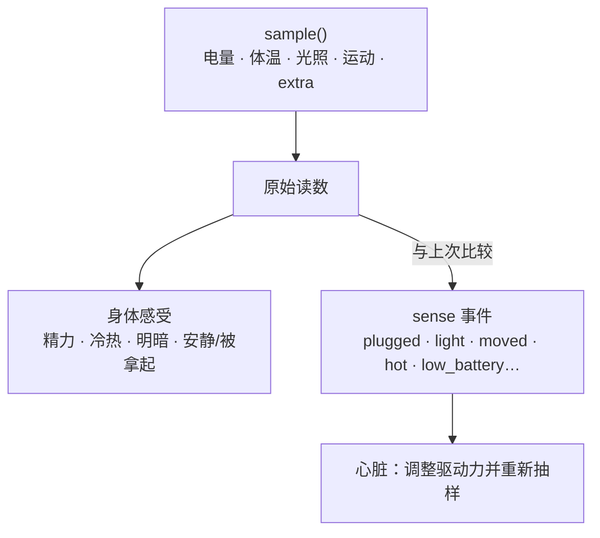

## 适配器是什么

运行基座的核心不知道自己跑在手机、树莓派还是服务器上。设备的一切（传感器采样、系统通知、播放声音、设备动作）都由**身体适配器**提供。适配器是一个独立构建的 ES 模块，默认导出一个 `BodyAdapter` 对象。

仓库自带两个平台级的参考实现：`runtime/adapters/termux/`（任意安卓手机 + Termux:API，传感器按名字探测），构建为 `dist/termux.mjs`；`runtime/adapters/linux/`（任意 Linux 机器，电池与温度读 `/sys`，桌面工具按可用程序探测），构建为 `dist/linux.mjs`。

## 接口

```ts
import type { BodyAdapter, RawSample, AdapterTool } from "./adapter";   // 只能 import type

const adapter: BodyAdapter = {
  name: "my-board",
  describe: "一块装在窗台上的开发板，有光线传感器和一个蜂鸣器",
  async init() { /* 可选：打开设备、检查依赖 */ },
  async sample(): Promise<RawSample> {
    return {
      battery: { level: 0.82, charging: true, tempC: 31 },
      lux: await readLux(),
      motion: 0,
      extra: { humidity: 46 },         // 设备特有的读数，原样进入身体孪生
    };
  },
  async notify(title, text) { /* 系统通知：配对码、主动消息的本地出口 */ },
  async playAudio(file) { /* 播放语音合成的结果 */ },
  tools: [
    {
      name: "beep",
      description: "让蜂鸣器响一声",
      parameters: { type: "object", properties: { ms: { type: "number" } } },
      permission: "device",            // 必须是闸门已知的能力类别
      handler: async ({ ms }) => { await beep(ms ?? 200); return "响了"; },
    },
  ],
};
export default adapter;
```

| 成员 | 必需 | 说明 |
|---|---|---|
| `name` / `describe` | 是 | `describe` 一句话描述这具身体，写进 ta 的自我认知 |
| `sample()` | 是 | 一次物理采样，字段全部可选：有什么报什么 |
| `init()` | 否 | 启动时调用一次 |
| `notify()` | 否 | 本地系统通知；没有它配对码只能从令牌文件读 |
| `speak()` / `playAudio()` | 否 | 说话 / 播放音频文件 |
| `tools` | 否 | 设备动作，每个声明所属能力类别（`device`、`camera`、`microphone`、`location`…） |
| `hands` | 否 | 预留：看屏幕、点击、输入、打开应用 |

## 约束

- 适配器**只能 `import type`** 接口文件的类型，不得依赖核心的其他实现；构建时类型被擦除，产物不依赖核心。
- 工具的 `permission` 必须是闸门已知的类别，否则按「允许」处理。
- 加载失败时核心回退到通用适配器（无传感器），并在日志里说明。

## 构建与指定

```bash
npx esbuild my-adapter.ts --bundle --platform=node --target=node22 --format=esm --outfile=my-adapter.mjs
QUETZAL_HOME=~/.quetzal QUETZAL_ADAPTER=$PWD/my-adapter.mjs node --enable-source-maps main.cjs
```

也可以写进配置 `config/quetzal.json` 的 `adapter` 字段。

## 采样如何变成感受



采样间隔自适应：有显著变化时 2 分钟，平静时逐步拉长到 10 分钟。采样不调用模型、不等于醒来。

## Termux 适配器提供了什么（参考）

`sample()`：电量 / 充电 / 体温 / 健康、光照与运动（传感器按名字探测，没有就不报）；`notify()`（带「打开 Quetzal」按钮）、`playAudio()`；工具 `take_photo`、`record_audio`、`location`、`vibrate`、`torch`、`clipboard`、`read_sensor`。不提供 `speak`（很多手机没有系统 TTS），说话由运行基座的 `voice_speak`（Azure 语音）完成。

完整类型见 [适配器接口](/docs/reference/adapter-interface)。
