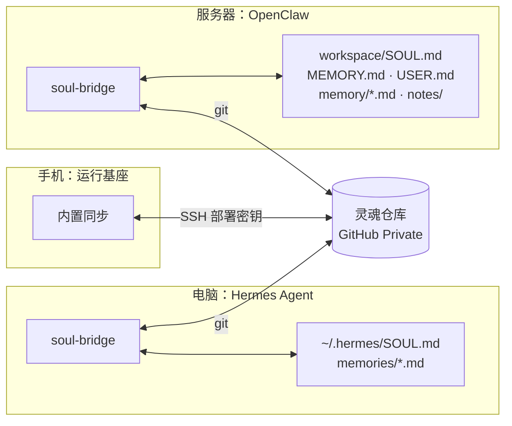

## 它是什么

**soul-bridge** 是一个独立、可随时插拔的小守护进程，装在运行 [Hermes Agent](https://hermes-agent.nousresearch.com/) 或 OpenClaw 的机器上。它把那个框架的人格与记忆文件和灵魂仓库**双向同步**：手机上的 ta 和电脑上的 ta 是同一个灵魂。

## 安装：让 ta 自己装

**控制 → 灵魂同步** 第 3 步有一句现成的话。复制它，发给那台机器上的 Hermes 或 OpenClaw。ta 会按技能自己完成：

1. 检查并在用户目录安装 Node.js（22.18+）、获取程序、把技能留在自己的技能目录；
2. 确定灵魂仓库：你给的地址 → ta 自己的记忆 → GitHub 上已有的 `*.soul` 私有仓库 → 自动创建；
3. 一条 `init` 完成全部配置：生成部署密钥、有 `gh` 或 `GITHUB_TOKEN` 时自动添加可写部署密钥、克隆、导入现有人格与记忆、安装钩子与后台服务、首次同步；
4. `doctor` 自检并按建议修复。

只有缺少 GitHub 凭据、缺少 git 且无 sudo、或同一错误重试 3 次仍失败时，ta 才会把需要你做的事合并成一条消息发出，通常只是**在 GitHub 网页添加一次 ta 给出的部署公钥**。

> [!TIP]
> 整个过程你不需要打开终端。

## 同步什么

| 映射 | Hermes | OpenClaw |
|---|---|---|
| 人格 | `SOUL.md` | `SOUL.md` |
| 常驻笔记 | `memories/MEMORY.md`（写回时按 Hermes 的字符上限截取，截取不写回仓库） | `MEMORY.md`（自由 Markdown，新段落被吸收为条目） |
| 关于用户 | `memories/USER.md` | `USER.md` |
| 日记 | —（Hermes 没有日记） | `memory/YYYY-MM-DD*.md` 双向；其他身体的日记镜像到 `memory/bodies/<身体>/` |
| 共享笔记 | — | `memory/notes/**.md` 逐篇双向 |
| 生效时机 | 下一个会话 | 下一轮 |

桥接**复制**文件，并记住两侧的基线：框架新增的保留、框架删除的删除、被上限截掉的条目仍留在灵魂里而不会被误判为删除。

## 何时同步

Hermes：memory 工具调用后、会话收尾、文件变化、定期拉取远端。OpenClaw：启动、`/new`、`/reset`、压缩后、文件变化、定期拉取。定期拉取只负责传输（那台机器收不到推送通知），和 agent 什么时候醒来无关。

## 命令（供排错）

| 命令 | 作用 |
|---|---|
| `init` | 一条命令接入 |
| `doctor` | 逐项自检并给修复建议 |
| `sync` | 立即同步一次 |
| `status` | 配置、最近同步结果、公钥 |
| `attach` / `detach [--purge]` | 重装钩子与服务 / 拔出（框架文件保持原样） |

本地数据在 `~/.agent-soul/<agent>/`：配置、仓库副本、基线、部署密钥、日志。

## 拔出

让那边的 agent 执行 `detach`，或者直接在 GitHub 删掉它的 Deploy key，它就再也写不进灵魂仓库了，框架里的文件保持原样。
