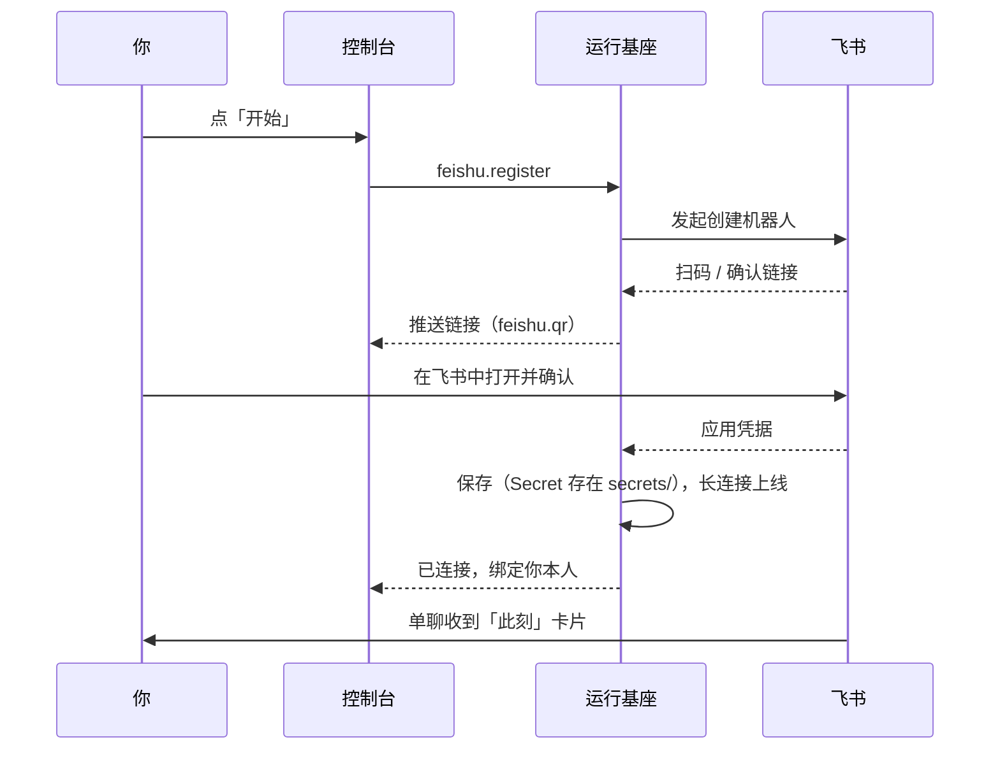

## 它能做什么

接入飞书后，ta 有了第二个和你说话的地方。飞书里的一切操作都通过**交互卡片**完成，不需要命令。

- 单聊自动推送**「此刻」卡片**：状态、驱动力、ta 想分享的一句话。
- 对话：发消息给机器人即可；ta 工作时你再发，默认作为插话并入。
- 审批、授权、暂停、急停等卡片按钮直接调用操作层，与 App 行为一致。
- ta 醒来时的主动消息带「💭 主动消息」标识。

## 一键接入

**控制 → 飞书 → 开始**：

机器人以 agent 的显示名命名，并自动绑定操作的你本人为所有者。接入用的是**长连接**，手机不需要公网地址。

> [!NOTE]
> 也可以手动填入已有应用的 App ID 与 App Secret（**控制 → 飞书**）。Secret 保存在本机 `secrets/` 目录，不进灵魂仓库。

## 在飞书里对话

- 直接发消息。ta 的回复在进行中的那一轮里给出；ta 工作时收到的消息只加一个表情表示收到，下一次模型调用前并入。
- 发 **`/new [标题]`** 开启新会话。
- 发图片、文件：通过飞书的消息资源接口下载后作为附件交给 ta。
- ta 索取密码或密钥时会发一张**保密输入**卡片（见 [保密传递](/docs/guide/secrets)）。飞书不允许机器人撤回你的消息，结束后请**自己撤回**含密钥的消息。

## 可选：机器人菜单

在飞书开发者后台「机器人 → 自定义菜单」添加推送事件 `home` / `flow` / `memory` / `control`，就能在聊天框底部一键打开对应卡片。

## 状态与排错

**控制 → 飞书** 显示连接状态、错误、所有者。常见问题见 [排错](/docs/advanced/troubleshooting)。
