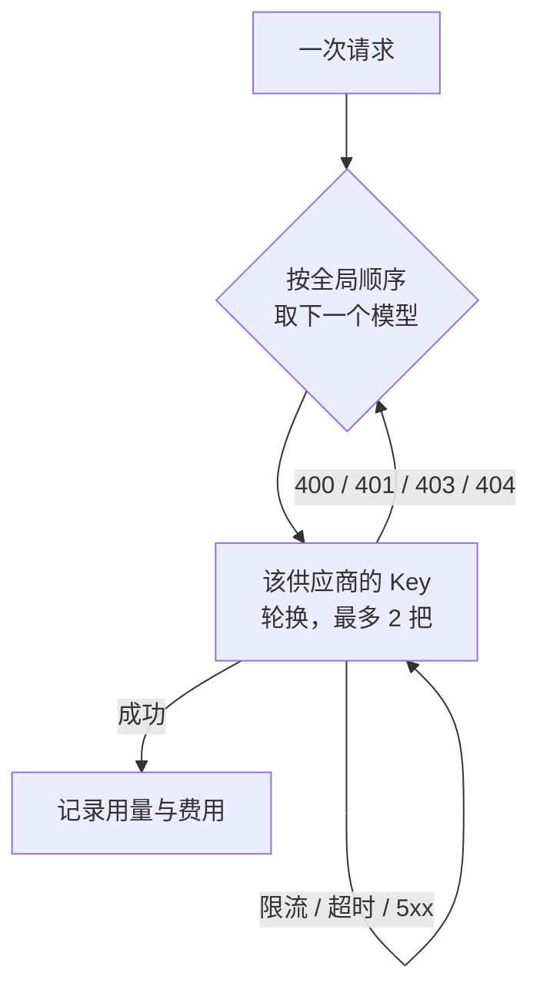

## 支持的协议

| 协议 | 适用 |
|---|---|
| `openai-completions` | OpenAI Chat Completions 及一切兼容接口（大多数国内外供应商、本地推理服务） |
| `openai-responses` | OpenAI Responses 接口 |
| `anthropic-messages` | Anthropic Messages 接口 |
| `google-generative-ai` | Google Gemini |

## 在控制台里配置（手机 App 或网页版，同一份界面）

**控制 → 模型**：点一个供应商、粘贴 Key、点「接上」，运行基座会自动挑模型、试通、排好顺序（见[第一步](/docs/start/first-steps)）。

需要细调时，点右上角「**编辑**」。你在编辑器里改的内容先存成草稿，点保存时一次性生效：

1. **添加供应商**：从目录选择或自定义（名称、API 地址含版本路径如 `/v1`、协议）。
2. **添加 Key**：同一个供应商可以加多把 Key，调用时轮流用。
3. **选择模型**：从公共目录（models.dev，含上下文长度与价格）里勾选，或者从供应商的 models 接口拉取，或者手动添加自定义模型。
4. **测试连通**：显示延迟与结果。
5. **全局模型顺序**：所有供应商里已启用的模型排在同一个列表里，拖动来排序。

> [!NOTE]
> 这两条规则用来防止 Key 被发到错误的地址：修改 API 地址前，要先移除旧 Key；每次保存都带版本号，如果别处（比如飞书卡片）先改过，这次保存会被拒绝，并提示你重新加载。

## 调用顺序与故障转移

每次调用按**全局顺序**依次尝试已启用的模型；同一个供应商的 Key 轮流用，最多试 2 把：

- 限流、超时、5xx：换 Key 重试；
- 400/401/403/404 这类说明模型或配置本身有问题的错误：换下一个模型；
- 模型流式响应 90 秒没有收到任何数据块，或 180 秒只收到保活、没有任何内容，算作失败；还在输出的回答不限时长。

## 内省模型

你可以指定一个 **quick（内省）模型**。ta 醒来时先用它做一个轻量判断：想不想动、想做什么。这里选一个便宜、快的模型，ta 醒来又接着睡的那些次数就花不了多少钱。

## 看图的模型

发图片给 ta 时，运行基座只选**能看图**的模型。按这个顺序判断一个模型能不能看图：你手动设置的 `vision` 标记 → 公共目录里的输入模态 → 模型名。一个能看图的模型都没有时，图片会被去掉，消息里会写明。

## 特殊供应商

个别供应商有额外的约定，运行基座会自动处理，你不用做任何设置。目前有 **OpenCode Go**：目录 ID 为 `opencode-go` 或地址为 `opencode.ai/zen/go` 时自动生效，按官方规则为每个模型选择接口并带上会话标识。

## Key 的保存

- Key 用 **AES-256-GCM** 加密保存在手机上，主密钥在 `QUETZAL_HOME/secrets/`；
- 任何接口只返回**末四位**；
- Key **不进灵魂仓库**，换身体时不会跟着走，每具身体要各自配置。

## 用量与预算

每次调用的 token 与估算费用记录在本机，在「此刻」与「控制 → 高级 → 预算」里能看到。预算用完后，ta 自己醒来的频率会大幅降低（见 [能力授权与安全](/docs/guide/permissions)）。
