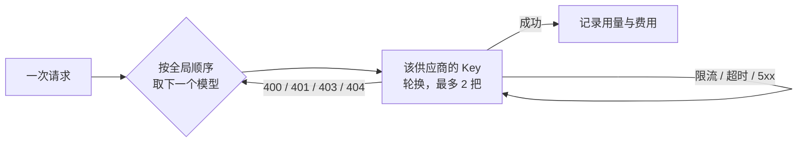

## 支持的协议

| 协议 | 适用 |
|---|---|
| `openai-completions` | OpenAI Chat Completions 及一切兼容接口（大多数国内外供应商、本地推理服务） |
| `openai-responses` | OpenAI Responses 接口 |
| `anthropic-messages` | Anthropic Messages 接口 |
| `google-generative-ai` | Google Gemini |

## 在 App 里配置

**控制 → 模型**。配置以「草稿」方式编辑，点保存时整份提交：

1. **添加供应商**：从目录选择或自定义（名称、API 地址含版本路径如 `/v1`、协议）。
2. **添加 Key**：可以给同一供应商加多把 Key，调用时轮换。
3. **选择模型**：从公共目录（models.dev，含上下文长度与价格）勾选，或从供应商的 models 接口拉取，或手动添加自定义模型。
4. **测试连通**：返回延迟与结果。
5. **全局模型顺序**：所有供应商已启用的模型在同一列表里拖动排序。

> [!NOTE]
> 修改 API 地址前必须先移除旧 Key；保存带版本号，若其他地方（比如飞书卡片）先改过，保存会被拒绝并提示重新加载。这些都是为了防止 Key 被发到错误的地址。

## 调用顺序与故障转移

每次调用按**全局顺序**遍历已启用模型；同一供应商的 Key 轮换，最多试 2 把：

- 限流、超时、5xx：换 Key 重试；
- 400/401/403/404 这类"这个模型/配置本身不行"的错误：换下一个模型；
- 模型流式响应 90 秒没有任何数据块视为失败（另有 15 分钟绝对上限）。

## 内省模型

可以指定一个 **quick（内省）模型**。ta 醒来时先用它做一个轻量判断：想不想动、想做什么。选一个便宜、快的模型放这里，能省下大部分"醒来又继续睡"的开销。

## 看图的模型

发图片给 ta 时，路由只会选**能看图**的模型。判断顺序：你手动设置的 `vision` 标记 → 公共目录里的输入模态 → 模型名。一个都没有时图片会被去掉，并在消息里说明。

## 特殊供应商

个别供应商有额外约定，由独立的兼容模块自动处理。目前有 **OpenCode Go**：目录 ID 为 `opencode-go` 或地址为 `opencode.ai/zen/go` 时自动生效，按官方规则为每个模型选择接口并带上会话标识。你不需要做任何设置。

## Key 的保存

- Key 用 **AES-256-GCM** 加密保存在手机上，主密钥在 `WINDLER_HOME/secrets/`；
- 任何接口只返回**末四位**；
- Key **不进入灵魂仓库**：换身体时不会跟着走，每具身体各自配置。

## 用量与预算

每次调用的 token 与估算费用记录在本机，「此刻」与「控制 → 预算」可见。预算用尽后 ta 的醒来率会大幅降低（见 [能力授权与安全](/docs/guide/permissions)）。
