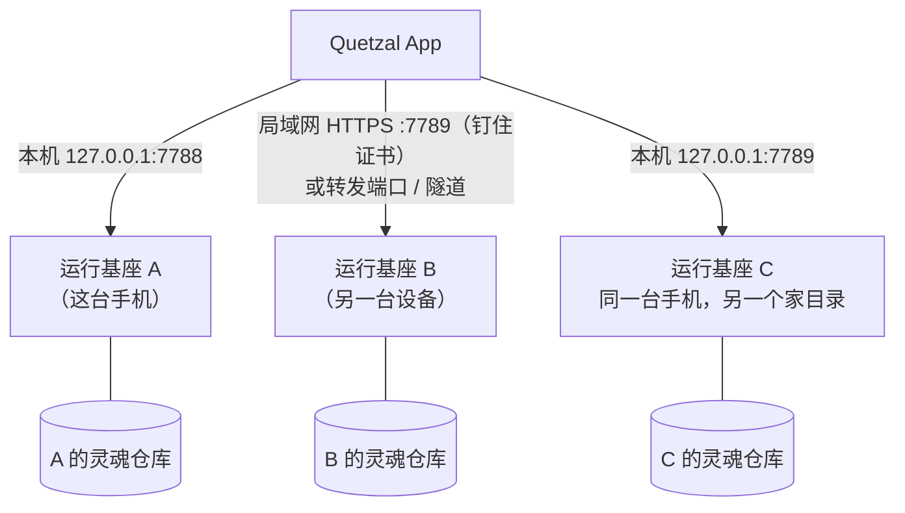

## 一个控制台，多个 agent

控制台（手机 App、Linux 与 Windows 的桌面版，或网页版）可以保存多个连接，每个连接对应一个运行基座，也就是一具身体里的一个 agent。手机上点顶栏的名字、网页版点左上角的头像，打开 **切换** 列表；切换后，界面的称呼与主题色跟着变。

## 连接新的 agent

顶栏名字 → **连接另一个**（连接页上也可以展开「连接另一台设备」填地址）：

1. 填入运行基座的地址。
   - 另一台设备：只填它的 IP 或名字（如 `192.168.1.8`），App 自动用加密连接 `https://…:7789`。那台设备要对局域网开放（Linux 上用 `--lan`，见 [部署到其他机器](/docs/advanced/other-machines)）；没有开放时，先把端口转发到手机上，再填 `127.0.0.1:<端口>`。
   - 同一台手机上的另一个基座：填 `127.0.0.1:<端口>`。
2. 用加密连接时，App 会显示那台设备的**证书指纹**（如 `1a2b 3c4d 5e6f 7a8b`）。把它和那台设备上的配对通知（或 `quetzal status`）核对一致。之后这个连接只认这张证书。
3. **获取配对码**：配对码是 8 位字母数字，5 分钟内有效。它和证书指纹一起，出现在那台设备的系统通知里（由身体适配器的 `notify` 发出）。
4. 输入配对码 → **配对**。App 保存令牌，之后自动重连。用加密连接时，配对码本身不在网络上传输，App 只发送用配对码与证书指纹算出的证明。

> [!NOTE]
> 两种情况不需要配对码：**这台手机**上由向导安装的运行基座，安装脚本已经把令牌直接交给了 App；网页控制台连**托管它的那台机器**上的运行基座，打开就已登录。

配对码输错超过 5 次或过期就会失效，重新获取一个即可。

## 同一台设备上的多个 agent

每个运行基座实例有自己的家目录与网关端口。同一台设备上的另一个 agent 通常用另一个端口（例如 7789）。每个 agent 有自己的灵魂仓库与身份 id，**身份守卫**保证 ta 们的记忆不会混在一起。

## 同一个 agent 的多具身体

**一个灵魂、多具身体**：几具身体通过灵魂仓库共享人格与记忆，各自写自己的日记。详见 [灵魂同步](/docs/guide/soul-sync) 与 [灵魂桥](/docs/advanced/soul-bridge)。

## 移除连接

在切换列表里可以移除一个连接。移除的只是控制台里的这条连接，那个运行基座和 ta 的记忆都还在。
