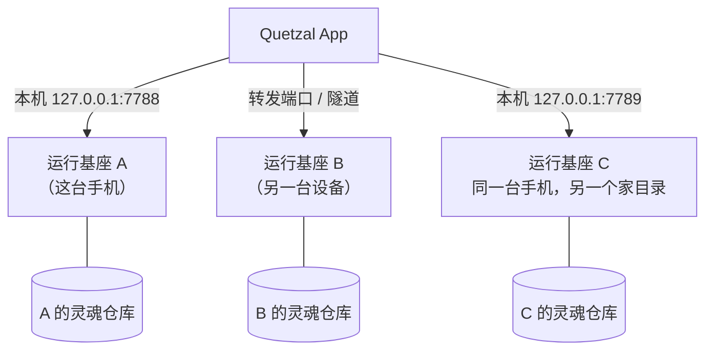

## 一个控制台，多个 agent

控制台（手机 App，或 Linux 机器上的网页版）可以保存多个连接，每个连接对应一个运行基座（一具身体里的一个 agent）。手机上点顶栏的名字、网页版点左上角的头像 → **切换 agent**，界面的称呼与主题色随之变化。

## 连接新的 agent

顶栏名字 → **连接新的 agent**：

1. 填入运行基座的**网关地址**（如 `http://127.0.0.1:7789`）。网关只监听本机，另一台设备上的基座需要先把端口转发到手机上（见 [部署到其他机器](/docs/advanced/other-machines)）。
2. **申请配对码**：6 位、5 分钟有效，通过那台设备的系统通知下发（身体适配器的 `notify`）。
3. 输入配对码 → 配对成功，App 保存令牌，之后自动重连。

> [!NOTE]
> 在**这台手机**上由向导安装的运行基座不需要配对码：安装脚本把令牌直接交给了 App。网页控制台连**托管它的那台机器**上的运行基座也不需要：打开即登录。

配对码输错超过 5 次或过期会失效，重新申请即可。

## 同一台设备上的多个 agent

每个运行基座实例有自己的家目录与网关端口。同一台设备上的另一个 agent 通常使用不同端口（例如 7789）。每个 agent 有自己的灵魂仓库与身份 id，**身份守卫**保证 ta 们的记忆不会混在一起。

## 同一个 agent 的多具身体

这是另一种情况：**一个灵魂、多具身体**。它们通过灵魂仓库共享人格与记忆，各自写自己的日记。详见 [灵魂同步](/docs/guide/soul-sync) 与 [灵魂桥](/docs/advanced/soul-bridge)。

## 移除连接

切换列表里可以移除一个连接。这只移除控制台里的这个连接；那个运行基座与它的记忆原样保留。
